### **Requerimiento**
Realizar un análisis exploratorio completo: distribuciones univariadas de la frecuencia, la severidad, los costos y el tamaño de las empresas; asociaciones bivariadas de la siniestralidad con la clase de riesgo, el sector, el tamaño y la geografía; estructura temporal y estacionalidad; detección y tratamiento de valores atípicos; y correlación y colinealidad entre los predictores candidatos. Acompañar cada hallazgo con la visualización que lo sustenta y cierre con la síntesis de lo que condiciona el modelado.

---

## 1.2.2 – Análisis Univariado (resultados preliminares)

> Generado a partir de `01-analisis_univariado/analisis_univariado.py` · 5 000 empresas · 39 894 siniestros · 2018–2024.

---

### A. Frecuencia de Siniestros

**A1 – Número de siniestros por empresa**

- La distribución del conteo de siniestros por empresa es **fuertemente asimétrica positiva** (cola larga derecha): la mayoría de empresas registra pocos eventos, mientras un pequeño grupo acumula muchos.
- El Q-Q contra una distribución Poisson muestra desviaciones sistemáticas en la cola superior, evidenciando **sobredispersión** — condición favorable para modelos Binomial Negativa o hurdle/zero-inflated en S03.

**A2 – Tasa de siniestros por 100 trabajadores**

- La frecuencia relativa también exhibe asimetría importante. Al segmentar por clase de riesgo, la **separación de distribuciones es notoria**: las clases 4 y 5 desplazan la moda hacia tasas más altas, confirmando que `clase_riesgo` es un predictor fuerte.
- Un **7.5% de empresas** no registró ningún siniestro en el periodo, lo cual deberá tratarse en el modelado (modelos de conteo con componente de ceros).

**A3 – Evolución temporal anual**

- El volumen de siniestros se mantiene relativamente estable año a año, sin una tendencia creciente o decreciente pronunciada, lo que sugiere que el portafolio es estacionario en primer orden. **Implicación para modelado:** las features de año calendario pueden tener baja contribución marginal.

---

### B. Severidad (días de incapacidad)

**B1 – Distribución de días de incapacidad**

- **Mediana: 6 días. P90: 37 días. Asimetría: 10.42** → distribución extremadamente leptocúrtica con cola derecha pesada.
- La transformación logarítmica produce una distribución aproximadamente simétrica, confirmando que la variable se debe modelar en escala log (familia Gamma o Lognormal).
- La CDF muestra que el 90% de siniestros genera 37 días o menos de incapacidad, pero la cola restante concentra carga desproporcionada.

**B2 – Severidad por tipo de siniestro (AT vs EL)**

- Las **Enfermedades Laborales (EL)** presentan distribuciones de severidad con media y cola superior significativamente más altas que los **Accidentes de Trabajo (AT)**. Esta diferencia estructural exige modelos separados de severidad (S03).

**B3 – Boxplot por nivel de gravedad**

- La variable `gravedad` discrimina correctamente los días de incapacidad: medianas crecientes de leve → mortal. No obstante, la varianza intra-grupo es alta, especialmente en categorías moderado y grave — confirma la necesidad de features adicionales más allá de la gravedad.

---

### C. Costos

**C1 – Distribución de costos por siniestro**

- **Mediana del costo total por siniestro: $1,272,000 COP. P90: $7,232,000 COP.**
- Tanto el costo asistencial como las prestaciones económicas exhiben distribuciones log-normales, con colas muy pesadas. La transformación `log(1+x)` normaliza satisfactoriamente ambas variables.
- **Implicación:** el resultado técnico del portafolio depende desproporcionadamente de una fracción pequeña de siniestros costosos (candidatos a manejo separado como "eventos catastróficos" en S03).

**C2 – Costo acumulado por empresa**

- La distribución del costo acumulado por empresa es también fuertemente sesgada. La versión logarítmica es razonablemente simétrica, apta para regresión estándar.

**C3 – Concentración de costos (Curva de Lorenz)**

- **Gini ≈ 0.702** → concentración muy alta de costos.
- El **top 10% de empresas** concentra el **56.5% del costo total** del portafolio. Esto implica que las estrategias de prevención focalizadas en el decil superior tienen un retorno potencial enorme.
- **Implicación para el negocio (S03/S04):** el modelo debe poder identificar correctamente ese decil crítico — la métrica prioritaria no debe ser accuracy global sino Recall/Precisión en el extremo superior.

---

### D. Tamaño de las Empresas

**D1 – Distribución del número de trabajadores**

- La distribución de `n_trabajadores` es **bimodal en escala natural** con fuerte sesgo positivo. El logaritmo revela una distribución aproximadamente unimodal.
- Segmentación por tamaño del portafolio:
  - **Micro (≤10 trab.):** ~12% de empresas
  - **Pequeñas/Medianas (11-200 trab.):** ~86.4% de empresas ← segmento dominante
  - **Grandes (>200 trab.):** ~1.6% de empresas
- El portafolio está **dominado por PyMEs**, lo que es un dato crítico para el diseño del sistema de recomendación (S05): las recomendaciones deben ser aplicables a empresas con pocos recursos.

**D2 – Prima anual**

- La prima anual también exhibe alta asimetría. La correlación esperada entre `prima_anual`, `n_trabajadores` y `clase_riesgo` se verificará en el análisis bivariado (1.2.3). Posible proxy del riesgo total asumido por la ARL.

**D3 – Antigüedad por clase de riesgo**

- La distribución de antigüedad es relativamente homogénea entre clases de riesgo, sin una diferencia sistemática clara. No se evidencia sesgo de selección por antigüedad asociado al riesgo.

---

### E. Variables Categóricas

**E1 – Tipo de siniestro**

- Predominio de **AT (Accidentes de Trabajo)** sobre EL, lo cual es consistente con el perfil de un portafolio PyME industrial.

**E2 – Gravedad**

- La categoría **"leve"** es la más frecuente, seguida por "moderado". Los eventos graves y mortales son poco frecuentes pero concentran costos desproporcionados — confirma necesidad de modelar la cola derecha.

**E3 – Sector económico**

- El portafolio tiene representación diversa por sector. Los sectores con mayor número de empresas serán analizados en detalle en el análisis bivariado para identificar si la exposición al riesgo difiere significativamente entre ellos.

---

## Síntesis preliminar (tras univariado)

| Hallazgo | Implicación para S03 / S04 / S05 |
|---|---|
| Frecuencia sobredispersa, 7.5% de ceros | Modelo Binomial Negativa o Zero-Inflated Poisson |
| `clase_riesgo` separa claramente distribuciones | Feature crítico; incluir en todos los modelos |
| Costos log-normales con cola pesada | Modelar severidad en escala log (Gamma / Lognormal) |
| Gini costos ≈ 0.70; top 10% = 56.5% del costo | Recall en el decil superior es la métrica de negocio central |
| PyMEs dominan (86.4%) | Recomendaciones deben ser factibles para empresas con recursos limitados |
| Asimetría severidad = 10.42 | Transformación log obligatoria; winsorizar outliers extremos |
| AT y EL tienen distribuciones distintas | Modelos de severidad separados por tipo de siniestro |

---

## 1.2.3 – Análisis Bivariado (resultados preliminares)

> Generado a partir de `02-analisis_bivariado/analisis_bivariado.py` · Panel completo de 5 000 empresas (incluye ceros) · Exploración descriptiva (sin pruebas formales; estas se abordan en S01-1.3).

---

### A. Siniestralidad × Clase de riesgo

**A1 – Boxplots de frecuencia, costo y severidad**
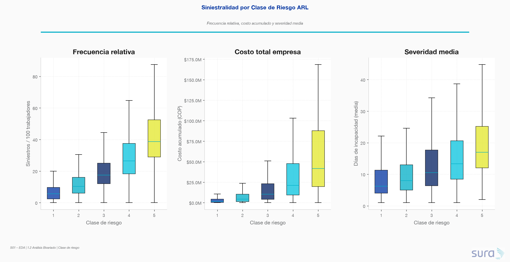

- Gradiente monotónico claro en las tres métricas: a mayor clase ARL, mayor frecuencia relativa, mayor costo acumulado y mayor severidad media.

**A2 – Medianas por clase**
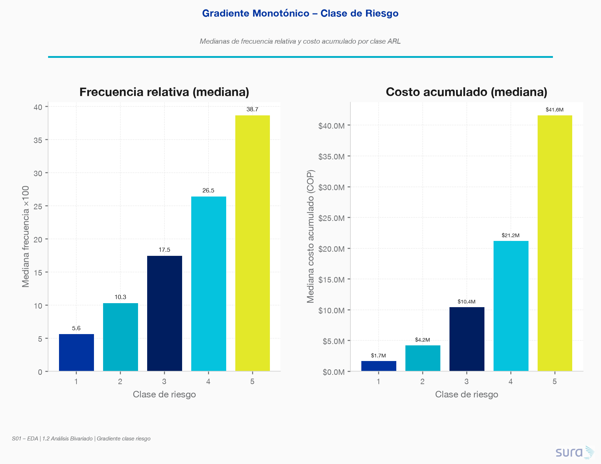

| Clase | n empresas | Freq.×100 (mediana) | Costo acum. (mediana) | Severidad (mediana) |
|---|---|---|---|---|
| 1 | 1 322 | 5.6 | $1.7M | 6.2 días |
| 2 | 950 | 10.3 | $4.2M | 8.0 días |
| 3 | 1 001 | 17.5 | $10.4M | 10.5 días |
| 4 | 1 056 | 26.5 | $21.2M | 13.3 días |
| 5 | 671 | 38.7 | $41.6M | 17.0 días |

- La frecuencia mediana de la **clase 5 es 6.9× la de la clase 1**.

**A3 – Participación del costo del portafolio**
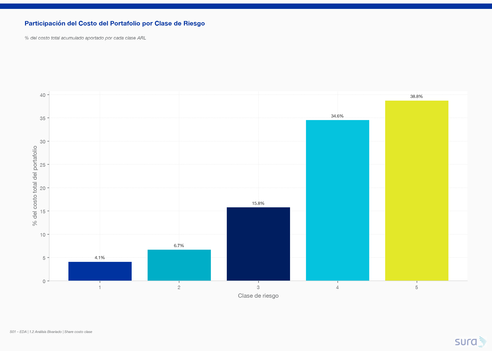

- Las clases **4 y 5 concentran ~73.3% del costo total** del portafolio (34.6% + 38.8%), pese a representar solo el 34.5% de las empresas.
- **Implicación:** priorizar prevención y modelado en clases altas maximiza impacto económico.

---

### B. Siniestralidad × Sector económico

**B1 – Frecuencia relativa por sector**
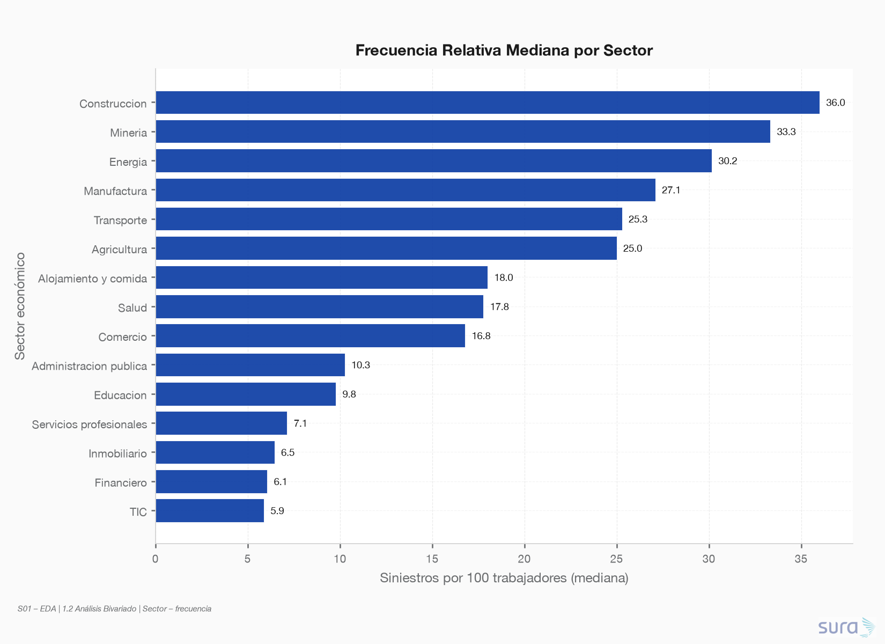

- **Top 5 (mayor frecuencia mediana):** Construcción (36.0), Minería (33.3), Energía (30.2), Manufactura (27.1), Transporte (25.3).
- **Bottom 5 (menor frecuencia):** TIC (5.9), Financiero (6.1), Inmobiliario (6.5), Servicios profesionales (7.1), Educación (9.8).
- El spread top/bottom es ~6× — el sector aparece como predictor de primer orden, comparable en magnitud a la clase de riesgo.

**B2 – Costo acumulado por sector**
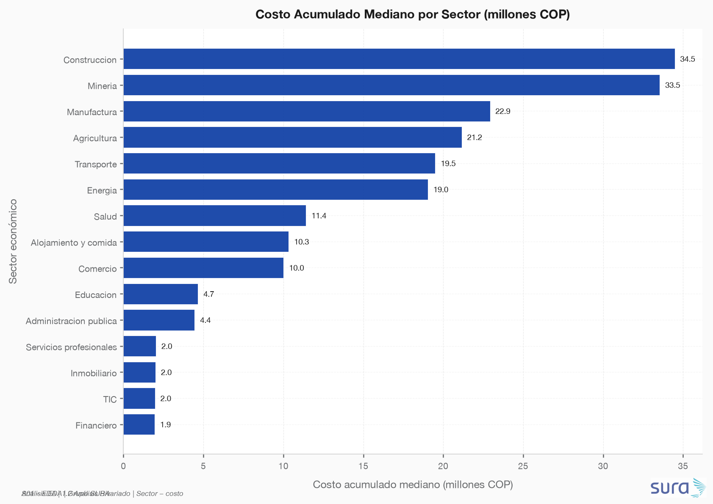

- El ranking de costos sigue el de frecuencia en sectores industriales, con matices: algunos sectores de frecuencia media pueden tener costos elevados por severidad o tamaño medio.

**B3 – Interacción sector × clase de riesgo**
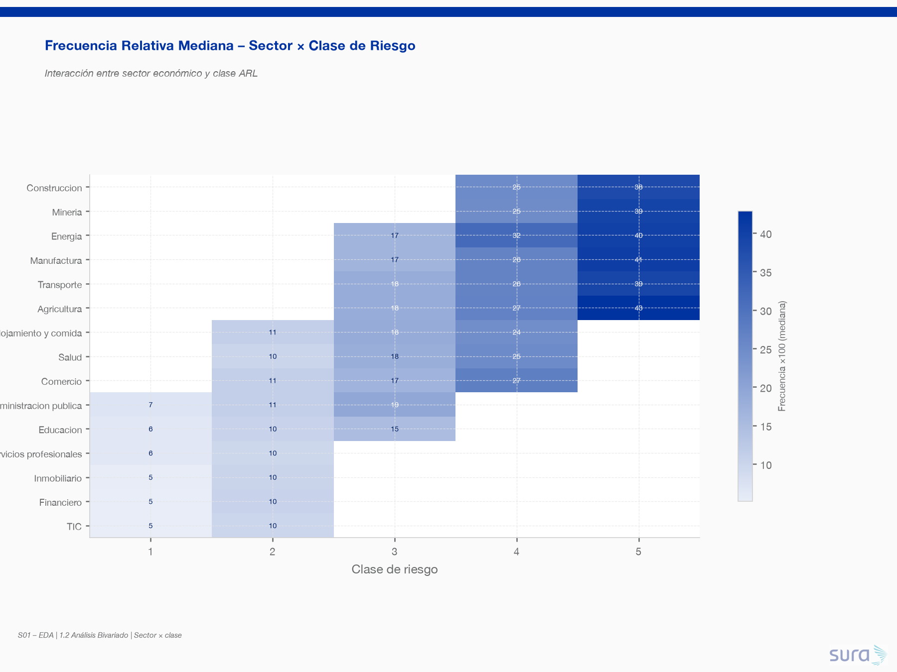

- Dentro de cada sector el gradiente por clase se mantiene; los sectores de alto riesgo base (Construcción, Minería) alcanzan frecuencias extremas en clases 4–5.
- **Implicación para S02/S03:** modelar interacción `sector × clase_riesgo` o estratificar; no asumir aditividad perfecta.

---

### C. Siniestralidad × Tamaño

**C1 – Scatter tamaño vs siniestralidad**
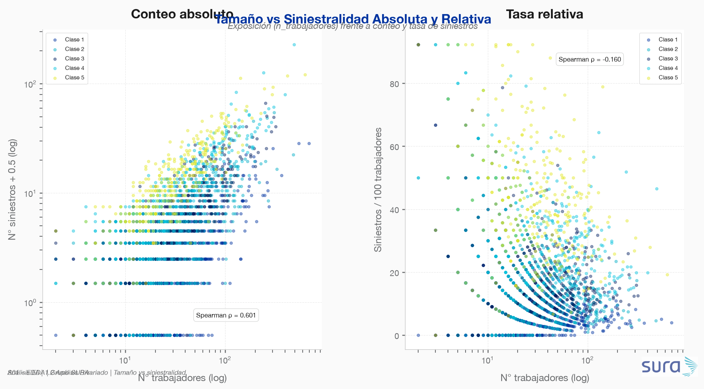

- El conteo absoluto de siniestros crece con `n_trabajadores` (efecto de exposición).
- La frecuencia relativa muestra patrón inverso leve: las microempresas tienden a tasas más altas (posible efecto de denominador pequeño / mayor volatilidad).

**C2 – Boxplots por segmento**
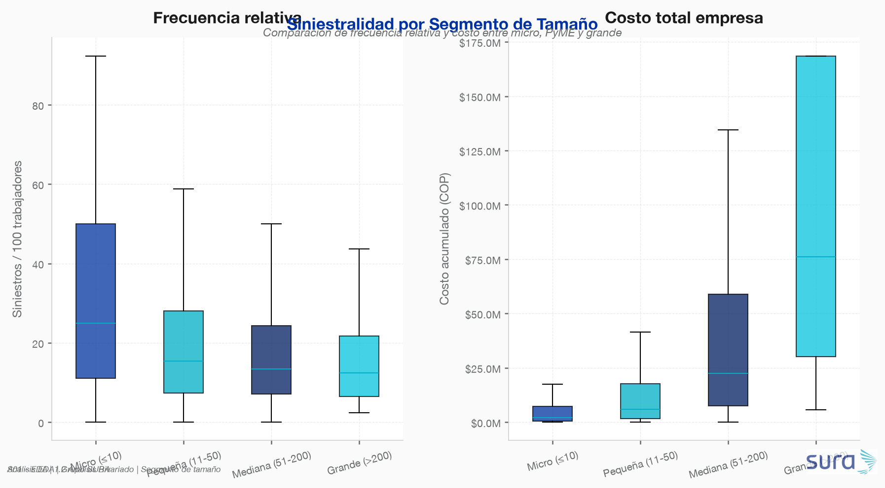

| Segmento | n | Freq.×100 (med) | n siniestros (med) | Costo (med) |
|---|---|---|---|---|
| Micro (≤10) | 598 | 25.0 | 2 | $2.1M |
| Pequeña (11–50) | 2 961 | 15.4 | 4 | $5.9M |
| Mediana (51–200) | 1 359 | 13.4 | 11 | $22.5M |
| Grande (>200) | 82 | 12.4 | 38 | $76.2M |

- El **costo y el conteo crecen con el tamaño**; la **tasa relativa es mayor en micro**. Para modelado de frecuencia relativa, el tamaño actúa como control/offset, no como driver lineal positivo.

**C3 – Prima vs costo**
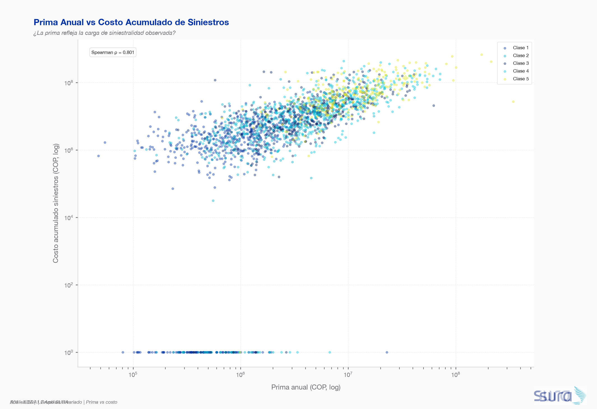

- La prima anual se alinea visualmente con el costo acumulado de siniestros (proxy de exposición + riesgo tarifado).
- Útil como feature o baseline de pricing en S02/S03; vigilar colinealidad con `n_trabajadores` y `clase_riesgo`.

---

### D. Siniestralidad × Geografía

**D1 – Por departamento**
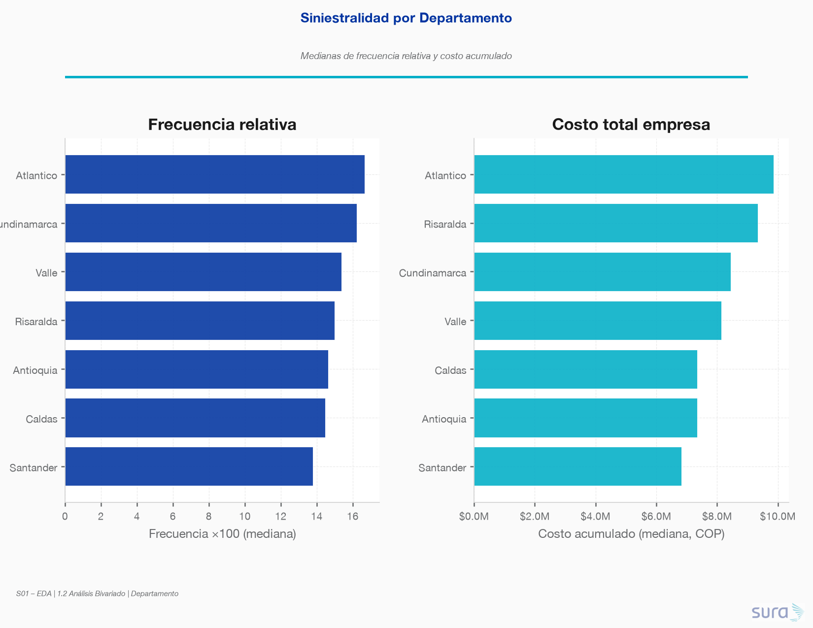

- Rango de medianas entre departamentos: **solo 2.9 puntos** de frecuencia×100 — efecto geográfico **débil en magnitud práctica**.
- Atlántico lidera en frecuencia y costo medianos; Santander en el extremo inferior.

**D2 – Por ciudad**
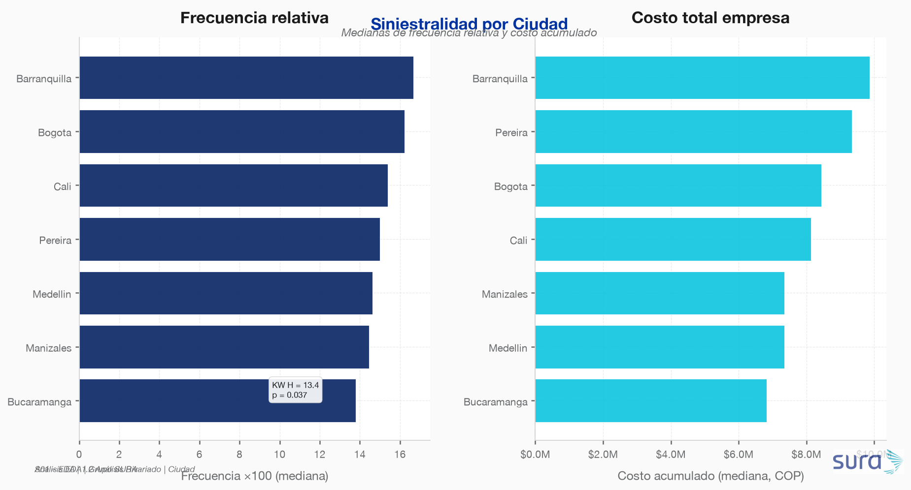

- Resultados idénticos al departamento: en este dataset sintético hay **mapeo 1:1 ciudad–departamento** (7 ciudades / 7 departamentos). No aporta señal adicional.

**D3 – Mix de clase de riesgo por departamento**
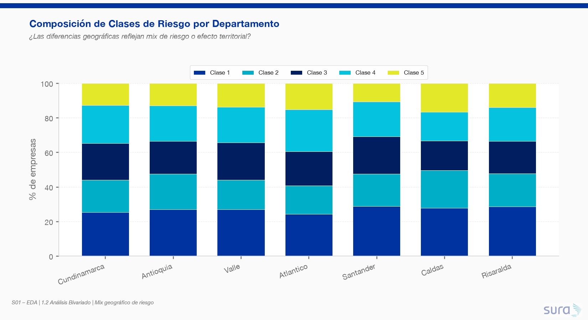

- La composición de clases de riesgo es similar entre departamentos → las pequeñas diferencias geográficas **no se explican por un mix de riesgo muy distinto**.
- **Implicación:** geografía es candidata secundaria/control; priorizar clase y sector en el feature set.

---

### E. Matriz de correlación descriptiva

**E1 – Predictores numéricos vs siniestralidad**
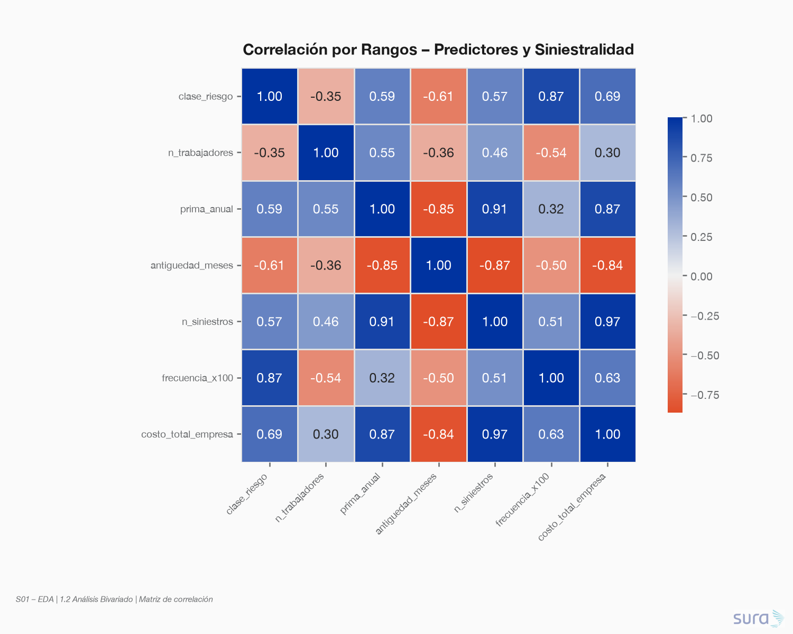

| Par | Correlación por rangos | Lectura descriptiva |
|---|---|---|
| `clase_riesgo` ~ `frecuencia_x100` | ~0.73 | Asociación fuerte; predictor dominante |
| `prima_anual` ~ `costo_total_empresa` | ~0.80 | Proxy fuerte de carga |
| `n_trabajadores` ~ `n_siniestros` | ~0.60 | Efecto de exposición |
| `n_trabajadores` ~ `frecuencia_x100` | ~−0.16 | Débil / inverso |
| `antiguedad_meses` ~ métricas | ≈ 0 | Baja relevancia bivariada |

> Las pruebas formales de estas asociaciones se realizarán en **S01-1.3**.

---

## Síntesis bivariada y condicionantes para el modelado

| Hallazgo | Implicación para S02 / S03 / S04 / S05 |
|---|---|
| Gradiente claro por `clase_riesgo`; clases 4–5 = 73% del costo | Feature obligatorio; posible estratificación o pesos por clase |
| Sector discrimina ~6× entre extremos (Construcción vs TIC) | Incluir `sector` (o embedding CIIU); explorar interacción con clase |
| Tamaño ↑ conteo y costo; ↓ levemente la tasa relativa | Usar offset/exposición (`n_trabajadores`) en modelos de conteo; no confundir tasa con volumen |
| Prima alineada con costo acumulado | Buen proxy / baseline; chequear VIF vs tamaño y clase |
| Geografía: rango de medianas ~3 pts | Feature de baja prioridad; evitar sobreajustar con dummies geográficas |
| Panel completo en staging (`empresa_siniestralidad_completa`) | Usar este dataset (no el de solo siniestros) para modelado con ceros |

---

## 1.2.4 – Análisis Temporal y Estacionalidad (resultados preliminares)

> Generado a partir de `03-analisis_temporal/analisis_temporal.py` · 39 894 siniestros · 2018–2024 · Panel empresa×año de 35 000 filas.

---

### A. Estructura temporal del portafolio

**A1 – Serie mensual de volumen**
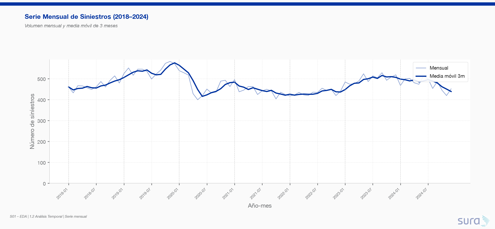

- El volumen mensual oscila en torno a ~450–550 siniestros, con picos en 2019 y un valle marcado en 2020–2022.
- La media móvil de 3 meses suaviza el ruido sin revelar un ciclo estacional fuerte a simple vista.

**A2 – Estructura anual (volumen, costo, severidad)**
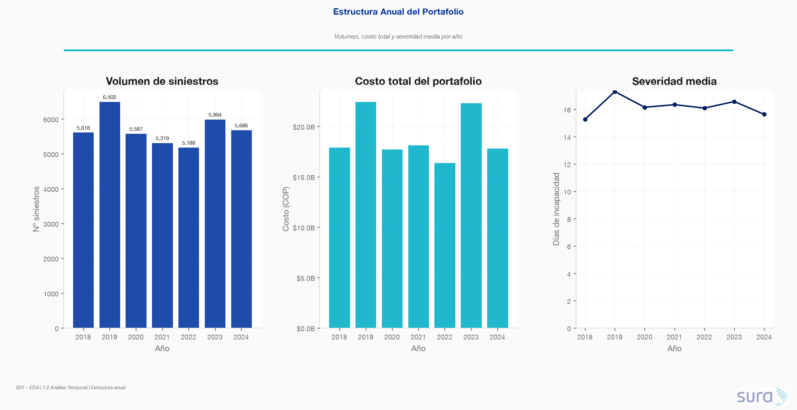

| Año | Siniestros | YoY vol. | Costo total | YoY costo | Severidad media | % AT |
|---|---|---|---|---|---|---|
| 2018 | 5 618 | — | $17.9B | — | 15.3 días | 85.9% |
| 2019 | 6 502 | **+15.7%** | $22.5B | +25.3% | 17.3 días | 87.6% |
| 2020 | 5 587 | **−14.1%** | $17.7B | −21.0% | 16.1 días | 85.8% |
| 2021 | 5 319 | −4.8% | $18.2B | +2.3% | 16.3 días | 85.3% |
| 2022 | 5 188 | −2.5% | $16.4B | −9.7% | 16.1 días | 84.7% |
| 2023 | 5 994 | **+15.5%** | $22.3B | +36.0% | 16.6 días | 86.9% |
| 2024 | 5 686 | −5.1% | $17.8B | −20.1% | 15.6 días | 86.8% |

- Hay **oscilación interanual relevante** (±15% en volumen en 2019 y 2023), no una tendencia monotónica.
- La severidad media se mantiene estable (~15–17 días); el costo del portafolio es más volátil que el volumen.

**A3 – Mix AT / EL**
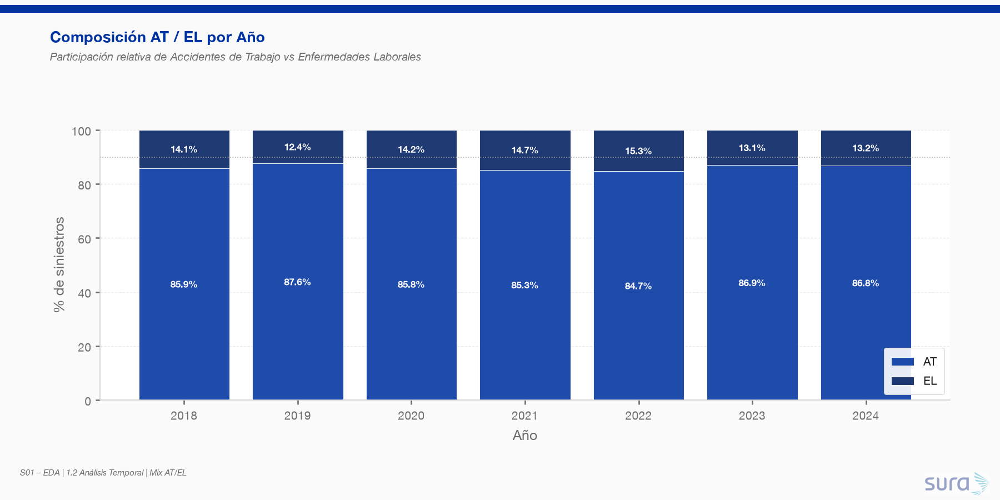

- El mix es **estable en el tiempo**: AT ≈ 85–88%, EL ≈ 12–15%. No hay cambio estructural de composición que justifique features de año × tipo.

---

### B. Estacionalidad

**B1 – Índice estacional de volumen**
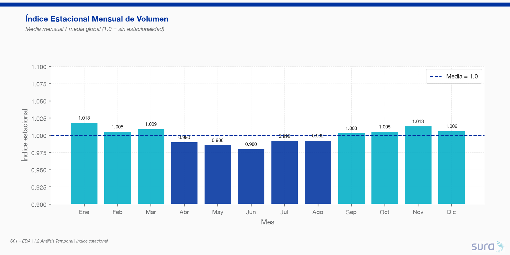

- Amplitud del índice de volumen: **solo 3.8 puntos porcentuales** (pico ene 1.018 → valle jun 0.980).
- Patrón leve: ligeramente más alto a inicios/finales de año; más bajo en abril–agosto. En la práctica es **estacionalidad débil / casi nula**.

**B2 – Heatmap año × mes**
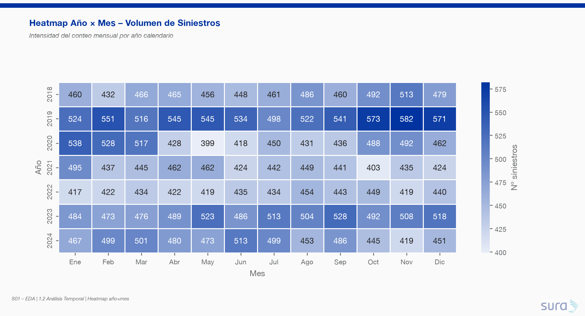

- 2019 concentra los meses más intensos (pico nov = 582); mayo-2020 es el mínimo absoluto (399).
- La variación **entre años** domina a la variación **entre meses** dentro del mismo año.

**B3 – Boxplots mensuales entre años**
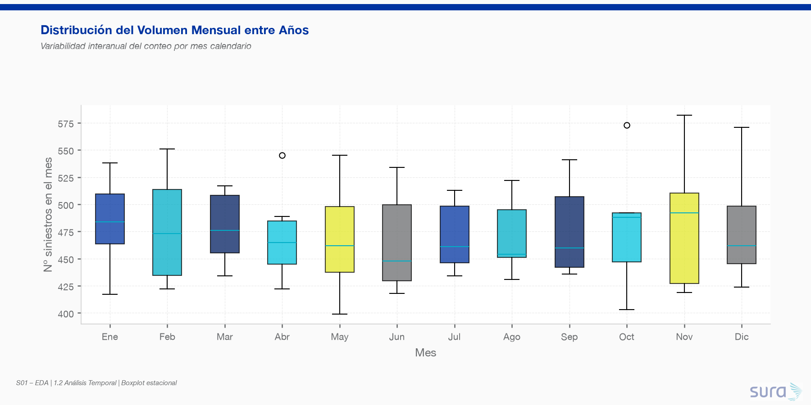

- Las cajas se solapan ampliamente entre meses; el CV interanual medio por mes es ~0.09.
- Confirma que dummies de mes aportarían poca señal frente al ruido interanual.

---

### C. YoY, costo/severidad y persistencia empresa-año

**C1 – Variación interanual**
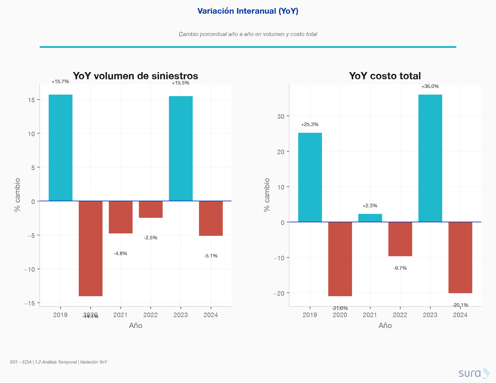

- El costo total amplifica los movimientos de volumen (p. ej. 2023: +15.5% vol. → +36% costo).
- **Implicación:** para nowcast / proyección de portafolio (S02/S03) conviene modelar volumen y severidad/costo por separado.

**C2 – Estacionalidad de costo y severidad**
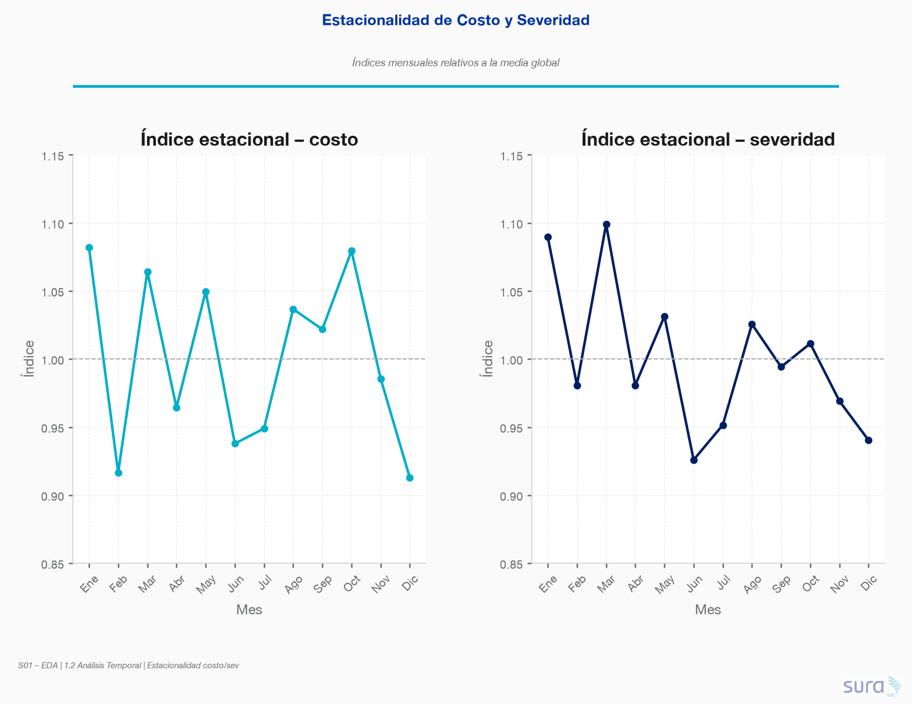

- Índices de costo y severidad oscilan más que el volumen (~±8–9% de amplitud), pero con 7 años y colas pesadas esta amplitud es **ruidosa**, no un ciclo operativo claro.
- No se recomienda priorizar features estacionales de mes para el modelo de clasificación empresa-año.

**C3 – Persistencia empresa–año (conteo y target Top 10%)**
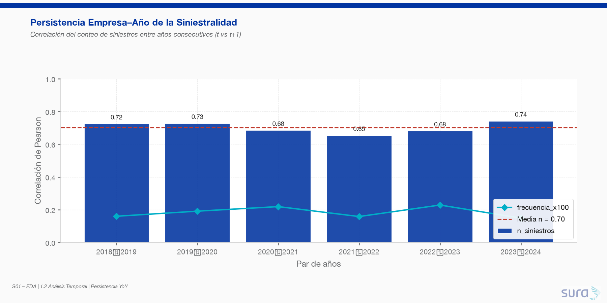

> **Target operativo (CRISP-DM):** `alta_siniestralidad` = Top 10% de empresas por `n_siniestros` dentro de cada año (~500 / 5 000). Umbral observado: **≥ 3 siniestros** en todos los años 2018–2024.

| Par | corr `n_siniestros` | corr `frecuencia_x100` | Retención Top 10% |
|---|---|---|---|
| 2018→2019 | 0.72 | 0.16 | 50.2% |
| 2019→2020 | 0.73 | 0.19 | 51.2% |
| 2020→2021 | 0.68 | 0.22 | 50.6% |
| 2021→2022 | 0.65 | 0.16 | 47.0% |
| 2022→2023 | 0.68 | 0.23 | 48.4% |
| 2023→2024 | 0.74 | 0.15 | 53.2% |
| **Media** | **0.70** | **0.18** | **50.1%** |

- El **conteo absoluto del año anterior es un predictor lag fuerte** (corr ≈ 0.70).
- La **tasa relativa persiste poco** (corr ≈ 0.18) — coherente con el efecto de exposición/denominador visto en el bivariado.
- Del Top 10% en t, **~50% permanece en el Top 10% en t+1** → el target binario es parcialmente estable; hay rotación material (~50%) que el modelo debe capturar más allá de un lag naive.
- Clase positiva fija en **10%** → métricas prioritarias Recall / Precision / F1 en el decil superior (no accuracy).

---

## Síntesis temporal y condicionantes para el modelado

| Hallazgo | Implicación para S02 / S03 / S04 / S05 |
|---|---|
| Estacionalidad mensual de volumen ≈ ±2% | Features de mes/calendario de **baja prioridad**; no invertir complejidad estacional |
| Oscilación YoY de volumen ±15% (sin tendencia monotónica) | Validación temporal T-1→T es crítica; el año de holdout importa |
| Mix AT/EL estable (~86%/14%) | No modelar cambio de composición; sí estratificar severidad AT vs EL (univariado) |
| Persistencia `n_siniestros` t→t+1 ≈ 0.70 | Incluir **lags** del conteo (y posiblemente costo) como features baseline fuertes |
| Persistencia de tasa relativa ≈ 0.18 | Preferir lags de conteo + offset de exposición sobre lags de tasa sola |
| Target = Top 10%; retención label ≈ 50% | Baseline lag útil pero insuficiente; evaluar lift vs “repetir Top 10% del año anterior” |
| Panel `temporal_empresa_anio` (35k filas) | Dataset listo para CV temporal y target `alta_siniestralidad` (Top 10%) sin leakage |

---

## 1.2.5 – Detección y Tratamiento de Valores Atípicos (resultados preliminares)

> Generado a partir de `04-analisis_outliers/analisis_outliers.py` · 39 894 siniestros · 5 000 empresas · Métodos: IQR 1.5×, MAD (z-mod ≥ 3.5), P1–P99 · Tratamiento: winsorización P1–P99 (**sin eliminar filas**).

---

### A. Detección

**A1 – Boxplots a nivel de siniestro**
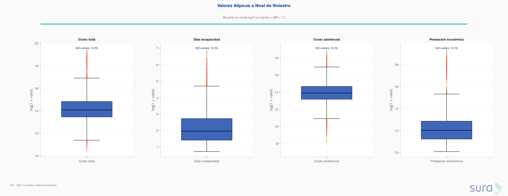

- Costo y días de incapacidad muestran colas derechas muy pesadas (coherente con el univariado: asimetría de severidad ≈ 10.4).
- IQR marca ~12–13% de siniestros como atípicos en costo/severidad: en distribuciones leptocúrticas esto **no implica error de dato**, sino límite del método.

**A2 – Boxplots a nivel de empresa**
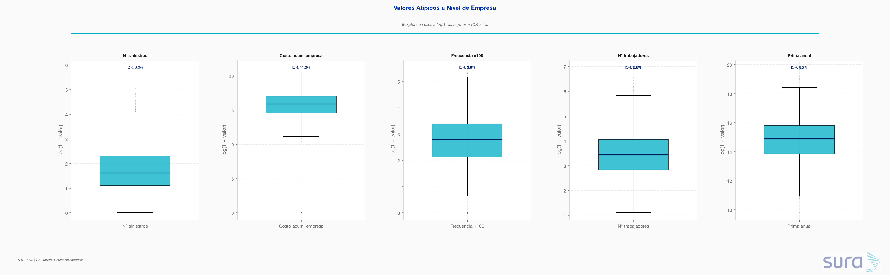

| Variable (empresa) | % IQR | % MAD | % fuera P1–P99 |
|---|---|---|---|
| `n_siniestros` | 9.2% | 9.2% | 1.0% |
| `costo_total_empresa` | 11.3% | 14.5% | 1.0% |
| `frecuencia_x100` | 3.9% | 3.1% | 1.0% |
| `n_trabajadores` | 5.9% | 5.9% | 1.8% |
| `prima_anual` | 9.2% | 11.7% | 2.0% |

- La frecuencia relativa tiene menos outliers IQR (~4%) que el costo acumulado (~11%): el efecto de exposición ya “normaliza” parte de la cola del conteo.

**A3 – Comparación de métodos**
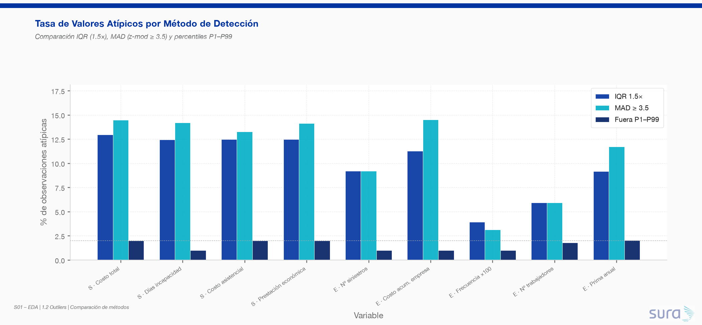

| Variable (siniestro) | % IQR | % MAD | % fuera P1–P99 | Máx observado | P99 |
|---|---|---|---|---|---|
| `costo_total` | 13.0% | 14.5% | 2.0% | $307M | $28.4M |
| `dias_incapacidad` | 12.4% | 14.2% | 1.0% | 1 081 días | 155 días |
| `costo_asistencial` | 12.5% | 13.3% | 2.0% | $198M | $20.9M |
| `costo_prestacion_economica` | 12.5% | 14.1% | 2.0% | $286M | $38.0M |

- **IQR y MAD son agresivos** (~12–15% en variables de siniestro): útiles para diagnóstico, no como regla de borrado.
- **P1–P99 es el criterio operativo** (~1–2% de observaciones en los extremos): alineado con tratamiento por winsorización.

---

### B. Tratamiento (winsorización P1–P99)

**Decisión:** no eliminar observaciones. En ARL, extremos de costo/severidad son **eventos reales de cola** (mortales / catastróficos). Se winsorizan features para estabilizar el modelado y se conservan originales para resultado técnico.

**B1 – Costo total por siniestro**
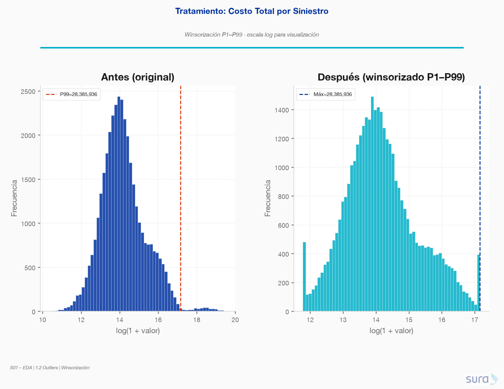

- Máximo: **$307M → $28.4M** (−90.8%); asimetría: **12.16 → 3.45** (−71.7%); clipados: **1.87%** de filas.
- La media baja de $3.56M a $2.83M; la mediana permanece esencialmente estable (tratamiento de cola, no del centro).

**B2 – Días de incapacidad**
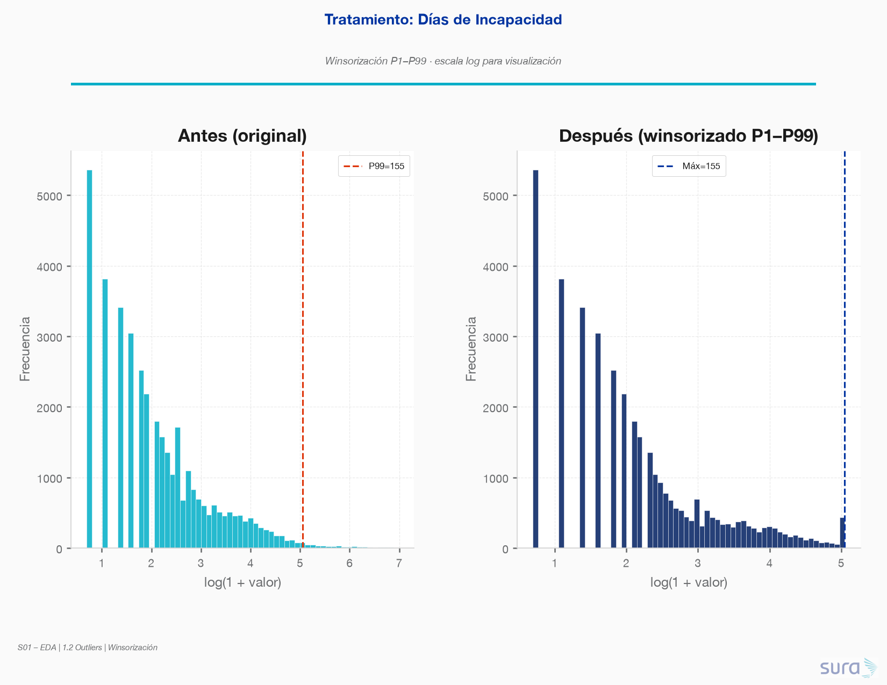

- Máximo: **1 081 → 155 días** (−85.7%); asimetría: **10.42 → 3.52** (−66.2%); clipados: **0.95%**.

**B3 – Costo acumulado por empresa**
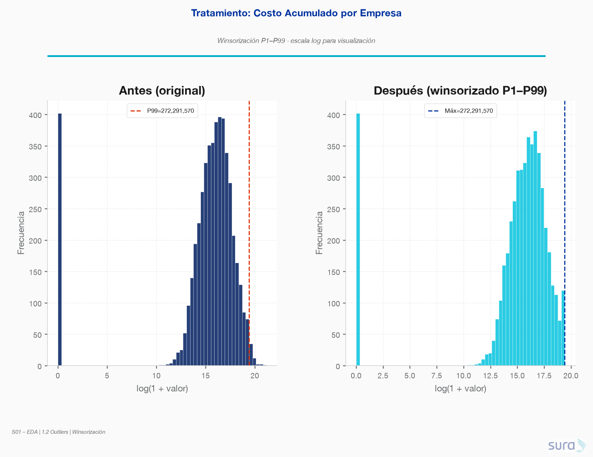

- Máximo: **$1.58B → $272M** (−82.8%); asimetría: **7.83 → 3.36** (−57.1%); clipados: **1.0%**.

---

### C. Contexto y condicionantes

**C1 – Costo × severidad con outliers P1–P99**
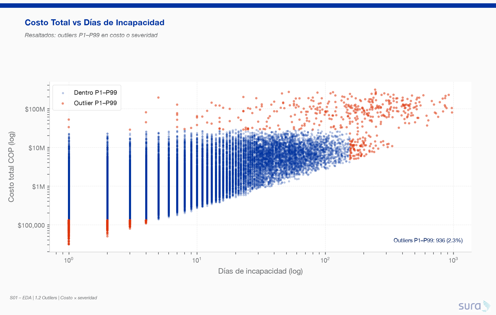

- **936 siniestros (2.3%)** están fuera de P1–P99 en costo o días; concentran la cola superior del scatter log–log.
- Confirma que costo y severidad extremos co-ocurren, pero también hay outliers de costo bajo a pocos días (cola inferior del P1).

**C2 – Tasa de outliers IQR por clase de riesgo**
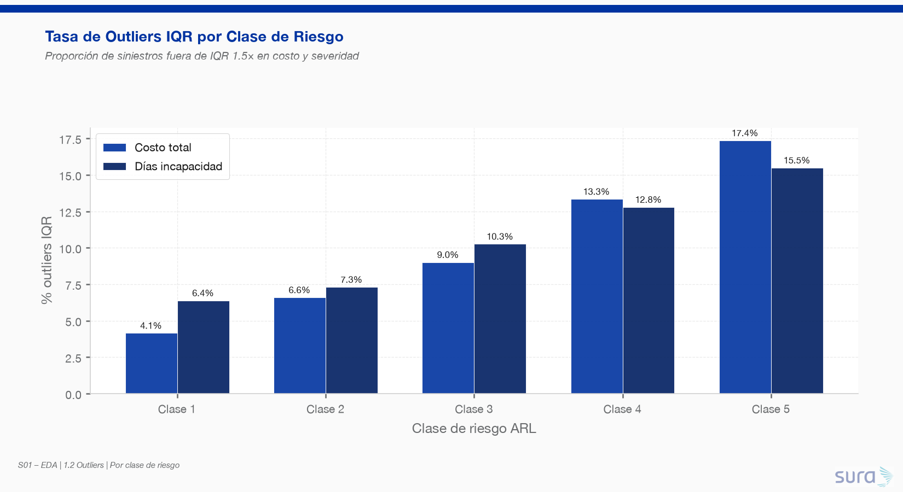

| Clase | % IQR costo | % IQR días |
|---|---|---|
| 1 | 4.1% | 6.4% |
| 2 | 6.6% | 7.3% |
| 3 | 9.0% | 10.3% |
| 4 | 13.3% | 12.8% |
| 5 | **17.4%** | **15.5%** |

- La tasa de “outliers” IQR **crece con la clase de riesgo**: muchos extremos son estructurales del segmento de alto riesgo, no anomalías a depurar.
- **Implicación:** winsorizar *globalmente* puede atenuar señal de clase 5; evaluar winsorización **estratificada por clase** o modelar cola con distribución de severidad (Gamma/Lognormal) en S03.

**C3 – Impacto agregado del tratamiento**
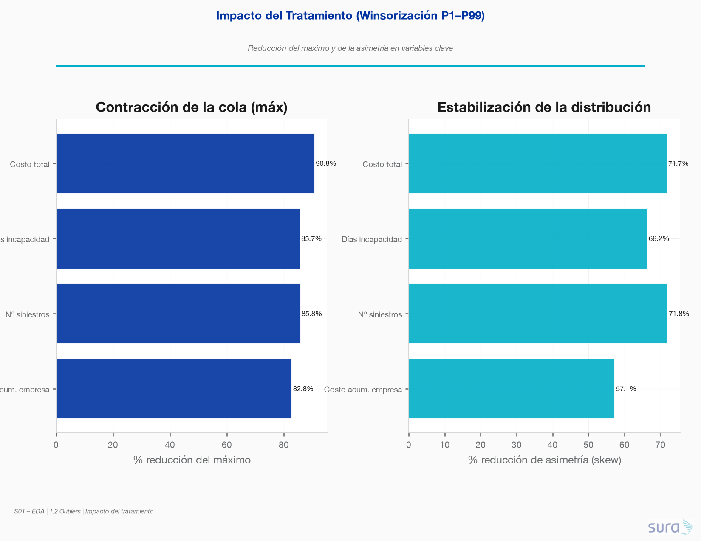

- Contracción del máximo ~83–91% y caída de asimetría ~57–72% en variables clave, clipando ≤2% de filas.
- Staging listo: `siniestros_tratados` / `empresa_siniestralidad_tratada` (columnas `*_w`) + tablas de flags/resumen.

---

## Síntesis outliers y condicionantes para el modelado

| Hallazgo | Implicación para S02 / S03 / S04 / S05 |
|---|---|
| IQR/MAD marcan ~12–15% en costo/severidad | No borrar por IQR; usar solo como diagnóstico de cola |
| P1–P99 clipa ~1–2% y reduce skew ~60–70% | **Tratamiento elegido:** winsorización P1–P99 en features numéricas |
| No eliminar filas | Conservar eventos para resultado técnico / análisis de cola |
| Outliers IQR ↑ con clase de riesgo (4–17%) | Considerar winsorización estratificada o familia de cola pesada |
| Datasets `*_tratados` + flags en staging | Usar `*_w` / `log_*_w` en training; originales para métricas de negocio de cola |

---

## 1.2.6 – Correlación y Colinealidad entre Predictores Candidatos (resultados preliminares)

> Generado a partir de `05-analisis_correlaciones/analisis_correlaciones.py` · Base: `empresa_siniestralidad_tratada` (5 000) + `temporal_empresa_anio` con lag · Métodos: Spearman / Pearson / VIF / número de condición κ.

---

### A. Correlación entre predictores y con outcomes

**A1 – Matriz Spearman (predictores + outcomes)**
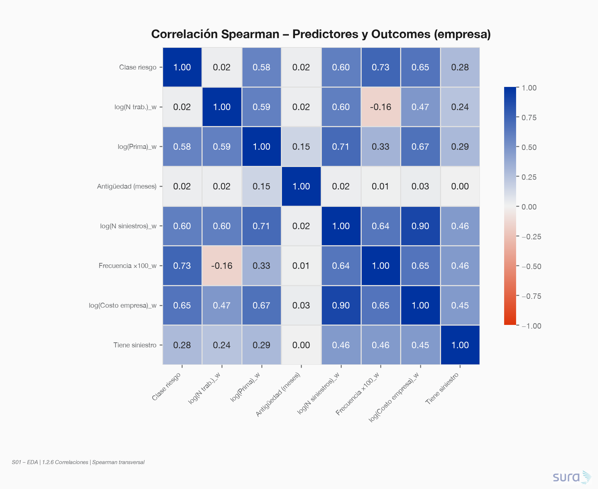

| Par (predictores) | ρ Spearman | Lectura |
|---|---|---|
| `log_prima_anual_w` ~ `log_n_trabajadores_w` | 0.59 | Asociación **moderada** (no ≥ 0.70) |
| `log_prima_anual_w` ~ `clase_riesgo` | 0.58 | Prima crece con clase (pricing ARL) |
| `clase_riesgo` ~ `log_n_trabajadores_w` | ≈ 0.02 | Independientes |
| `antiguedad_meses` ~ resto | ≤ 0.15 | Irrelevante bivariada |

**A2 – Pearson en escala log/winsor (solo predictores)**
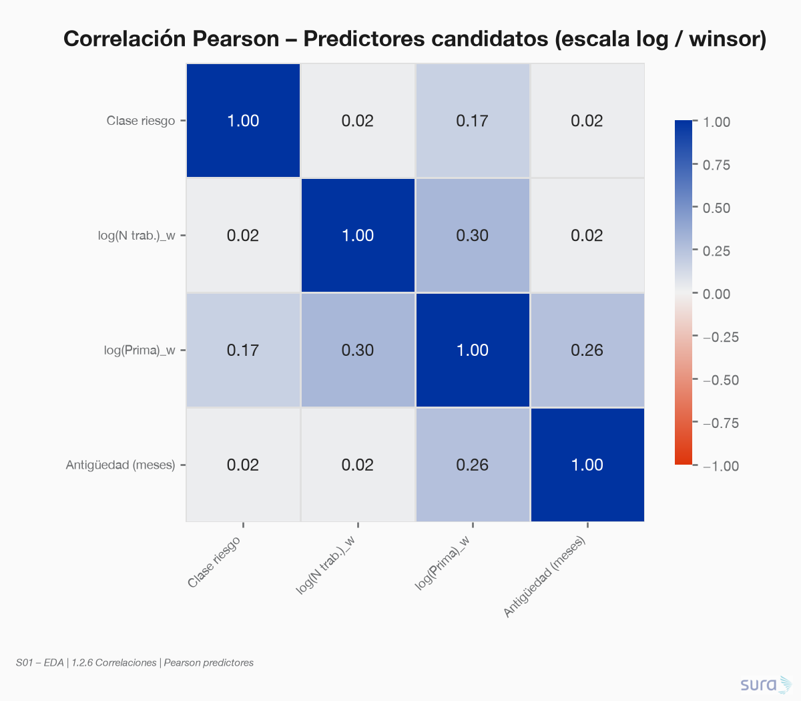

- Pearson prima↔tamaño ≈ **0.30** y prima↔clase ≈ **0.17** — claramente menores que Spearman → la asociación es **monótona/por rangos**, no lineal fuerte.
- Implicación: reportar Spearman como métrica principal de asociación en este portafolio sesgado.

**A3 – Predictores × targets (transversal)**
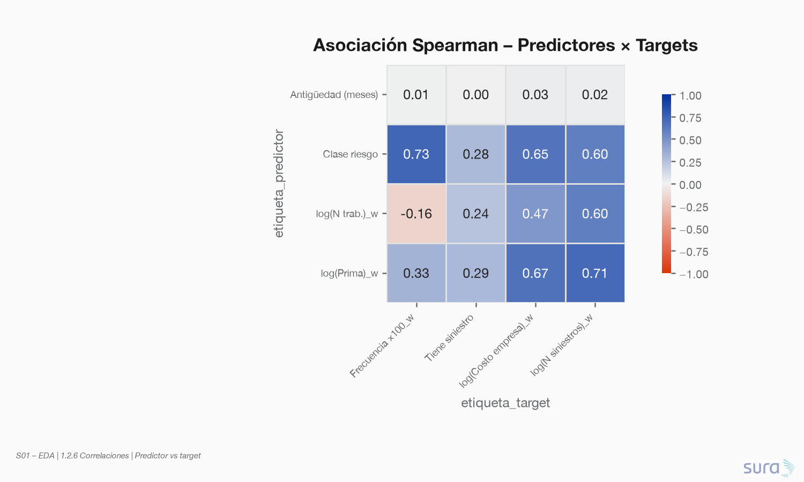

| Predictor | Target | ρ Spearman |
|---|---|---|
| `clase_riesgo` | `frecuencia_x100_w` | **0.73** |
| `log_prima_anual_w` | `log_n_siniestros_w` | **0.71** |
| `log_prima_anual_w` | `log_costo_total_empresa_w` | 0.67 |
| `clase_riesgo` | `log_costo_total_empresa_w` | 0.65 |
| `log_n_trabajadores_w` | `log_n_siniestros_w` | 0.60 |
| `log_n_trabajadores_w` | `frecuencia_x100_w` | **−0.16** |
| `antiguedad_meses` | outcomes | ≈ 0 |

- Confirma el gradiente de clase sobre frecuencia y el efecto de exposición (tamaño ↑ conteo; ↓ levemente la tasa).
- `log_n_siniestros_w` ~ `log_costo_total_empresa_w` = **0.90** (outcomes casi redundantes entre sí — no son features).

---

### B. Colinealidad (VIF y pares altos)

**B1 – VIF del set panel con lag**
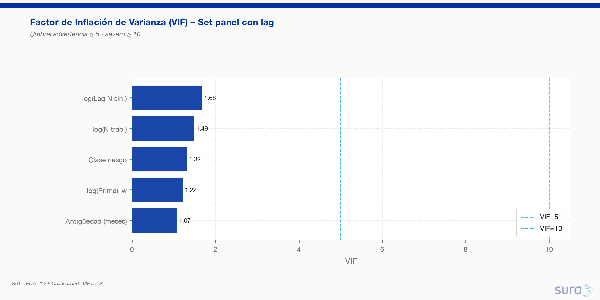

| Variable | VIF (set B) | Nivel |
|---|---|---|
| `log_lag_n_siniestros` | 1.68 | bajo |
| `log_n_trabajadores` | 1.49 | bajo |
| `clase_riesgo` | 1.32 | bajo |
| `log_prima_anual_w` | 1.22 | bajo |
| `antiguedad_meses` | 1.07 | bajo |

- **VIF máximo ≈ 1.68 ≪ 5** → **no hay colinealidad severa** entre predictores numéricos candidatos.
- Prima y tamaño **pueden coexistir** en el mismo modelo lineal/GLM sin inflación grave de varianza.

**B2 – Pares \|ρ\| ≥ 0.70**
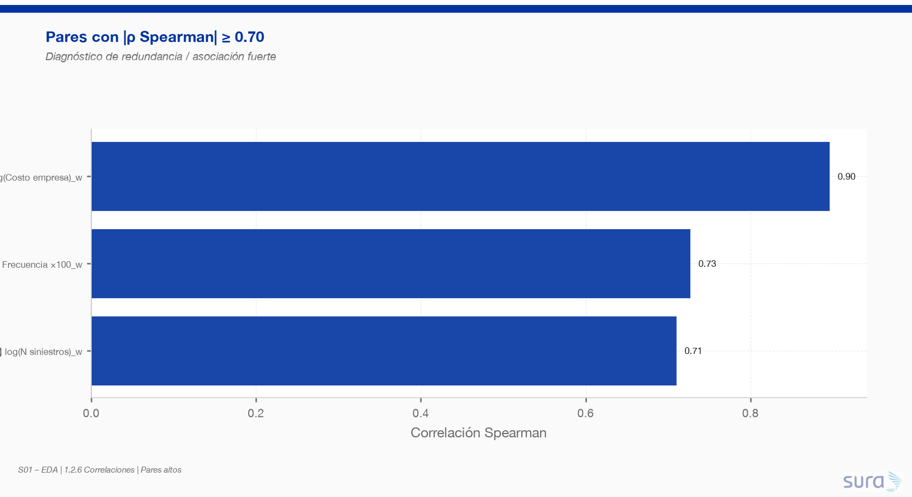

| Par | ρ | Tipo |
|---|---|---|
| `log_n_siniestros_w` ↔ `log_costo_total_empresa_w` | 0.90 | outcome ↔ outcome |
| `clase_riesgo` ↔ `frecuencia_x100_w` | 0.73 | predictor ↔ outcome |
| `log_prima_anual_w` ↔ `log_n_siniestros_w` | 0.71 | predictor ↔ outcome |

- **Ningún par predictor–predictor** supera 0.70. La “colinealidad percibida” prima–tamaño (ρ≈0.59) es moderada y compatible con VIF bajo.

**B3 – Scatter prima vs tamaño**
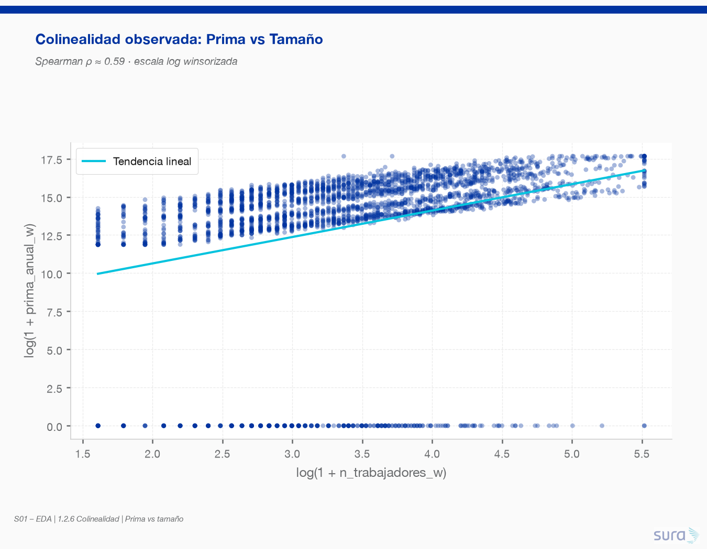

- Nube con tendencia positiva pero dispersión material; no es una relación casi perfecta que fuerce a descartar una de las dos.

---

### C. Sets de features y panel con lag

**C1 – Comparación de VIF entre sets**
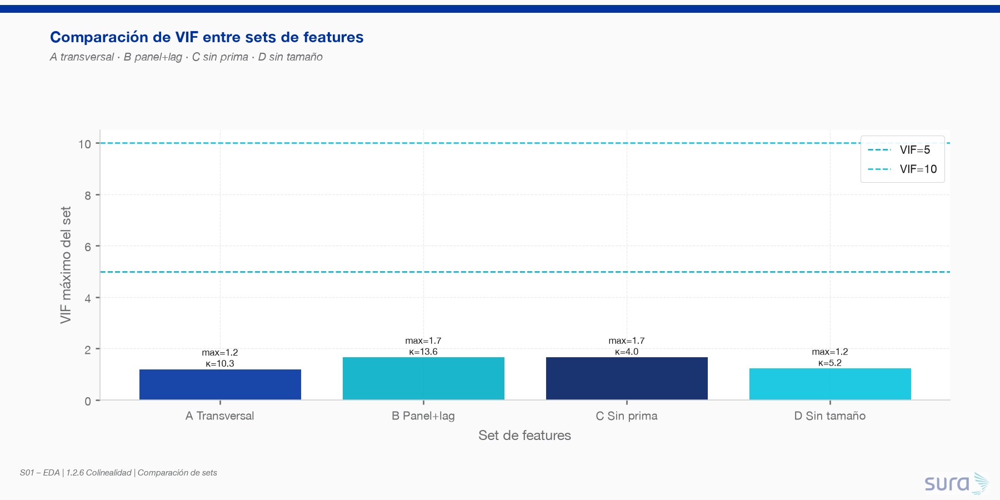

| Set | Features | max VIF | κ (condición) |
|---|---|---|---|
| A Transversal | clase + tamaño + prima + antigüedad | 1.22 | 10.3 |
| B Panel + lag | A + log(lag N sin.) | **1.68** | 13.6 |
| C Sin prima | clase + tamaño + antigüedad + lag | 1.68 | **4.0** |
| D Sin tamaño | clase + prima + antigüedad + lag | **1.25** | 5.2 |

- El set **C** tiene la mejor condición numérica (κ≈4); B es aceptable y más completo.
- Reducir por colinealidad **no es obligatorio**; sí es opcional si se busca máxima estabilidad numérica.

**C2 – Heatmap set recomendado C**
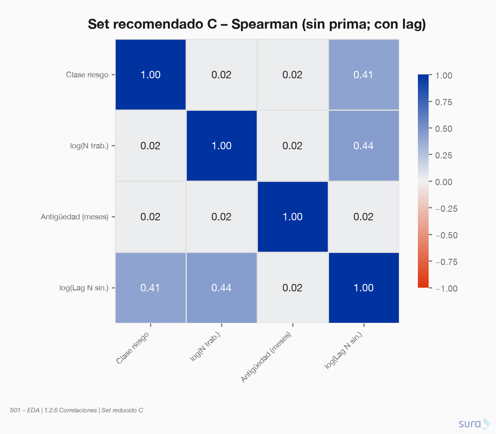

**C3 – Asociaciones en panel empresa-año (con lag)**
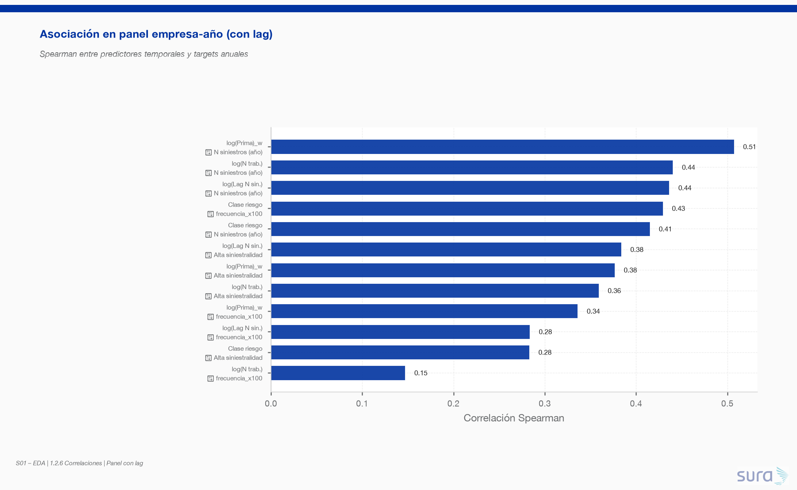

| Predictor | Target anual | ρ Spearman |
|---|---|---|
| `log_prima_anual_w` | `n_siniestros` | 0.51 |
| `log_n_trabajadores` | `n_siniestros` | 0.44 |
| `log_lag_n_siniestros` | `n_siniestros` | 0.44 |
| `log_lag_n_siniestros` | `alta_siniestralidad` | 0.38 |
| `clase_riesgo` | `frecuencia_x100` | 0.43 |
| `clase_riesgo` | `alta_siniestralidad` | 0.28 |

- El lag aporta señal material al target binario Top 10% (coherente con persistencia 1.2.4), sin VIF problemático.
- En panel, las ρ son menores que en el corte transversal agregado (escala año vs acumulado multi-año).

---

## Síntesis correlación / colinealidad y condicionantes para el modelado

| Hallazgo | Implicación para S02 / S03 / S04 / S05 |
|---|---|
| VIF max ≈ 1.7 en todos los sets | **No hace falta eliminar** predictores por colinealidad clásica |
| ρ Spearman prima↔tamaño ≈ 0.59 | Redundancia parcial; ambas OK, o elegir una si se prioriza interpretabilidad |
| `clase_riesgo` ↔ frecuencia ≈ 0.73 | Feature obligatorio; fuerte separación de riesgo |
| Lag de conteo ↔ target / alta_siniestralidad | Incluir `log_lag_n_siniestros` con shift estricto (anti-leakage) |
| Antigüedad ≈ 0 con outcomes | Baja prioridad en el feature set |
| Sector (categórico, 1.2.3) | Incluir vía encoding; no evaluado en VIF numérico |
| Geografía (1.2.3) | Control secundario; evitar overfit de dummies |
| Staging `predictores_recomendacion` + `colinealidad_vif` | Contrato de features para S03 / baseline S01-1.5 |

**Feature set numérico sugerido para S03 (panel):**
`clase_riesgo` + `log_n_trabajadores` (exposición/offset) + `log_lag_n_siniestros` + (`log_prima_anual_w` opcional) + `sector` (encoding) · antigüedad/geografía opcionales.

---

*Análisis realizado con `sura_brand` · Sección S01-1.2 EDA · Prueba Técnica Grupo SURA.*
