### **Requerimiento**
Realizar un análisis exploratorio completo: distribuciones univariadas de la frecuencia, la severidad, los costos y el tamaño de las empresas; asociaciones bivariadas de la siniestralidad con la clase de riesgo, el sector, el tamaño y la geografía; estructura temporal y estacionalidad; detección y tratamiento de valores atípicos; y correlación y colinealidad entre los predictores candidatos. Acompañar cada hallazgo con la visualización que lo sustenta y cierre con la síntesis de lo que condiciona el modelado.

---

## 1.2.2 – Análisis Univariado (resultados preliminares)

> Generado a partir de `01-analisis_univariado/analisis_univariado.py` · 5 000 empresas · 39 894 siniestros · 2018–2024.

---

### A. Frecuencia de Siniestros

**A1 – Número de siniestros por empresa**
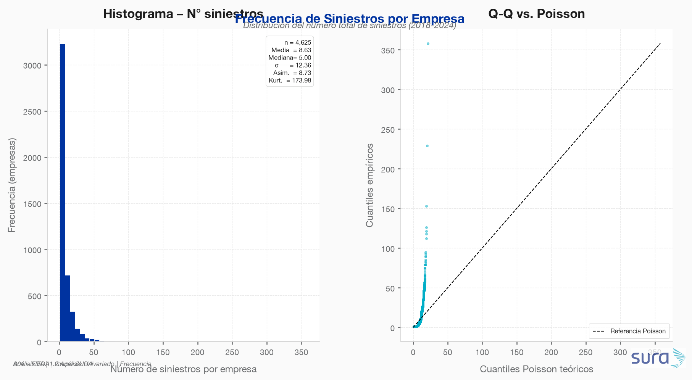

- La distribución del conteo de siniestros por empresa es **fuertemente asimétrica positiva** (cola larga derecha): la mayoría de empresas registra pocos eventos, mientras un pequeño grupo acumula muchos.
- El Q-Q contra una distribución Poisson muestra desviaciones sistemáticas en la cola superior, evidenciando **sobredispersión** — condición favorable para modelos Binomial Negativa o hurdle/zero-inflated en S03.

**A2 – Tasa de siniestros por 100 trabajadores**
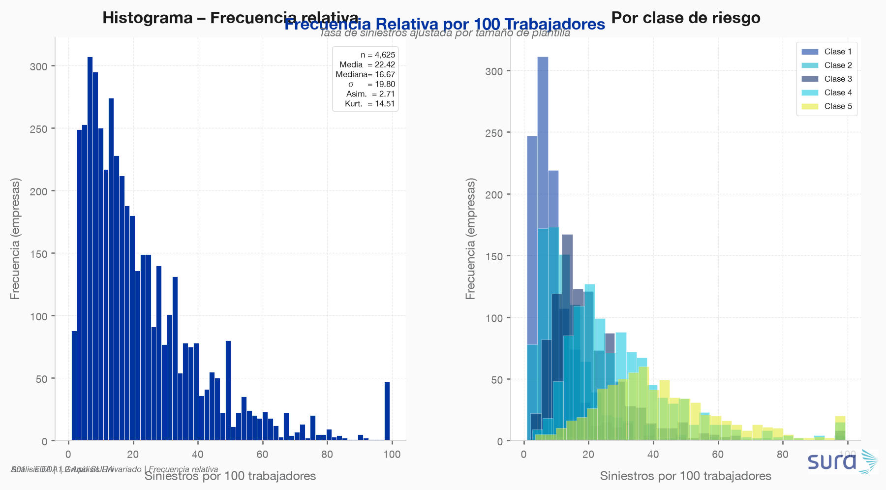

- La frecuencia relativa también exhibe asimetría importante. Al segmentar por clase de riesgo, la **separación de distribuciones es notoria**: las clases 4 y 5 desplazan la moda hacia tasas más altas, confirmando que `clase_riesgo` es un predictor fuerte.
- Un **7.5% de empresas** no registró ningún siniestro en el periodo, lo cual deberá tratarse en el modelado (modelos de conteo con componente de ceros).

**A3 – Evolución temporal anual**
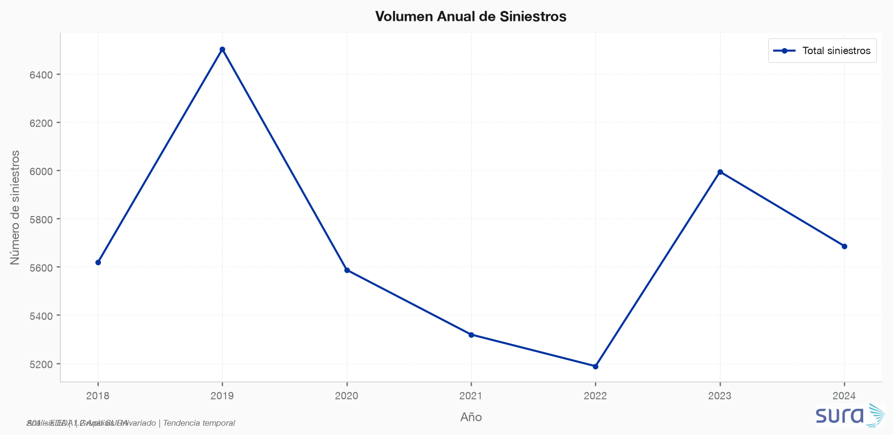

- El volumen de siniestros se mantiene relativamente estable año a año, sin una tendencia creciente o decreciente pronunciada, lo que sugiere que el portafolio es estacionario en primer orden. **Implicación para modelado:** las features de año calendario pueden tener baja contribución marginal.

---

### B. Severidad (días de incapacidad)

**B1 – Distribución de días de incapacidad**
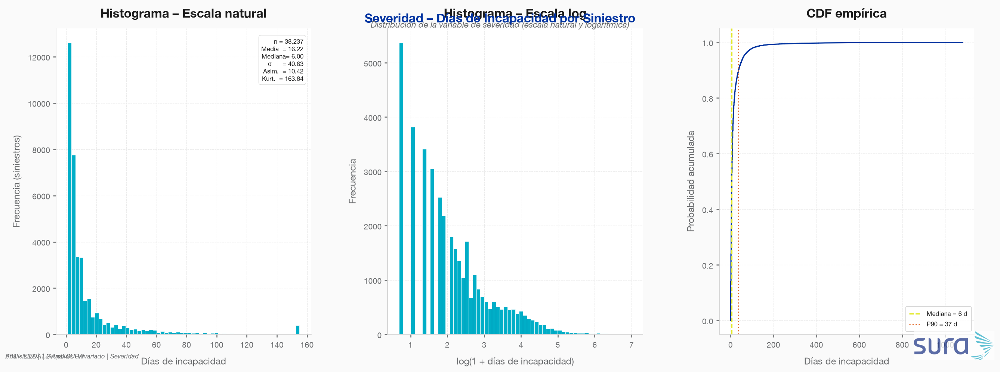

- **Mediana: 6 días. P90: 37 días. Asimetría: 10.42** → distribución extremadamente leptocúrtica con cola derecha pesada.
- La transformación logarítmica produce una distribución aproximadamente simétrica, confirmando que la variable se debe modelar en escala log (familia Gamma o Lognormal).
- La CDF muestra que el 90% de siniestros genera 37 días o menos de incapacidad, pero la cola restante concentra carga desproporcionada.

**B2 – Severidad por tipo de siniestro (AT vs EL)**
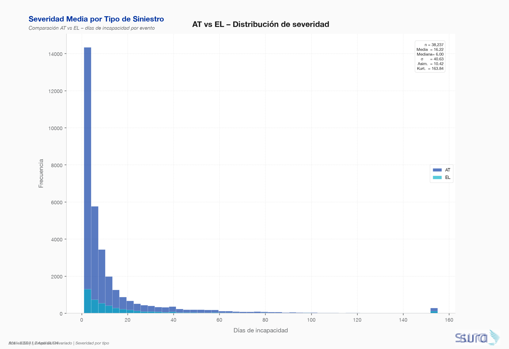

- Las **Enfermedades Laborales (EL)** presentan distribuciones de severidad con media y cola superior significativamente más altas que los **Accidentes de Trabajo (AT)**. Esta diferencia estructural exige modelos separados de severidad (S03).

**B3 – Boxplot por nivel de gravedad**
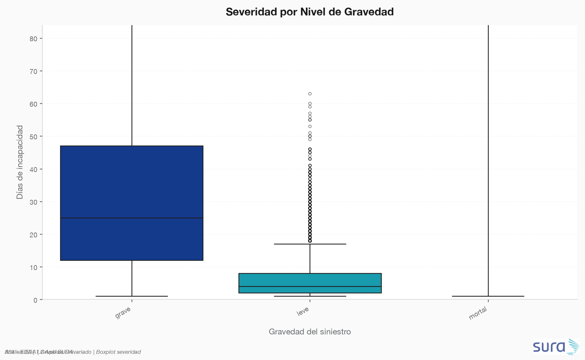

- La variable `gravedad` discrimina correctamente los días de incapacidad: medianas crecientes de leve → mortal. No obstante, la varianza intra-grupo es alta, especialmente en categorías moderado y grave — confirma la necesidad de features adicionales más allá de la gravedad.

---

### C. Costos

**C1 – Distribución de costos por siniestro**
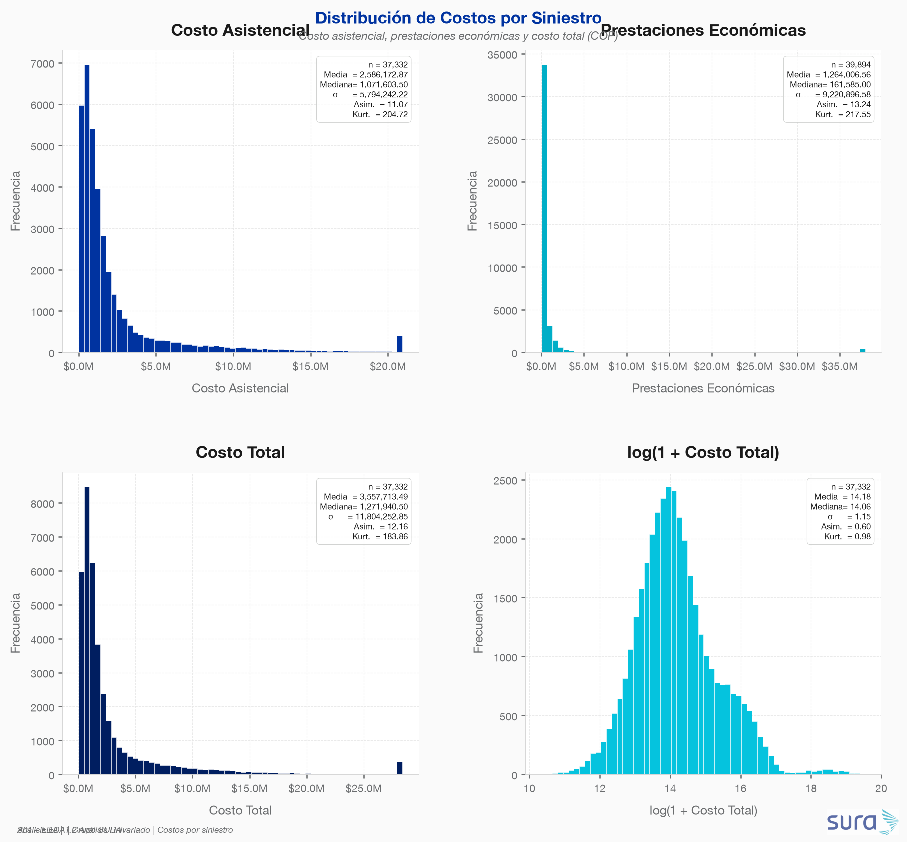

- **Mediana del costo total por siniestro: $1,272,000 COP. P90: $7,232,000 COP.**
- Tanto el costo asistencial como las prestaciones económicas exhiben distribuciones log-normales, con colas muy pesadas. La transformación `log(1+x)` normaliza satisfactoriamente ambas variables.
- **Implicación:** el resultado técnico del portafolio depende desproporcionadamente de una fracción pequeña de siniestros costosos (candidatos a manejo separado como "eventos catastróficos" en S03).

**C2 – Costo acumulado por empresa**
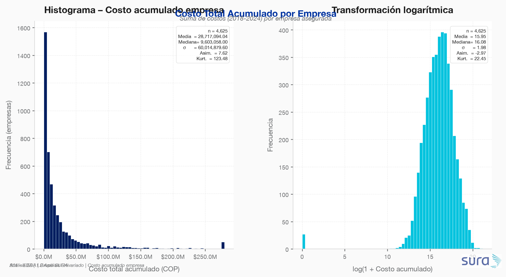

- La distribución del costo acumulado por empresa es también fuertemente sesgada. La versión logarítmica es razonablemente simétrica, apta para regresión estándar.

**C3 – Concentración de costos (Curva de Lorenz)**
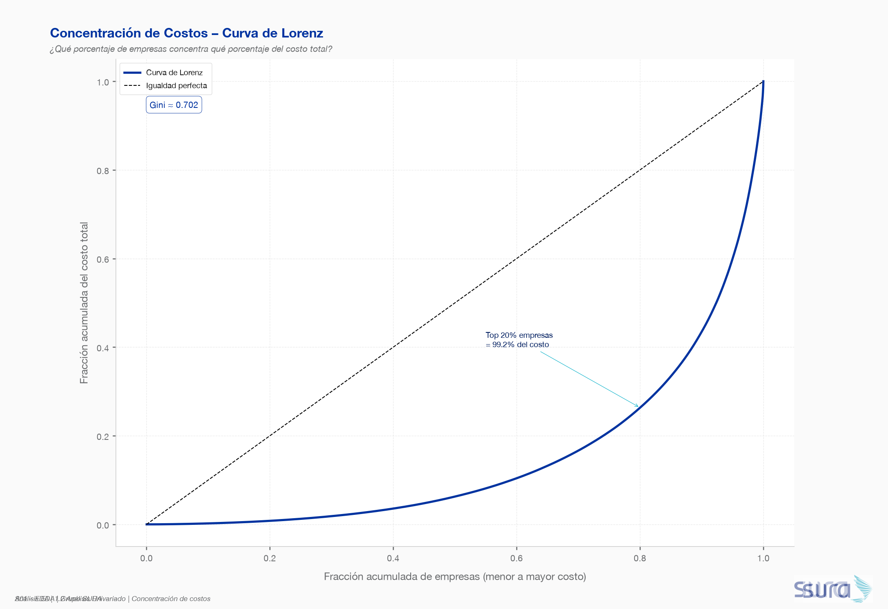

- **Gini ≈ 0.702** → concentración muy alta de costos.
- El **top 10% de empresas** concentra el **56.5% del costo total** del portafolio. Esto implica que las estrategias de prevención focalizadas en el decil superior tienen un retorno potencial enorme.
- **Implicación para el negocio (S03/S04):** el modelo debe poder identificar correctamente ese decil crítico — la métrica prioritaria no debe ser accuracy global sino Recall/Precisión en el extremo superior.

---

### D. Tamaño de las Empresas

**D1 – Distribución del número de trabajadores**
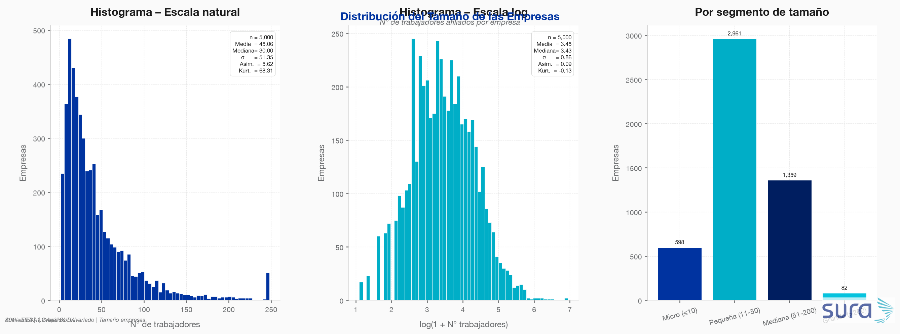

- La distribución de `n_trabajadores` es **bimodal en escala natural** con fuerte sesgo positivo. El logaritmo revela una distribución aproximadamente unimodal.
- Segmentación por tamaño del portafolio:
  - **Micro (≤10 trab.):** ~12% de empresas
  - **Pequeñas/Medianas (11-200 trab.):** ~86.4% de empresas ← segmento dominante
  - **Grandes (>200 trab.):** ~1.6% de empresas
- El portafolio está **dominado por PyMEs**, lo que es un dato crítico para el diseño del sistema de recomendación (S05): las recomendaciones deben ser aplicables a empresas con pocos recursos.

**D2 – Prima anual**
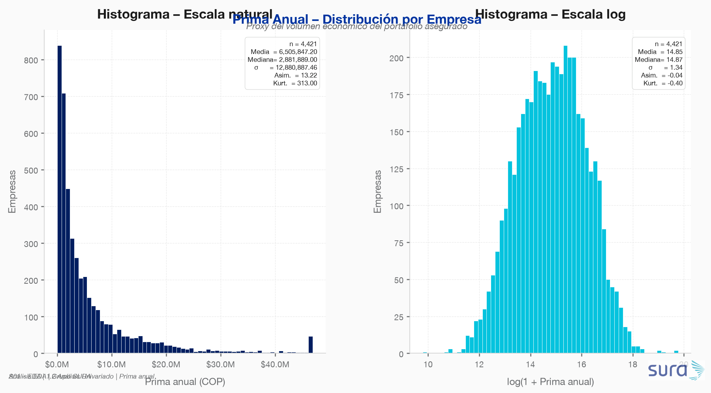

- La prima anual también exhibe alta asimetría. La correlación esperada entre `prima_anual`, `n_trabajadores` y `clase_riesgo` se verificará en el análisis bivariado (1.2.3). Posible proxy del riesgo total asumido por la ARL.

**D3 – Antigüedad por clase de riesgo**
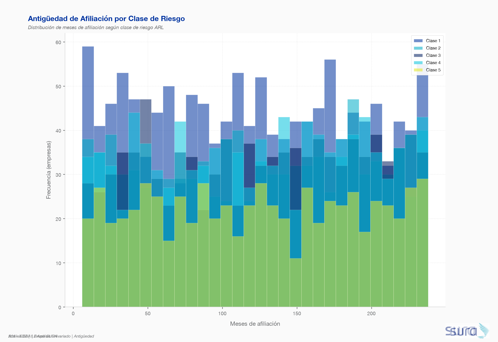

- La distribución de antigüedad es relativamente homogénea entre clases de riesgo, sin una diferencia sistemática clara. No se evidencia sesgo de selección por antigüedad asociado al riesgo.

---

### E. Variables Categóricas

**E1 – Tipo de siniestro**
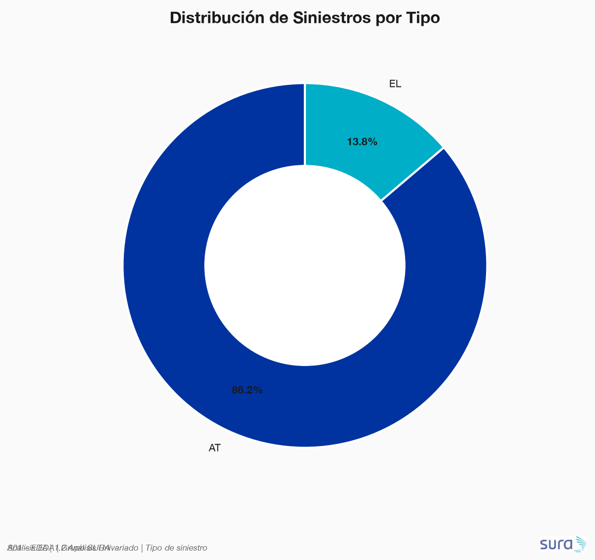

- Predominio de **AT (Accidentes de Trabajo)** sobre EL, lo cual es consistente con el perfil de un portafolio PyME industrial.

**E2 – Gravedad**
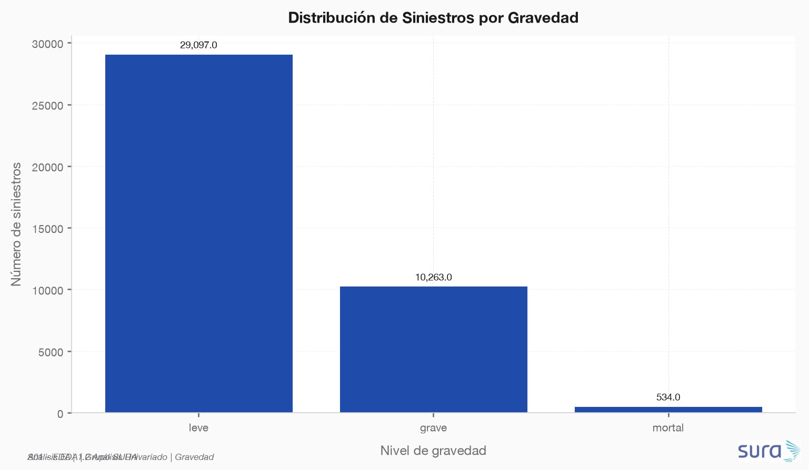

- La categoría **"leve"** es la más frecuente, seguida por "moderado". Los eventos graves y mortales son poco frecuentes pero concentran costos desproporcionados — confirma necesidad de modelar la cola derecha.

**E3 – Sector económico**
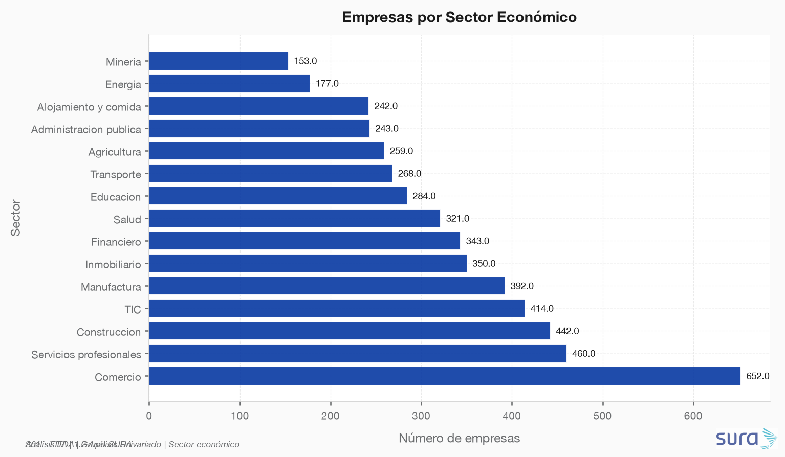

- El portafolio tiene representación diversa por sector. Los sectores con mayor número de empresas serán analizados en detalle en el análisis bivariado para identificar si la exposición al riesgo difiere significativamente entre ellos.

---

## Síntesis y condicionantes para el modelado

| Hallazgo | Implicación para S03 / S04 / S05 |
|---|---|
| Frecuencia sobredispersa, 7.5% de ceros | Modelo Binomial Negativa o Zero-Inflated Poisson |
| `clase_riesgo` separa claramente distribuciones | Feature crítico; incluir en todos los modelos |
| Costos log-normales con cola pesada | Modelar severidad en escala log (Gamma / Lognormal) |
| Gini costos ≈ 0.70; top 10% = 56.5% del costo | Recall en el decil superior es la métrica de negocio central |
| PyMEs dominan (86.4%) | Recomendaciones deben ser factibles para empresas con recursos limitados |
| Asimetría severidad = 10.42 | Transformación log obligatoria; winsorizar outliers extremos |
| AT y EL tienen distribuciones distintas | Modelos de severidad separados por tipo de siniestro |

---

*Análisis realizado con `sura_brand` · Sección S01-1.2 EDA · Prueba Técnica Grupo SURA.*
