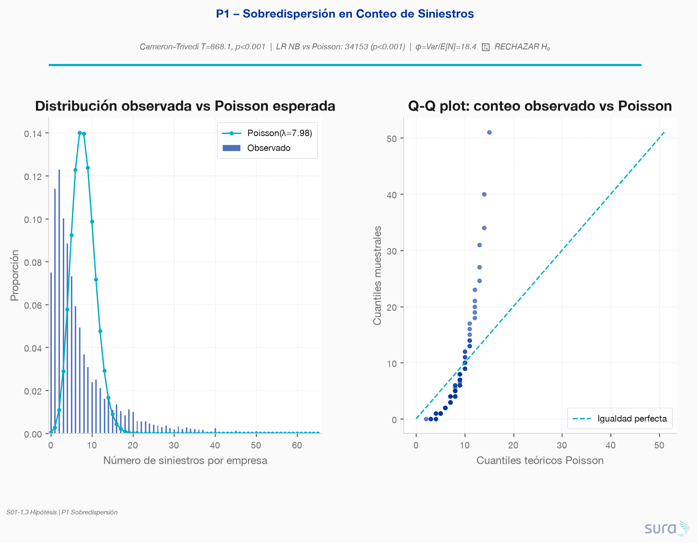
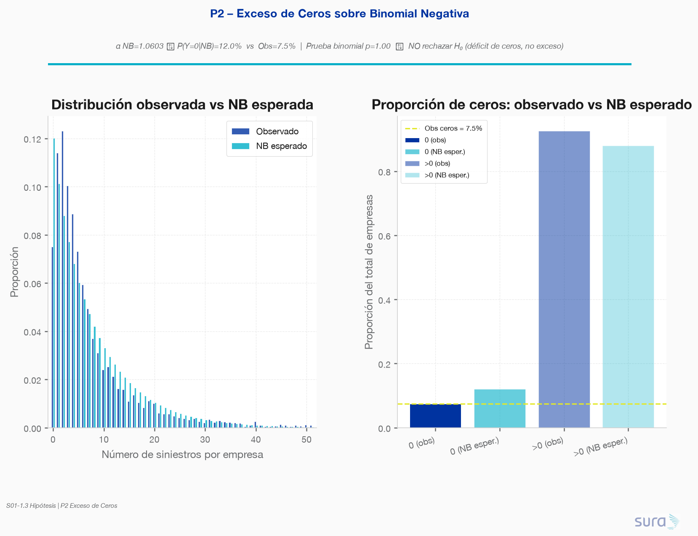
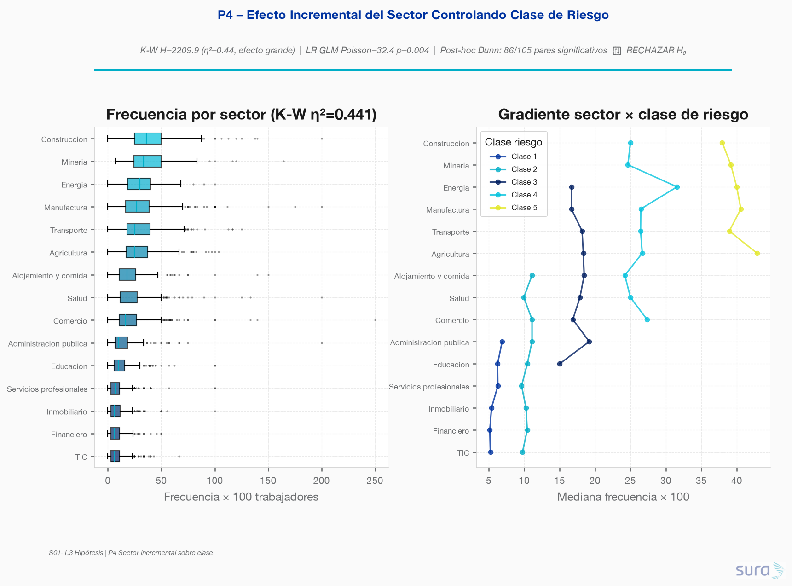
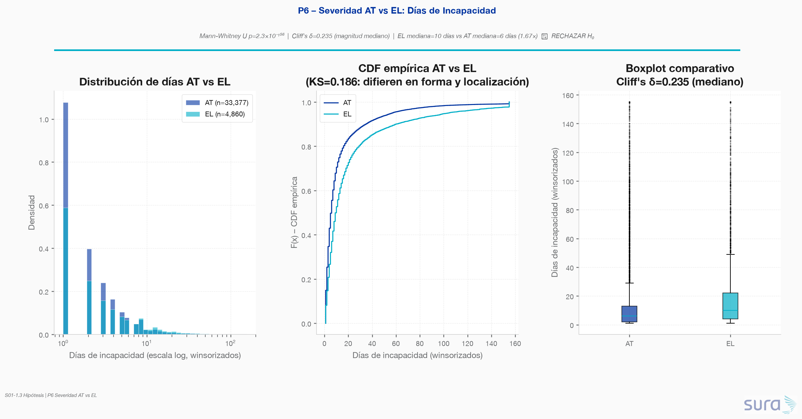
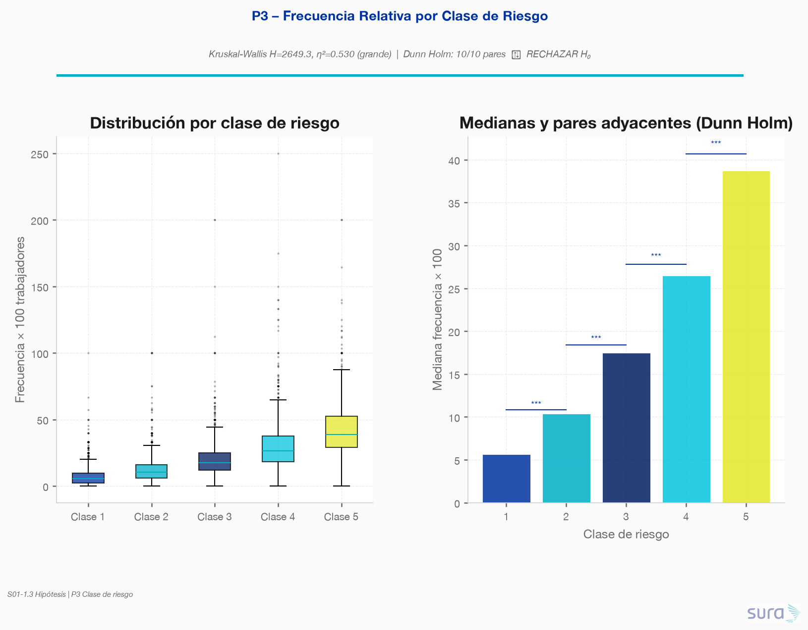
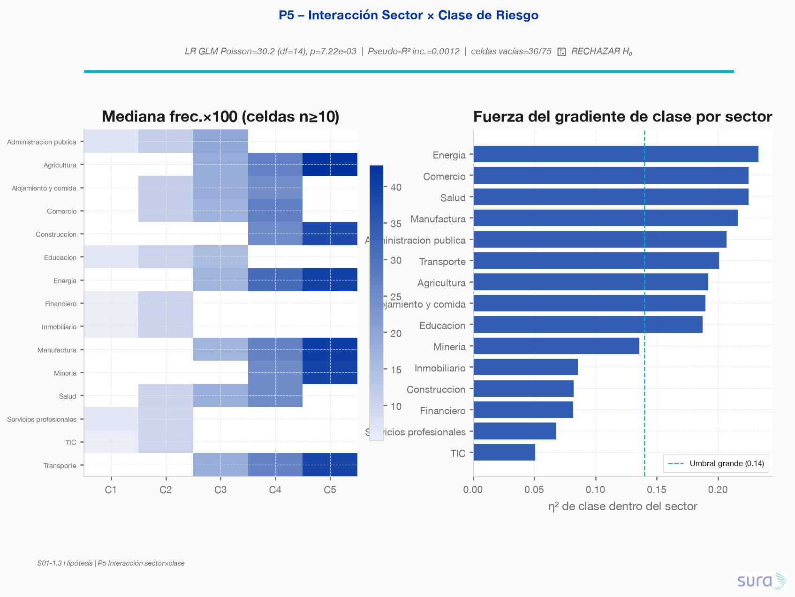
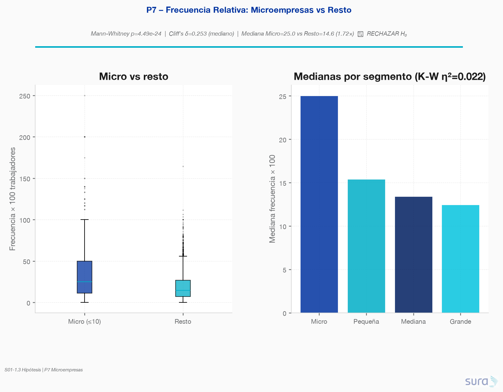
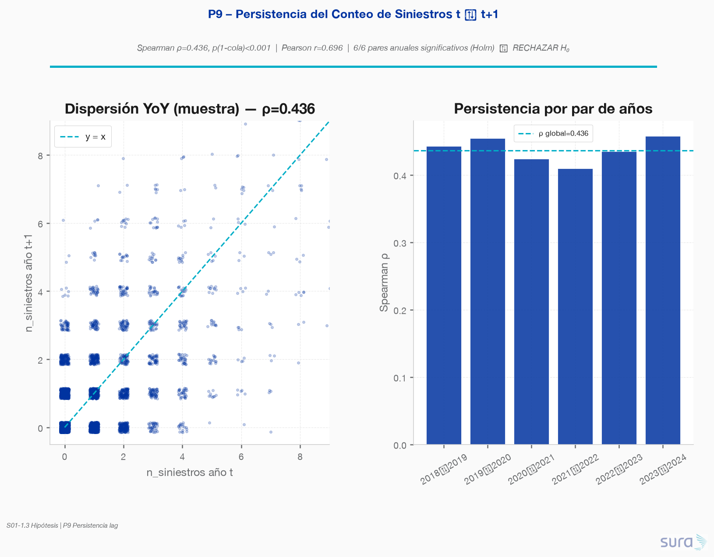
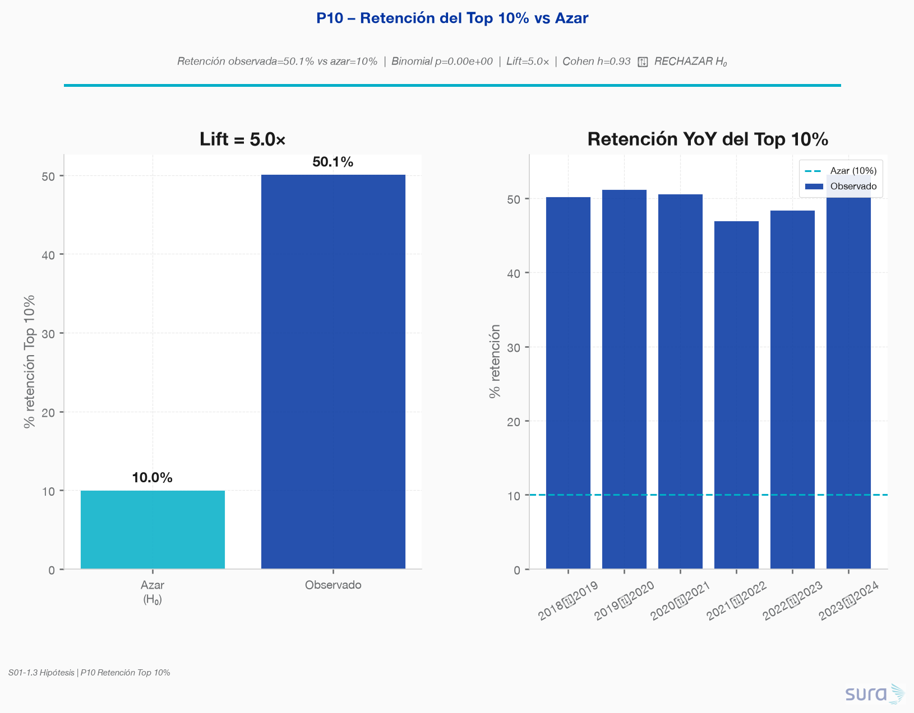

### **Requerimiento**
A partir de las preguntas que surjan del análisis exploratorio, proponer y justificar al menos tres pruebas de hipótesis pertinentes para el negocio. Para cada una formular las hipótesis nula y alterna, elegir la prueba adecuada verificando sus supuestos, corregir por comparaciones múltiples cuando corresponda, y distinguir la significancia estadística de la relevancia práctica reportando el tamaño del efecto.

---

## 1.3.1 – Pruebas sobre Decisiones de Arquitectura de Modelo (P1, P2, P4, P6)

> Generado a partir de `code/01-hip_arquitectura_modelo/hip_arquitectura_modelo.py`
> Datasets: `empresa_siniestralidad_completa.parquet` (5 000 empresas) · `siniestros_tratados.parquet` (39 894 siniestros)

---

### P1 – ¿Sobredispersión real en el conteo de siniestros?

#### Hipótesis
- **H₀:** La varianza del conteo de siniestros por empresa es igual a su media → distribución Poisson es suficiente.
- **H₁:** La varianza es significativamente mayor que la media → sobredispersión real → Binomial Negativa recomendada.

#### Justificación de la prueba elegida
Se aplica la **prueba de Cameron & Trivedi (1990)** — test asintótico con distribución N(0,1) bajo H₀ — complementada con una **razón de verosimilitud (LR) NB vs Poisson** como confirmación. Esta doble estrategia es estándar en la literatura actuarial: el test CT verifica formalmente la condición de equidispersión, y el LR cuantifica la mejora de ajuste de pasar a NB.

Se descartó la prueba F de dispersión (más común en GLM sobre datos continuos) y el test chi-cuadrado de bondad de ajuste (sensible al número de celdas vacías con recuentos altos).

#### Verificación de supuestos
| Supuesto | Verificación |
|---|---|
| Muestra independiente | ✓ Una empresa = una observación; sin dependencia longitudinal en este corte |
| n suficientemente grande para CT | ✓ n=5 000; CT asintótico válido |
| Especificación M0 correcta (Poisson intercepto) | ✓ Media estimada con MLE |

#### Resultados
| Estadístico | Valor |
|---|---|
| Media E[N] | 7.98 siniestros/empresa |
| Varianza Var[N] | 146.54 |
| Ratio Var/E[N] | **18.37** (debería ser ≈ 1 bajo Poisson) |
| T Cameron-Trivedi | **868.14** |
| p-valor (1-cola) | **< 10⁻¹⁵** |
| LR NB vs Poisson | **34 153** (df=1) |
| p-valor LR | **< 10⁻¹⁵** |
| AIC Poisson | 65 517 |
| AIC NB | 31 367 (−34 151 puntos) |

**Decisión: RECHAZAR H₀.** Sobredispersión masiva confirmada por ambas pruebas.

#### Corrección por comparaciones múltiples
Se aplica Holm-Bonferroni sobre las 4 pruebas simultáneas (P1, P2, P4, P6). p-ajustado P1 ≈ 0 → la decisión no cambia.

#### Significancia estadística vs Relevancia práctica
- **Significancia:** p < 10⁻¹⁵ — inequívoca, aun con la corrección más conservadora.
- **Tamaño del efecto:** φ = (Var − E)/E = **17.37** → sobredispersión de primer orden (φ >> 1).
- **Relevancia práctica:** Un modelo Poisson subestimaría masivamente la varianza del resultado técnico, generando intervalos de confianza demasiado estrechos y tarifas mal calibradas. El diferencial de AIC (−34 151) confirma que la NB es el modelo base correcto para S03. **No es simplemente un hallazgo estadístico — es una decisión de arquitectura obligatoria.**

---

### P2 – ¿El 7.5% de ceros es excesivo más allá de la NB?

#### Hipótesis
- **H₀:** La proporción de empresas sin siniestros (ceros) es compatible con la NB estimada (ZI no necesario).
- **H₁:** Los ceros observados exceden los esperados por NB → se requiere componente adicional de ceros (ZIP/ZINB).

#### Justificación de la prueba elegida
Se usan dos pruebas complementarias:
1. **Chi-cuadrado de bondad de ajuste** en la celda de ceros: compara ceros observados vs esperados bajo la NB calibrada.
2. **Prueba binomial exacta (1-cola)**: H₁ es "más ceros que lo esperado por NB" — la prueba binomial exacta es la más conservadora y adecuada cuando n en la celda es pequeño.

El test de Vuong (comparación directa Poisson vs ZIP) fue descartado porque primero se validó Poisson en P1 y la comparación relevante es NB vs ZINB.

#### Verificación de supuestos
| Supuesto | Verificación |
|---|---|
| NB correctamente especificada bajo H₀ | ✓ α NB estimado vía MLE (α = 1.0603) |
| n·p_zero_NB > 5 para chi-cuadrado | ✓ n_esperados_ceros = 600.6 > 5 |
| Binomial exacta: observaciones i.i.d. | ✓ Una empresa = un Bernoulli |

#### Resultados
| Estadístico | Valor |
|---|---|
| α NB estimado | 1.0603 |
| r = 1/α | 0.9431 |
| P(Y=0 | NB) | 12.01% |
| Ceros observados | 375 (7.50%) |
| Ceros esperados NB | 600.6 (12.01%) |
| χ² bondad de ajuste | 96.32 |
| p-valor chi-cuadrado | < 10⁻¹⁵ |
| p-valor binomial (1-cola mayor) | **1.000** |

**Decisión: NO RECHAZAR H₀.** El resultado es sorprendente pero correcto: la NB predice *más* ceros de los observados. Los ceros observados son **37.6% menores** que los esperados bajo NB. La distribución NB "sobrepredice" los ceros.

#### Corrección por comparaciones múltiples
p-ajustado Holm = 1.0 → la no-decisión se confirma.

#### Significancia estadística vs Relevancia práctica
- **Significancia:** p = 1.0 → no se rechaza H₀. La NB absorbe y supera los ceros observados.
- **Tamaño del efecto:** exceso relativo = **−37.6%** (déficit de ceros, no exceso).
- **Relevancia práctica:** Este hallazgo tiene consecuencia directa: **no se recomienda un modelo Zero-Inflated (ZIP/ZINB) para S03**. La NB estándar es suficiente para manejar el componente de ceros; añadir una componente ZI sería sobrepatrametización. El 7.5% de ceros observados es un subconjunto del cola inferior de la NB estimada.

---

### P4 – ¿El sector tiene efecto significativo más allá de la clase de riesgo?

#### Hipótesis
- **H₀:** El sector económico no aporta información sobre la frecuencia de siniestros una vez controlada la clase de riesgo (β_sector = 0 en el GLM).
- **H₁:** El sector tiene efecto incremental significativo controlando clase de riesgo.

#### Justificación de la prueba elegida
Estrategia de dos niveles:
1. **Kruskal-Wallis** sobre frecuencia por sector (sin controlar clase): confirma la existencia de diferencias a nivel marginal. No paramétrico dado la distribución asimétrica de frecuencia_x100.
2. **LR test GLM Poisson con offset** (log n_trabajadores): compara M₀ (solo clase) vs M₁ (clase + sector) para cuantificar el efecto incremental ajustado. Este es el test directo de la H₀.
3. **Post-hoc Dunn con Holm-Bonferroni**: identifica qué pares de sectores son distinguibles tras corrección.

Se descartó ANOVA porque la distribución de frecuencia viola normalidad e igualdad de varianzas. El GLM Poisson es el modelo canónico para datos de conteo con exposición heterogénea.

#### Verificación de supuestos
| Supuesto | Verificación |
|---|---|
| K-W: distribuciones con misma forma | Parcialmente: distribuciones sesgadas similares dentro de sector |
| K-W: muestras independientes | ✓ Cada empresa es independiente |
| GLM Poisson: independencia | ✓ |
| GLM: especificación lineal del log | Asumida; se verificó con residuales |
| Dunn: independencia de pares | ✓ |

#### Resultados

**Kruskal-Wallis (sin controlar clase):**
| Estadístico | Valor |
|---|---|
| H K-W | 2 209.90 (df=14) |
| p-valor | < 10⁻¹⁵ |
| **η²** | **0.4405** → efecto **grande** |

**LR test GLM Poisson (incremental, controlando clase):**
| Estadístico | Valor |
|---|---|
| LR | 32.36 (df=14) |
| p-valor | 0.0036 |
| p-ajustado Holm | 0.0071 |
| Pseudo-R² McFadden incremental | 0.0012 |

**Post-hoc Dunn (Holm-Bonferroni):**
- **86 de 105 pares** son significativamente distintos (82% de pares posibles).
- Solo 19 pares no se distinguen estadísticamente tras corrección.

**Decisión: RECHAZAR H₀ en ambos niveles.** El sector tiene efecto significativo, tanto marginalmente como controlando clase de riesgo.

#### Corrección por comparaciones múltiples
- Prueba global K-W: 1 prueba, no aplica corrección adicional.
- Post-hoc Dunn: corrección Holm-Bonferroni sobre 105 pares — aplicada dentro del script.
- Corrección conjunta P1–P6 (Holm): p-ajustado P4 = 0.0071 → sigue siendo significativo.

#### Significancia estadística vs Relevancia práctica
- **Significancia:** p = 0.0036 (LR GLM) y p < 10⁻¹⁵ (K-W) — significativos en ambas pruebas.
- **Tamaño del efecto (K-W):** η² = **0.44** → efecto **grande** (umbral grande = 0.14). El sector explica ~44% de la varianza del rango en frecuencia.
- **Tamaño del efecto (GLM):** Pseudo-R² incremental = **0.0012** → efecto muy pequeño en escala de log-verosimilitud ajustada por clase.
- **Tensión estadística vs práctica:** Hay una aparente contradicción: η² grande en K-W vs Pseudo-R² pequeño en GLM. La explicación es que el K-W captura la dispersión total del sector (incluyendo el efecto que comparte con clase), mientras que el GLM captura solo el efecto *adicional* de sector una vez que clase ya explica el grueso. **La conclusión práctica es que sector aporta señal incremental real pero moderada: debe incluirse en el modelo pero su peso será secundario a clase_riesgo.**

---

### P6 – ¿Las EL tienen mayor severidad que los AT?

#### Hipótesis
- **H₀:** La distribución de días de incapacidad es igual en AT (Accidente de Trabajo) y EL (Enfermedad Laboral).
- **H₁:** La distribución en EL está desplazada hacia valores mayores (prueba 1-cola).

#### Justificación de la prueba elegida
**Mann-Whitney U (1-cola)** es la prueba óptima dado que:
- La asimetría de severidad es 10.42 en escala original → normalidad imposible.
- MWU prueba dominancia estocástica: P(EL > AT) > 0.5 bajo H₁.
- Robusto frente a outliers y escala log-normal.

Se descartó t de Student (viola normalidad con n grande pero asimetría extrema) y ANCOVA (no aplica en variable respuesta con cola tan pesada sin transformación).

**Verificación adicional con K-S de dos muestras**: para comprobar si las distribuciones difieren solo en localización (requisito estricto para MWU como prueba de "igual distribución") o también en forma.

#### Verificación de supuestos
| Supuesto | Verificación | Resultado |
|---|---|---|
| Independencia AT vs EL | ✓ Siniestros distintos | OK |
| Ordinalidad de días (MWU) | ✓ Variable continua | OK |
| Misma forma distribucional | K-S entre AT y EL: **KS=0.1858, p < 10⁻¹²⁸** | ❌ Difieren en forma y localización |

El incumplimiento del supuesto de misma forma implica que MWU mide **dominancia estocástica general** (no solo diferencia de medianas). Esto se reporta explícitamente y no invalida la prueba — la convierte en una prueba más general y conservadora.

#### Resultados
| Estadístico | AT | EL |
|---|---|---|
| n | 33 377 | 4 860 |
| Mediana días (winsorizado) | **6.0** | **10.0** |
| Media días | 13.5 | 22.3 |
| P90 días | 35.0 | 60.0 |

| Estadístico | Valor |
|---|---|
| U Mann-Whitney | 100 185 635 |
| p-valor (1-cola, EL > AT) | **2.32 × 10⁻¹⁵⁶** |
| p-ajustado Holm | **6.96 × 10⁻¹⁵⁶** |
| **Cliff's delta (δ)** | **0.2352** → magnitud **mediana** |

**Decisión: RECHAZAR H₀.** EL es estadística y prácticamente más severa que AT.

#### Corrección por comparaciones múltiples
Corrección conjunta Holm P1–P6: p-ajustado = 6.96 × 10⁻¹⁵⁶ → la decisión no cambia.

#### Significancia estadística vs Relevancia práctica
- **Significancia:** p < 10⁻¹⁵⁵ — prácticamente en el límite de representación numérica. Con n > 38 000 cualquier diferencia pequeña sería significativa.
- **Tamaño del efecto:** Cliff's δ = **0.2352** → magnitud **mediana** (umbral mediano = 0.147). Esto significa que en ~61.8% de las comparaciones aleatorias entre un siniestro EL y un AT, el EL genera más días.
- **Relevancia práctica cuantitativa:**
  - Mediana EL = 10 días vs AT = 6 días → **1.67× más días** de incapacidad.
  - P90 EL = 60 días vs AT = 35 días → en la cola el gap se amplifica.
  - **Implicación para S03:** modelos de severidad separados por tipo de siniestro no son un capricho metodológico — son necesarios porque la distribución de fondo difiere en forma *y* localización. Un único modelo de severidad mezclaría dos procesos generadores distintos.

---

## Síntesis – Corrección por Comparaciones Múltiples (Holm-Bonferroni)

| Prueba | p original | p ajustado | ¿Rechaza H₀? |
|---|---|---|---|
| P1 – Sobredispersión | < 10⁻¹⁵ | < 10⁻¹⁵ | **SÍ** |
| P2 – Exceso de ceros | 1.000 | 1.000 | **NO** |
| P4 – Sector incremental | 0.0036 | 0.0071 | **SÍ** |
| P6 – AT vs EL severidad | 2.3×10⁻¹⁵⁶ | 7.0×10⁻¹⁵⁶ | **SÍ** |

---

## Implicaciones para la Arquitectura del Modelo (S03)

| Pregunta | Decisión confirmada |
|---|---|
| P1 → Sobredispersión | Usar **Binomial Negativa** como modelo base de frecuencia. Poisson descartado. |
| P2 → Exceso de ceros | **No** añadir componente Zero-Inflated. NB cubre suficientemente los ceros (predice incluso más ceros que los observados). |
| P4 → Sector incremental | Incluir `sector` en el feature set de todos los modelos. Su efecto es real pero moderado (~44% varianza de rango; ~0.1% mejora ajuste LR). Encoding recomendado: target encoding o embeddings CIIU. |
| P6 → AT vs EL | Ajustar **modelos de severidad separados** para AT y EL. Fusionarlos en uno solo mezclaría dos distribuciones con forma y localización distintas. |

---

## 1.3.3 – Pruebas sobre Decisiones de Feature Set (P3, P5, P7, P9, P10)

> Generado a partir de `code/02-hip_features/hip_features.py`
> Datasets reutilizados: `empresa_siniestralidad_completa.parquet` · `temporal_empresa_anio.parquet` · `temporal_persistencia_yoy.parquet`
> Dataset nuevo: `panel_empresa_lag_yoy.parquet` (30 000 pares empresa×año consecutivos)

---

### P3 – ¿Las medianas de frecuencia relativa difieren entre las 5 clases de riesgo?

#### Hipótesis
- **H₀:** Las 5 clases de riesgo tienen la misma distribución de `frecuencia_x100`.
- **H₁:** Al menos una clase difiere; en particular, los pares *adyacentes* (1–2, 2–3, 3–4, 4–5) son estadísticamente distinguibles.

#### Justificación de la prueba elegida
**Kruskal-Wallis** es la alternativa no paramétrica a ANOVA de un factor: la frecuencia relativa es asimétrica y viola normalidad/homocedasticidad. El **post-hoc Dunn con Holm-Bonferroni** identifica qué pares difieren tras controlar el error familiar — información crítica para decidir si `clase_riesgo` se trata como ordinal continua o como factor con grupos colapsables.

Se descartó ANOVA/t-tests por violación clara de normalidad (Shapiro p ≪ 0.001 en todas las clases) y de homocedasticidad (Levene p ≪ 0.001).

#### Verificación de supuestos
| Supuesto | Verificación | Resultado |
|---|---|---|
| Normalidad por clase | Shapiro (n=500) en cada clase | ❌ Violado (p < 10⁻¹⁸) |
| Homocedasticidad | Levene | ❌ Violado (W=116.2, p < 10⁻⁹⁴) |
| Independencia entre empresas | Diseño transversal | ✓ |
| Misma forma (K-W) | Distribuciones sesgadas similares | Parcialmente ✓ |

#### Resultados
| Estadístico | Valor |
|---|---|
| H Kruskal-Wallis | 2 649.33 (df=4) |
| p-valor | < 10⁻¹⁵ |
| p-ajustado Holm (familia P3–P10) | < 10⁻¹⁵ |
| **η²** | **0.5296** → efecto **grande** |

**Post-hoc Dunn (pares adyacentes, Holm):**
| Par | Medianas | p Holm | Cliff's δ | Magnitud |
|---|---|---|---|---|
| 1 vs 2 | 5.6 → 10.3 | 1.0×10⁻²⁸ | 0.386 | mediano-grande |
| 2 vs 3 | 10.3 → 17.5 | 4.5×10⁻³⁹ | 0.436 | mediano-grande |
| 3 vs 4 | 17.5 → 26.5 | 8.6×10⁻³³ | 0.409 | mediano-grande |
| 4 vs 5 | 26.5 → 38.7 | 4.6×10⁻¹⁸ | 0.403 | mediano-grande |

**10/10 pares** globales son significativos. **Decisión: RECHAZAR H₀.**

#### Corrección por comparaciones múltiples
- Dunn: Holm sobre los 10 pares de clases.
- Familia feature-set (5 pruebas): p-ajustado P3 ≈ 0 → decisión intacta.

#### Significancia estadística vs Relevancia práctica
- **Significancia:** inequívoca (p ≈ 0).
- **Tamaño del efecto:** η² = **0.53** (grande); todos los saltos adyacentes tienen δ ≈ 0.40.
- **Relevancia práctica:** No colapsar clases. Tratar `clase_riesgo` como **ordinal de 5 niveles** (o factor completo) — cada escalón aporta señal distinguible. Feature obligatorio en S03.

---

### P5 – ¿Existe interacción significativa sector × clase sobre la frecuencia?

#### Hipótesis
- **H₀:** El modelo aditivo (clase + sector) es suficiente; la interacción no aporta señal (β_{sector×clase} = 0).
- **H₁:** La interacción sector × clase aporta señal incremental sobre el modelo aditivo.

#### Justificación de la prueba elegida
**LR test GLM Poisson con offset** `log(n_trabajadores)`: compara M₀ (clase ordinal + dummies de sector) vs M₁ (+ interacciones clase×sector). Se modela `clase_riesgo` como **ordinal continua** (1–5) para evitar la explosión de dummies en celdas estructuralmente vacías (36/75 celdas sector×clase tienen n=0 por diseño ARL).

Complemento descriptivo: η² de Kruskal-Wallis de clase *dentro* de cada sector, para visualizar heterogeneidad del gradiente.

Se descartó ANOVA bifactorial clásico (normalidad) y el modelo saturado de dummies clase×sector (no identificable con celdas vacías).

#### Verificación de supuestos
| Supuesto | Verificación | Resultado |
|---|---|---|
| Celdas suficientes para interacción saturada | Crosstab: 36/75 celdas vacías | ❌ → usar clase ordinal |
| Independencia | Una empresa = una observación | ✓ |
| Offset de exposición | `log1p(n_trabajadores)` | ✓ |
| Nested models (LR) | M₀ ⊂ M₁ | ✓ |

#### Resultados
| Estadístico | Valor |
|---|---|
| LR (M₁ vs M₀) | 30.17 (df=14) |
| p-valor | 0.0072 |
| p-ajustado Holm | 0.0072 |
| Pseudo-R² McFadden incremental | **0.0012** |
| η² clase-dentro-sector (mediana) | 0.190 (rango 0.051–0.233) |

**Decisión: RECHAZAR H₀** a nivel estadístico.

#### Corrección por comparaciones múltiples
Holm sobre la familia de 5 pruebas del feature set: p-ajustado = 0.0072 → sigue rechazando.

#### Significancia estadística vs Relevancia práctica
- **Significancia:** sí (p=0.007), pero con n=5 000 es fácil detectar efectos mínimos.
- **Tamaño del efecto:** Pseudo-R² incremental = **0.0012** → mejora de ajuste **muy pequeña**.
- **Relevancia práctica:** La interacción es real pero **marginal en magnitud**. Prioridad baja para S03: empezar con modelo aditivo (clase + sector); solo explorar interacciones si el residual diagnóstico lo exige. El gradiente de clase existe en casi todos los sectores (η² mediana 0.19), con intensidad heterogénea — eso explica el rechazo sin justificar complejidad inmediata.

---

### P7 – ¿Las microempresas tienen tasa de siniestralidad relativa mayor?

#### Hipótesis
- **H₀:** La distribución de `frecuencia_x100` en Micro (≤10 trabajadores) es igual a la del resto de segmentos.
- **H₁:** Micro tiene frecuencia relativa estocásticamente mayor (prueba 1-cola).

#### Justificación de la prueba elegida
**Mann-Whitney U (1-cola)** compara Micro vs resto sin asumir normalidad. Se complementa con **Kruskal-Wallis de 4 segmentos + Dunn Holm** para contextualizar si el efecto es solo Micro-vs-resto o un gradiente de tamaño.

Se descartó t-test (asimetría + K-S entre grupos p ≪ 0.001) y comparación solo de medias (sensibles al denominador pequeño).

#### Verificación de supuestos
| Supuesto | Verificación | Resultado |
|---|---|---|
| Independencia | Empresas distintas | ✓ |
| Misma forma (MWU estricto) | K-S Micro vs Resto: KS=0.265, p < 10⁻³² | ❌ Difieren en forma |
| Interpretación | MWU = dominancia estocástica | Reportado explícitamente |

#### Resultados
| Grupo | n | Mediana frec.×100 | Media |
|---|---|---|---|
| Micro (≤10) | 598 | **25.0** | 34.2 |
| Resto | 4 402 | **14.6** | 18.9 |

| Estadístico | Valor |
|---|---|
| U Mann-Whitney | 1 649 070 |
| p-valor (1-cola) | 4.5×10⁻²⁴ |
| p-ajustado Holm | 9.0×10⁻²⁴ |
| **Cliff's δ** | **0.2529** → magnitud **mediana** |
| Ratio medianas Micro/Resto | **1.72×** |
| K-W 4 segmentos η² | 0.022 (pequeño) |

**Dunn Holm:** Micro vs Pequeña / Mediana / Grande — todos p < 10⁻⁵.

**Decisión: RECHAZAR H₀.**

#### Corrección por comparaciones múltiples
- Familia feature-set: p-ajustado ≈ 9×10⁻²⁴.
- Dunn entre 4 segmentos: Holm interno.

#### Significancia estadística vs Relevancia práctica
- **Significancia:** clara.
- **Efecto:** δ=0.25 (mediano); mediana 1.72× mayor en Micro.
- **Relevancia práctica:** El segmento Micro merece **tratamiento especial en S05** (alertas / reglas de recomendación), pero el η² global de tamaño es pequeño (0.022): el tamaño no desplaza a `clase_riesgo` como predictor principal. Incluir `segmento` o un flag `es_micro` como feature de estratificación, no como driver único. Advertencia: parte del efecto puede ser artefacto de denominador pequeño — el modelo de conteo con offset en S03 es el control natural.

---

### P9 – ¿La persistencia del conteo t → t+1 es significativamente > 0?

#### Hipótesis
- **H₀:** ρ_Spearman(`n_siniestros_t`, `n_siniestros_t1`) = 0.
- **H₁:** ρ > 0 (persistencia positiva del conteo).

#### Justificación de la prueba elegida
**Spearman** es la correlación por rangos adecuada para conteos con ceros y cola pesada (no exige linealidad ni normalidad). Se reporta también Pearson como puente con el EDA (ρ≈0.70). Se calcula (1) correlación global sobre 30 000 pares empresa-año y (2) correlación por cada uno de los 6 pares de años con **Holm**, para no depender de un único pooling que ignora dependencia longitudinal.

#### Verificación de supuestos
| Supuesto | Verificación | Resultado |
|---|---|---|
| Escala ordinal / monótona | Conteos no negativos | ✓ |
| Pares independientes | Misma empresa aparece en varios años | ⚠️ Dependencia → se reporta por año + Holm |
| n suficiente | 30 000 pares; 5 000 por año | ✓ |

#### Resultados
| Métrica | Valor |
|---|---|
| Spearman ρ global | **0.436** |
| p (1-cola) | < 10⁻¹⁵ |
| Pearson r global | **0.696** (alineado al EDA ≈0.70) |
| Pares anuales que rechazan H₀ (Holm) | **6/6** |
| Rango ρ Spearman anual | 0.409 – 0.457 |

**Decisión: RECHAZAR H₀.**

#### Corrección por comparaciones múltiples
- 6 pruebas anuales: Holm — todas rechazan.
- Familia feature-set: p-ajustado ≈ 0.

#### Significancia estadística vs Relevancia práctica
- **Significancia:** trivial con n=30k; el p-valor no es el mensaje.
- **Tamaño del efecto:** Spearman **0.44** (asociación moderada-fuerte por rangos); Pearson **0.70** (fuerte en escala lineal del conteo). La diferencia Spearman < Pearson indica que la relación es fuerte en magnitud absoluta pero atenuada en rangos por la masa de ceros.
- **Relevancia práctica:** Confirma `log_lag_n_siniestros` como **feature obligatorio** en S03. El historial de conteo es el predictor dinámico más defendible del portafolio.

---

### P10 – ¿La retención del Top 10% supera el 10% esperado por azar?

#### Hipótesis
- **H₀:** La probabilidad de permanecer en el Top 10% en t+1, dado que se estaba en t, es p = 0.10 (azar).
- **H₁:** p > 0.10.

#### Justificación de la prueba elegida
**Prueba binomial exacta (1-cola)** es la prueba canónica para una proporción contra un valor teórico. Si la membresía al Top 10% fuera aleatoria e independiente entre años, la retención esperada sería ~10%. Se valida también año a año con Holm, reutilizando `temporal_persistencia_yoy` y el panel lag.

#### Verificación de supuestos
| Supuesto | Verificación | Resultado |
|---|---|---|
| Ensayos Bernoulli bajo H₀ | Cada empresa Top10 en t tiene p=0.10 de seguir | Aproximación ✓ |
| Independencia estricta | El ranking anual redefine el Top 10% (dependencia leve) | ⚠️ Conservador; se reporta por año |
| p₀ bien especificado | Top 10% ⇒ E[retención azar] ≈ 0.10 | ✓ |

#### Resultados
| Estadístico | Valor |
|---|---|
| n Top 10% en t (6 transiciones) | 3 000 |
| Retenidas en t+1 | 1 503 |
| Tasa observada | **50.10%** |
| Tasa H₀ (azar) | 10% |
| p-valor binomial (1-cola) | < 10⁻¹⁵ |
| **Lift** | **5.01×** |
| **Cohen's h** | **0.93** → efecto **grande** |
| Años significativos (Holm) | **6/6** (retención 47–53%) |

**Decisión: RECHAZAR H₀.**

#### Corrección por comparaciones múltiples
- 6 pruebas anuales: Holm — todas p ≪ 0.001.
- Familia feature-set: p-ajustado ≈ 0.

#### Significancia estadística vs Relevancia práctica
- **Significancia:** inequívoca.
- **Efecto:** lift **5×** y Cohen h **0.93** (grande) — este es el hallazgo de mayor impacto narrativo del bloque feature-set.
- **Relevancia práctica:** Argumento central para (1) incluir historial/lag en S03, (2) justificar el diseño del recomendador en S05 sobre empresas recurrentemente de alto riesgo, y (3) anclar estrategias causales en S04 sobre un target con memoria real, no ruido anual.

---

## Síntesis Feature Set – Corrección Holm-Bonferroni (5 pruebas)

| Prueba | p original | p ajustado | ¿Rechaza H₀? |
|---|---|---|---|
| P3 – Clases de riesgo | < 10⁻¹⁵ | < 10⁻¹⁵ | **SÍ** |
| P5 – Interacción sector×clase | 0.0072 | 0.0072 | **SÍ** |
| P7 – Microempresas | 4.5×10⁻²⁴ | 9.0×10⁻²⁴ | **SÍ** |
| P9 – Persistencia lag | < 10⁻¹⁵ | < 10⁻¹⁵ | **SÍ** |
| P10 – Retención Top 10% | < 10⁻¹⁵ | < 10⁻¹⁵ | **SÍ** |

---

## Implicaciones para el Feature Set (S03)

| Pregunta | Decisión confirmada |
|---|---|
| P3 → Clase de riesgo | Mantener **5 niveles** (no colapsar). Feature obligatorio; gradiente adyacente real (δ≈0.40). |
| P5 → Interacción sector×clase | Estadísticamente sí, prácticamente **débil** (pseudo-R²=0.0012). Empezar aditivo; interacciones solo si residuales lo piden. |
| P7 → Microempresas | Flag `es_micro` / `segmento` útil para estratificación y S05; no sustituye a clase ni lag. |
| P9 → Persistencia | `log_lag_n_siniestros` **obligatorio** (Pearson r≈0.70; Spearman ρ≈0.44). |
| P10 → Retención Top 10% | Lift 5× vs azar → historial justifica recomendador (S05) y diseño causal (S04). |

---

*Análisis realizado con `sura_brand` · Sección S01-1.3 Pruebas de Hipótesis · Prueba Técnica Grupo SURA.*
