### **Requerimiento**
Diagnosticar los datos faltantes de empresas.csv y siniestros.csv: cuantifícarlos, plantear una hipótesis sobre su mecanismo entre MCAR, MAR o MNAR, proponer y aplicar una estrategia de imputación, y evaluar su efecto sobre el modelado frente a la alternativa de descartar registros.

---

## 1.4.1 – Cuantificación de datos faltantes (resultados preliminares)

> Generado a partir de `01-cuantificacion/cuantificacion_faltantes.py` · fuentes: `data/raw/empresas.csv` (5 000 × 10) y `data/raw/siniestros.csv` (39 894 × 9) · nulos de columnas raw contrastados con `empresas_staging` / `siniestros_staging` (coinciden).

---

### A. Completitud global

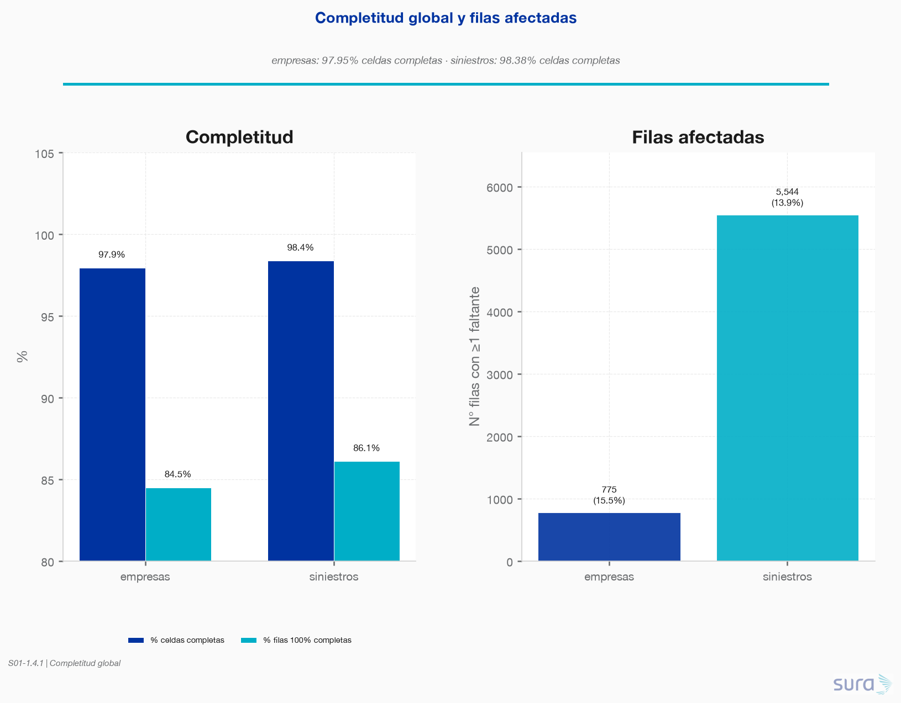

| Dataset | Filas | Columnas | Celdas faltantes | Completitud celdas | Filas con ≥1 nulo |
|---|---:|---:|---:|---:|---:|
| empresas | 5 000 | 10 | 1 027 (2.05%) | **97.95%** | 775 (**15.50%**) |
| siniestros | 39 894 | 9 | 5 820 (1.62%) | **98.38%** | 5 544 (**13.90%**) |

- A nivel **celda** ambos datasets están muy completos (>97%).
- A nivel **fila**, ~1 de cada 6–7 registros tiene al menos un faltante → un listwise deletion ingenuo descartaría **15.5%** de empresas y **13.9%** de siniestros.
- **Implicación:** la cuantificación ya descarta “completeness total” como supuesto; el modelado debe tratar nulos de forma explícita (imputación o modelos que los toleren), no ignorarlos.

---

### B. Faltantes por columna

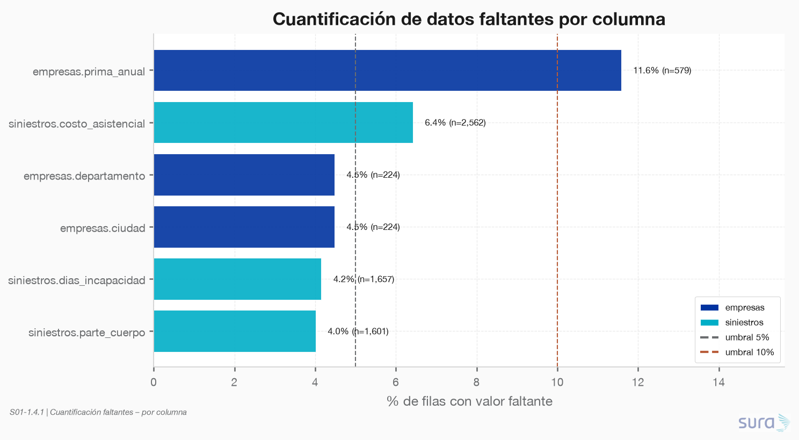

**empresas** — 3 de 10 columnas con nulos:

| Columna | N faltantes | % filas |
|---|---:|---:|
| `prima_anual` | 579 | **11.58%** |
| `ciudad` | 224 | 4.48% |
| `departamento` | 224 | 4.48% |

Columnas 100% completas: `id_empresa`, `ciiu`, `sector`, `clase_riesgo`, `n_trabajadores`, `antiguedad_meses`, `fecha_afiliacion`.

**siniestros** — 3 de 9 columnas con nulos:

| Columna | N faltantes | % filas |
|---|---:|---:|
| `costo_asistencial` | 2 562 | **6.42%** |
| `dias_incapacidad` | 1 657 | 4.15% |
| `parte_cuerpo` | 1 601 | 4.01% |

Columnas 100% completas: `id_siniestro`, `id_empresa`, `fecha_ocurrencia`, `tipo`, `costo_prestacion_economica`, `gravedad`.

- `prima_anual` es la única columna que supera el **10%** de faltantes.
- `costo_asistencial` supera el **5%** y arrastra nulos a `costo_total` / `log_costo_*` / `*_w` en staging (ya observado en 1.3.4 / GOF P12: 2 562 filas sin costo winsorizado).
- No se detectaron strings vacíos ni sentinels tipo `"NA"`/`"-"` adicionales: los faltantes son NaN explícitos del CSV.

---

### C. Patrones de co-ocurrencia

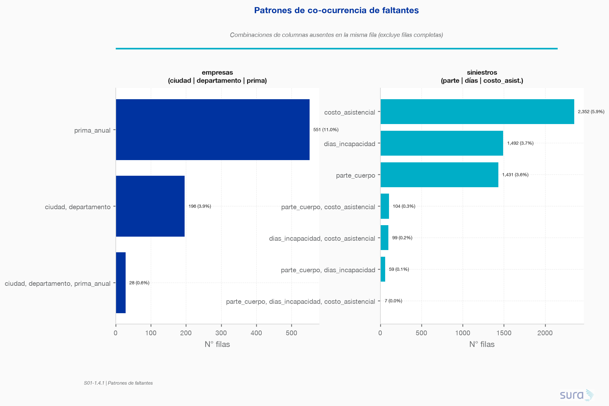

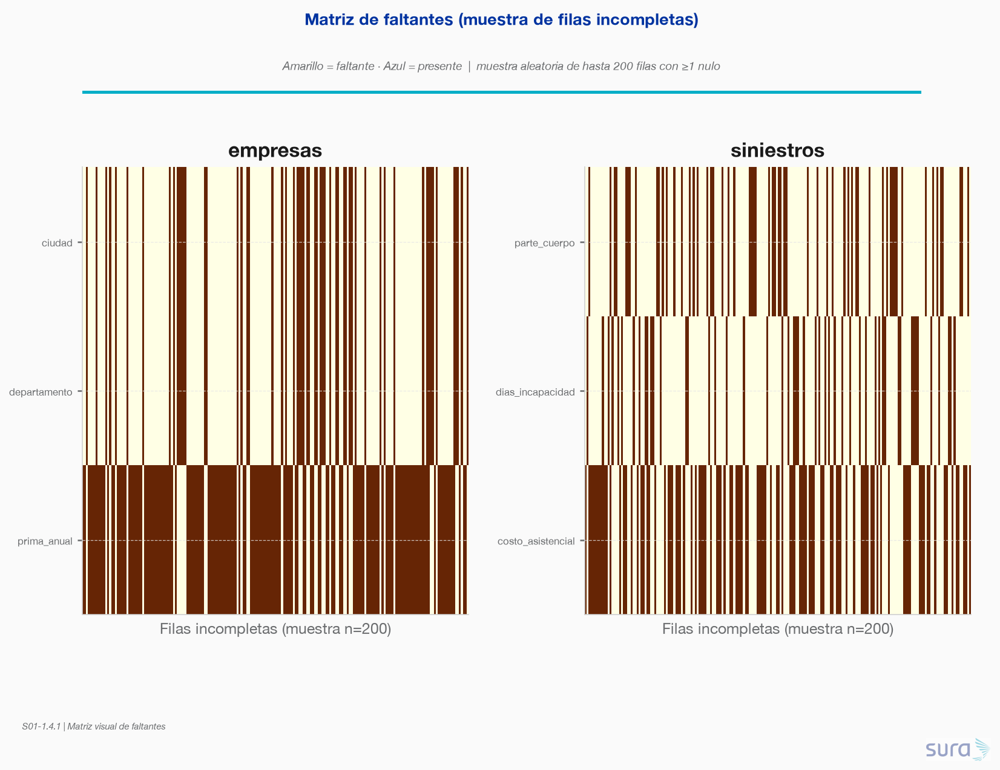

**empresas** (orden del patrón: ciudad | departamento | prima):

| Patrón | N filas | % | Lectura |
|---|---:|---:|---|
| completo | 4 225 | 84.50% | — |
| solo `prima_anual` | 551 | 11.02% | Dominante |
| `ciudad` + `departamento` | 196 | 3.92% | Geo siempre junta |
| las tres | 28 | 0.56% | — |
| solo ciudad / solo depto | 0 | 0% | **Nunca** ocurre |

- `ciudad` y `departamento` son un **bloque**: si falta una, falta la otra (224 filas). Compatible con un único campo geográfico mal capturado o no reportado.
- La mayoría de faltantes de prima (**551/579**) ocurren con geo completa → no son el mismo mecanismo que el bloque geográfico.

**siniestros** (orden: parte_cuerpo | dias | costo_asistencial):

| Patrón | N filas | % |
|---|---:|---:|
| completo | 34 350 | 86.10% |
| solo `costo_asistencial` | 2 352 | 5.90% |
| solo `dias_incapacidad` | 1 492 | 3.74% |
| solo `parte_cuerpo` | 1 431 | 3.59% |
| pares / triple | 269 | 0.67% |

- Predominan faltantes **univariados** (casi independientes entre sí); la intersección de las tres columnas es mínima (7 filas).
- Esto favorece estrategias de imputación **por variable** (no un único “registro inválido” a descartar).

---

### D. Tasas estratificadas (señales para 1.4.2)

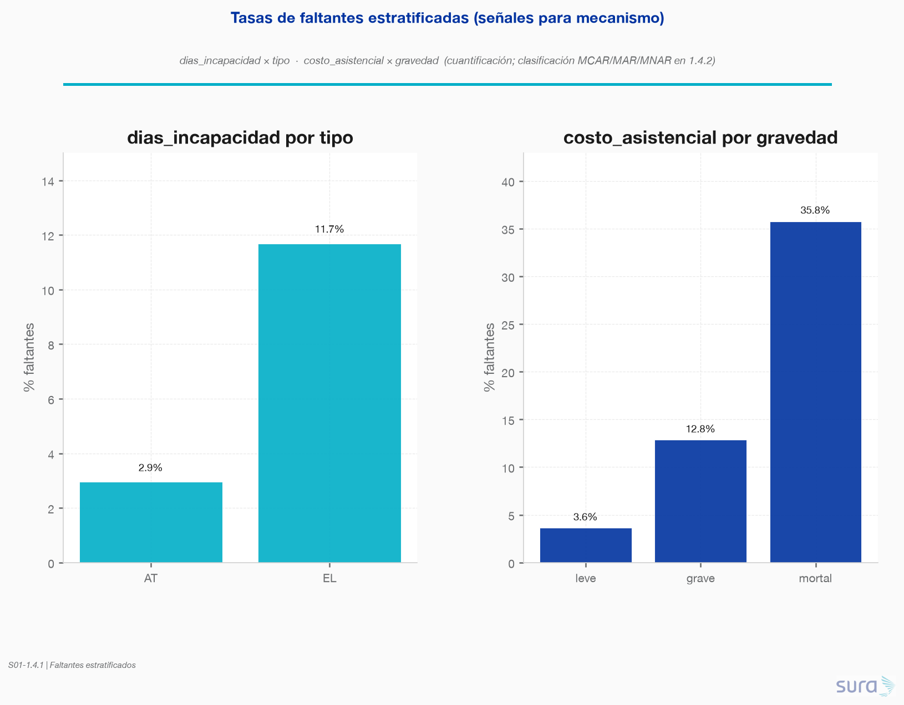

Cuantificación condicionada (aún **sin** test formal de mecanismo):

| Variable faltante | Estrato | Tasa |
|---|---|---:|
| `dias_incapacidad` | tipo = AT | 2.95% |
| `dias_incapacidad` | tipo = EL | **11.68%** |
| `costo_asistencial` | gravedad = leve | 3.62% |
| `costo_asistencial` | gravedad = grave | 12.84% |
| `costo_asistencial` | gravedad = mortal | **35.77%** |
| `prima_anual` | por `clase_riesgo` | ~10.7–12.4% (casi plano) |
| `ciudad` | por `sector` | ~3–7% (variación moderada) |

- La tasa de faltantes de `dias_incapacidad` en **EL (~4× AT)** y de `costo_asistencial` creciente con **gravedad** (hasta ~36% en mortal) son señales fuertes de dependencia respecto de variables observadas → candidatas a **MAR** en 1.4.2.
- `prima_anual` no varía mucho por clase de riesgo → menos evidencia estratificada aquí; el mecanismo se evaluará con otras covariables / tests.

---

### E. Implicaciones preliminares para modelado (sin imputar aún)

1. **No hacer listwise deletion** sobre el universo de empresas/siniestros: se perdería ~14–15% de filas y, en siniestros, se sesgaría la cola de severidad/costo (faltantes concentrados en EL y mortal).
2. **Features geográficas** (`ciudad`/`departamento`): ya descartadas como predictores principales en 1.3 (P11); el 4.5% de nulos refuerza tratarlas como opcionales / con categoría “desconocido” si se usan solo para segmentación.
3. **`prima_anual` (11.6%)**: predictor candidato con hueco material → requiere estrategia de imputación o flag de missing antes de S03.
4. **`costo_asistencial` / `dias_incapacidad`**: outcomes o componentes de severidad; imputar o modelar con missingness informativa puede sesgar el resultado técnico — evaluar en 1.4.3–1.4.4 frente a descartar solo esas filas en modelos de severidad.
5. Staging de resumen reutilizable: `faltantes_resumen_datasets`, `faltantes_resumen_columnas`, `faltantes_patrones`, `faltantes_por_estrato` en `data/staging/S01/`.

---

## 1.4.2 – Mecanismos formales (MCAR / MAR / MNAR)

> Generado a partir de `02-mecanismos/mecanismos_faltantes.py`.  
> Reutiliza `faltantes_por_estrato` y `faltantes_patrones` (1.4.1).  
> Marco: H₀ = MCAR (R ⊥ X_obs). Rechazo → evidencia compatible con **MAR**. **MNAR** no es identificable solo con observados; se reporta sospecha cuando procede.

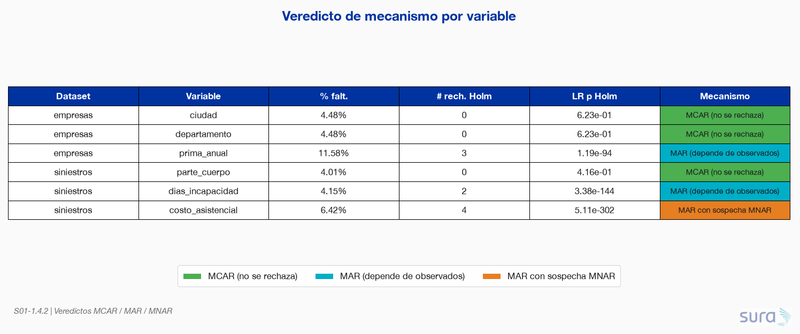

### A. Resumen de veredictos

| Dataset | Variable | % falt. | Rechazos Holm (univar.) | LR p Holm (logit) | Mecanismo |
|---|---|---:|---:|---:|---|
| empresas | `ciudad` | 4.48% | 0 | 0.62 | **MCAR (no se rechaza)** |
| empresas | `departamento` | 4.48% | 0 | 0.62 | **MCAR (no se rechaza)** (= ciudad) |
| empresas | `prima_anual` | 11.58% | 3 | ~10⁻⁹⁴ | **MAR** |
| siniestros | `parte_cuerpo` | 4.01% | 0 | 0.42 | **MCAR (no se rechaza)** |
| siniestros | `dias_incapacidad` | 4.15% | 2 | ~10⁻¹⁴⁴ | **MAR** |
| siniestros | `costo_asistencial` | 6.42% | 4 | ~10⁻³⁰² | **MAR con sospecha MNAR** |

---

### B. Señales §D — pruebas formales

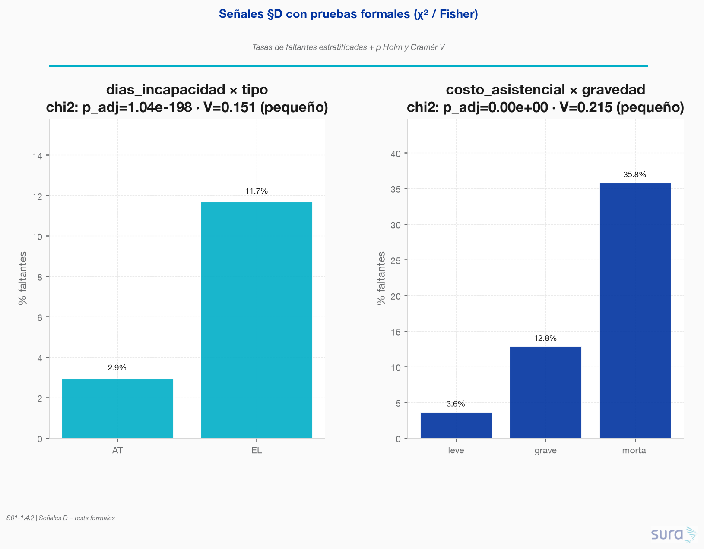

| Señal (1.4.1 §D) | Prueba | p Holm | Efecto | ¿Rechaza MCAR? |
|---|---|---:|---|---|
| `dias_incapacidad` × `tipo` | χ² | **1.04×10⁻¹⁹⁸** | V=0.151 (pequeño) | **Sí → MAR** |
| `costo_asistencial` × `gravedad` | χ² | **≈ 0** | V=0.215 (pequeño) | **Sí → MAR** |
| `prima_anual` × `clase_riesgo` | χ² | 1.00 | V=0.023 (despreciable) | No (confirma “casi plano”) |
| `ciudad` × `sector` | χ² | 1.00 | V=0.054 (despreciable) | No |

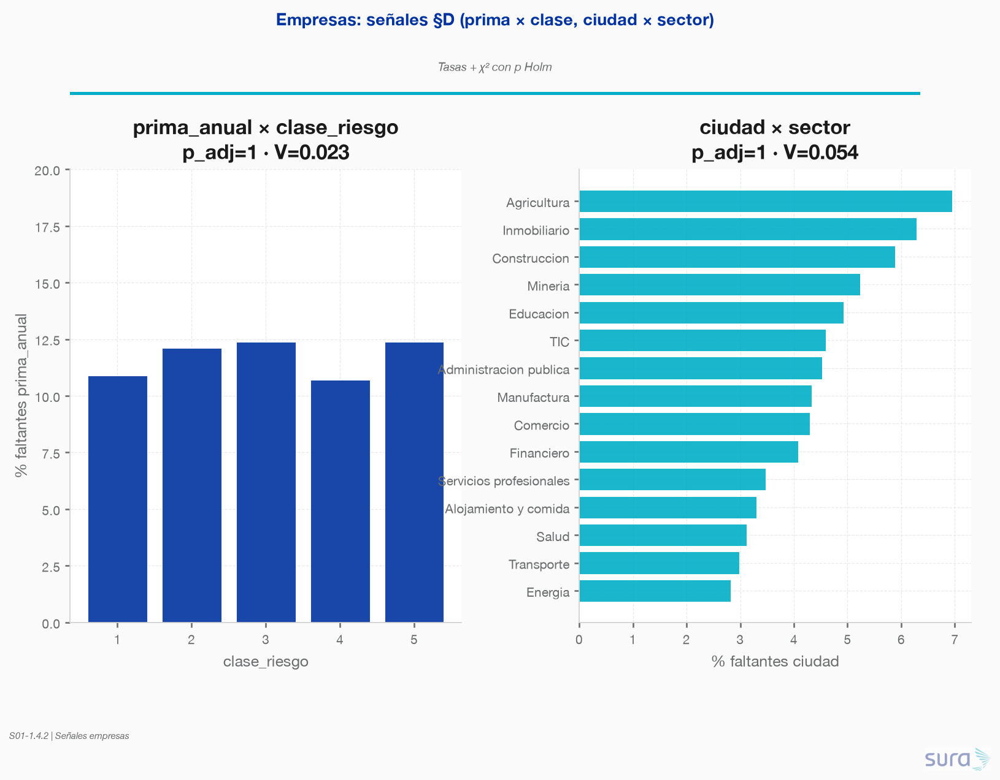

- La intuición de §D se **confirma** para días×tipo y costo×gravedad.
- Para `prima_anual`, la clase de riesgo **no** explica el faltante; el MAR proviene de otras covariables (abajo).

---

### C. Mapa de evidencia y logit

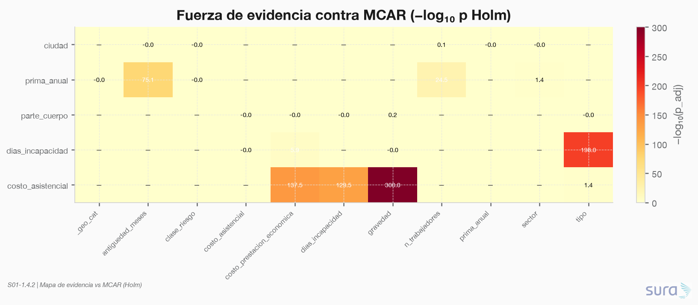

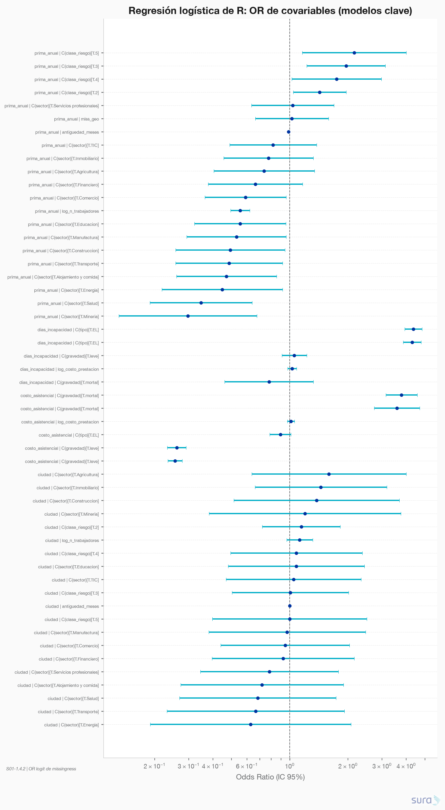

**Asociaciones univariadas que sobreviven Holm (principales):**

| Variable R | Covariable | Prueba | p Holm | Efecto |
|---|---|---|---:|---|
| `dias_incapacidad` | `tipo` | χ² | 1.0×10⁻¹⁹⁸ | V=0.151 |
| `dias_incapacidad` | `costo_prestacion_economica` | MWU | 1.2×10⁻⁶ | δ=0.07 |
| `costo_asistencial` | `gravedad` | χ² | ≈0 | V=0.215 |
| `costo_asistencial` | `costo_prestacion_economica` | MWU | 3.5×10⁻¹³⁸ | δ=0.30 |
| `costo_asistencial` | `dias_incapacidad` | MWU | 3.0×10⁻¹³⁰ | δ=0.29 |
| `prima_anual` | `antiguedad_meses` | MWU | 7.6×10⁻⁷⁶ | δ=−0.47 (**mediano**) |
| `prima_anual` | `n_trabajadores` | MWU | 3.3×10⁻²⁵ | δ=−0.27 |
| `prima_anual` | `sector` | χ² | 0.040 | V=0.075 |

**Logit primario (LR vs nulo, Holm entre 5 modelos full):**

| Variable | Modelo | n | LR p Holm | pseudo-R² McFadden |
|---|---|---:|---:|---:|
| `ciudad` | sector + clase + tamaño + antigüedad | 5 000 | 0.62 | 0.010 |
| `prima_anual` | clase + sector + tamaño + antigüedad + miss_geo | 5 000 | **1.2×10⁻⁹⁴** | **0.143** |
| `parte_cuerpo` | tipo + gravedad + log(prestación) | 39 894 | 0.42 | 0.000 |
| `dias_incapacidad` | tipo + gravedad + log(prestación) | 39 894 | **3.4×10⁻¹⁴⁴** | 0.049 |
| `costo_asistencial` | gravedad + tipo + log(prestación) | 39 894 | **5.1×10⁻³⁰²** | 0.074 |

Supuestos: χ² con chequeo de frecuencias esperadas (Fisher 2×2 si aplica); para numéricas, Shapiro → Welch-t si normal, si no **Mann-Whitney U** (caso dominante por sesgo).

---

### D. Interpretación por variable

**1. `ciudad` / `departamento` — MCAR (no se rechaza)**  
- Indicadoras idénticas (bloque geográfico 1.4.1).  
- Ningún test univariado rechaza tras Holm; logit full p=0.62.  
- Implicación: imputación simple / categoría “desconocido” es defendible; ya descartadas como predictores principales (P11).

**2. `prima_anual` — MAR**  
- §D tenía razón: **no** depende de `clase_riesgo`.  
- Sí depende de **antigüedad** (δ≈−0.47) y **tamaño**: las empresas con prima faltante tienden a ser más nuevas / de distinto porte.  
- Logit full pseudo-R²≈0.14 (el más alto del set).  
- Implicación: imputar condicionando por antigüedad, tamaño y sector (no media global).

**3. `parte_cuerpo` — MCAR (no se rechaza)**  
- Logit y univariados no rechazan MCAR.  
- Implicación: moda / “desconocido” aceptable si se usa la variable.

**4. `dias_incapacidad` — MAR**  
- Dependencia dominante de `tipo` (EL 11.7% vs AT 2.9%).  
- Implicación: imputación o modelo de severidad **estratificado por tipo**; listwise deletion sesgaría EL.

**5. `costo_asistencial` — MAR con sospecha MNAR**  
- MAR claro vía `gravedad` (V=0.22; mortal 35.8%).  
- Además, `costo_prestacion_economica` (proxy de magnitud económica, siempre observado) predice el faltante (δ=0.30, p≈0) → el hueco no es solo “etiqueta administrativa”, sino que se alinea con la escala económica del evento.  
- Eso **no prueba** MNAR, pero motiva sospecha: costos asistenciales no reportados en eventos caros/mortales (expediente abierto, liquidación pendiente).  
- Implicación: imputación MAR condicionada por gravedad (+ prestación); en 1.4.3–1.4.4 añadir **análisis de sensibilidad** / flag de missing.

---

### E. Implicaciones para 1.4.3 (imputación)

| Variable | Mecanismo | Estrategia sugerida |
|---|---|---|
| ciudad / departamento | MCAR | Categoría “desconocido” o imputación simple |
| parte_cuerpo | MCAR | Moda / “desconocido” |
| prima_anual | MAR | MICE / regresión con antigüedad, tamaño, sector |
| dias_incapacidad | MAR | Imputación condicionada por `tipo` (y gravedad) |
| costo_asistencial | MAR (+ sospecha MNAR) | Condicionar por gravedad + prestación; sensibilidad MNAR |

Staging nuevo: `faltantes_mecanismos_tests`, `_logit`, `_logit_coefs`, `_veredicto` en `data/staging/S01/`.

---

## 1.4.3 – Estrategia de imputación (aplicada)

> Generado a partir de `03-estrategia_imputacion/estrategia_imputacion.py`.  
> Anclado a veredictos 1.4.2. **No modifica** `empresas_staging` / `siniestros_staging` (1.2); genera `empresas_imputadas` y `siniestros_imputados`.

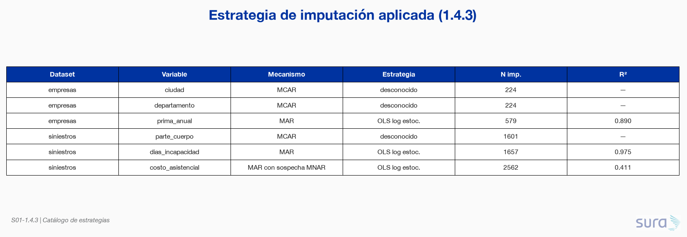

### A. Estrategias aplicadas

| Variable | Mecanismo (1.4.2) | Estrategia | N imputados | R² (log OLS) |
|---|---|---|---:|---:|
| `ciudad` | MCAR | categoría `desconocido` | 224 | — |
| `departamento` | MCAR | categoría `desconocido` (bloque = ciudad) | 224 | — |
| `parte_cuerpo` | MCAR | categoría `desconocido` | 1 601 | — |
| `prima_anual` | MAR | OLS estocástica log ~ sector + tamaño + antigüedad | 579 | **0.890** |
| `dias_incapacidad` | MAR | OLS estocástica log ~ tipo + gravedad + log(prestación) | 1 657 | **0.975** |
| `costo_asistencial` | MAR + sospecha MNAR | OLS estocástica log ~ tipo + gravedad + log(prestación) + log(días_imp) | 2 562 | **0.411** |

Detalles técnicos:
- Predicción **estocástica** (ŷ + ε, ε ~ N(0, σ²_resid)) = paso MICE univariado cuando solo hay una variable numérica incompleta en el bloque de predictores.
- Flags `miss_*` se conservan en los datasets imputados (crítico para `miss_costo_asist` → sensibilidad MNAR en 1.4.4).
- Tras imputar: 0 nulos en las variables objetivo.

---

### B. MCAR categóricas

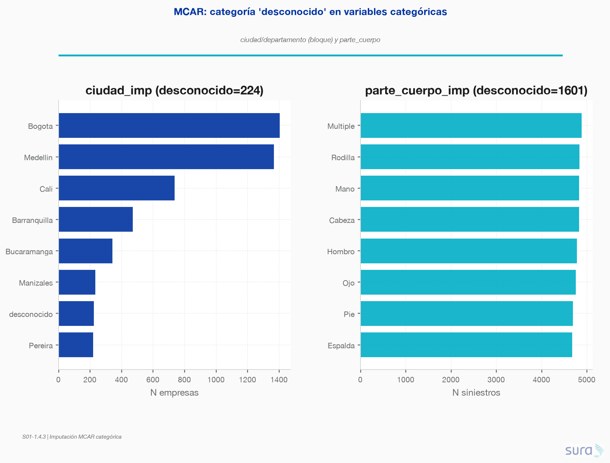

- `ciudad`/`departamento`: 224 empresas quedan con nivel `desconocido` (mismo bloque que en 1.4.1).
- `parte_cuerpo`: 1 601 siniestros con `desconocido`.
- Justificación: MCAR no rechazado → un nivel explícito es interpretable y no introduce el sesgo de moda.

---

### C. MAR numéricas — diagnóstico antes/después

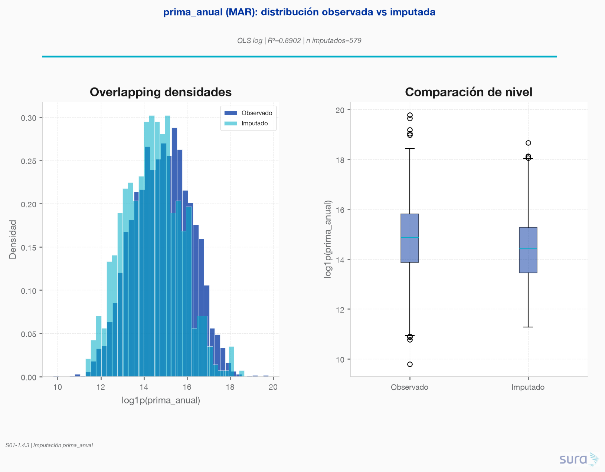

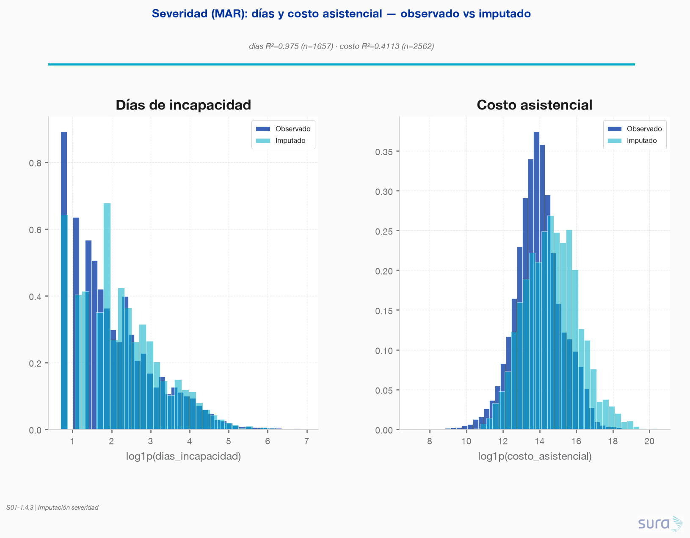

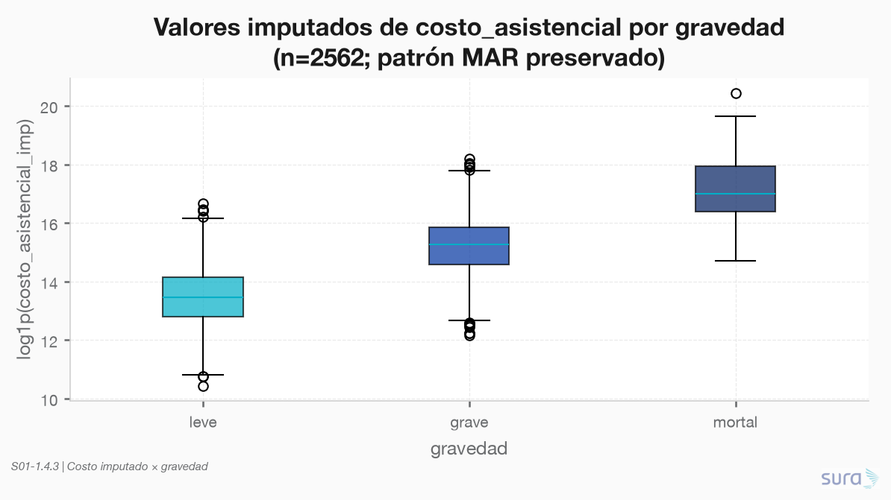

| Variable | Media observado | Media imputados (solo R=1) | Lectura |
|---|---:|---:|---|
| `prima_anual` | 6.51 M | 4.43 M | Imputados algo menores (empresas más nuevas/pequeñas; coherente con MAR) |
| `dias_incapacidad` | 16.2 | 16.4 | Alineado al observado |
| `costo_asistencial` | 2.59 M | **7.58 M** | Imputados más altos: faltantes en gravedad alta — **esperado bajo MAR** |

- R² alto en `prima` y `dias`: covariables MAR capturan casi toda la variación log; en `costo` R²=0.41 deja más incertidumbre residual (coherente con sospecha MNAR).
- El boxplot de costos imputados por gravedad preserva el gradiente leve < grave < mortal.

---

### D. Datasets generados (staging)

| Dataset | Filas × cols | Uso |
|---|---|---|
| `empresas_imputadas.parquet` | 5 000 × 20 | Panel empresas sin NaN + flags |
| `siniestros_imputados.parquet` | 39 894 × 21 | Eventos sin NaN + flags + `costo_total` recalculado |
| `faltantes_imputacion_estrategia.parquet` | 6 | Catálogo reproducible |
| `faltantes_imputacion_diagnostico.parquet` | 10 | Stats antes/después para 1.4.4 |

---

### E. Implicaciones para 1.4.4

1. Comparar modelado con **datos imputados** vs **listwise deletion** (descartar filas con R=1).
2. Para `costo_asistencial`, sensibilidad: (a) imputación MAR, (b) descarte, (c) MAR + flag `miss_costo_asist` como predictor.
3. No usar listwise deletion como default: perdería ~14% de siniestros y sesgaría la cola de severidad.

---

### Pendiente

- [x] 1.4.4 – Evaluación del efecto sobre el modelado vs descartar registros.

---

## 1.4.4 – Impacto de la imputación vs listwise deletion

> Generado a partir de `04_impacto/impacto_imputacion.py`.  
> Reutiliza `empresas_imputadas`, `siniestros_imputados`, `empresa_siniestralidad_completa`.  
> Escenarios: **(a)** listwise · **(b)** imputado · **(c)** imputado + flag `miss_*`.  
> Holdout 80/20 evaluado solo sobre outcomes **originalmente observados** (comparación justa).

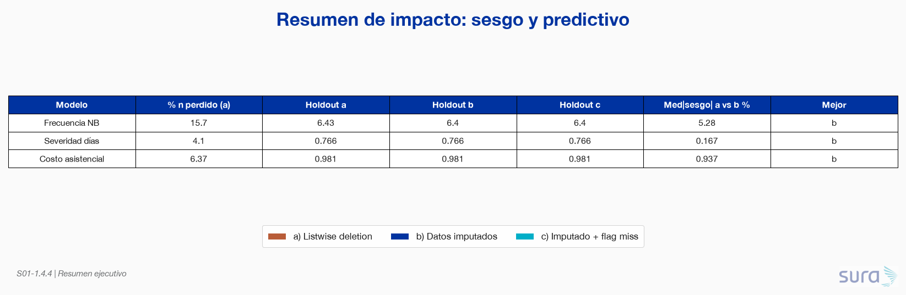

### A. Diseño experimental

| Modelo | Familia | Fórmula base | Listwise descarta |
|---|---|---|---|
| Frecuencia (empresa) | **Binomial Negativa** | `n_siniestros ~ C(clase_riesgo) + log_n_trab + log_prima` | `miss_prima` o `miss_geo` |
| Severidad (siniestro) | **Lognormal** (OLS log) | `log(días) ~ C(tipo) + C(gravedad)` | `miss_dias` |
| Costo asistencial | **Lognormal** (OLS log) | `log(costo_asist) ~ C(tipo)+C(gravedad)+log(prestación)` | `miss_costo_asist` |

Escenario (c) añade el/los flag(s) correspondientes (`miss_prima`+`miss_geo`, `miss_dias`, o `miss_costo_asist`).

---

### B. Pérdida muestral y AIC

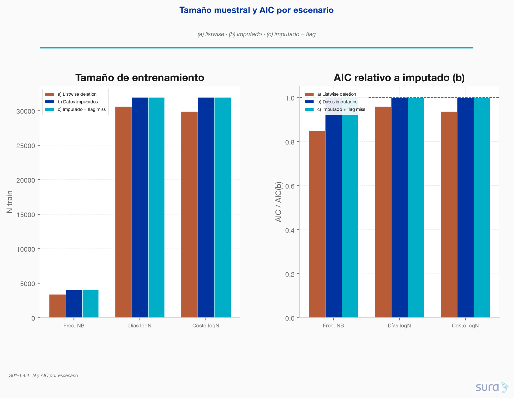

| Modelo | N train (a) | N train (b=c) | % perdido listwise |
|---|---:|---:|---:|
| Frecuencia NB | 3 372 | 4 000 | **15.7%** |
| Severidad días | 30 605 | 31 915 | 4.1% |
| Costo asistencial | 29 883 | 31 915 | 6.4% |

- El AIC crudo **no es comparable** entre (a) y (b) porque cambia n; se reporta AIC/AIC(b) en el plot.
- El costo operativo de listwise es máximo en **frecuencia** (pierde ~1 de cada 6 empresas de train).

---

### C. Métricas predictivas (holdout)

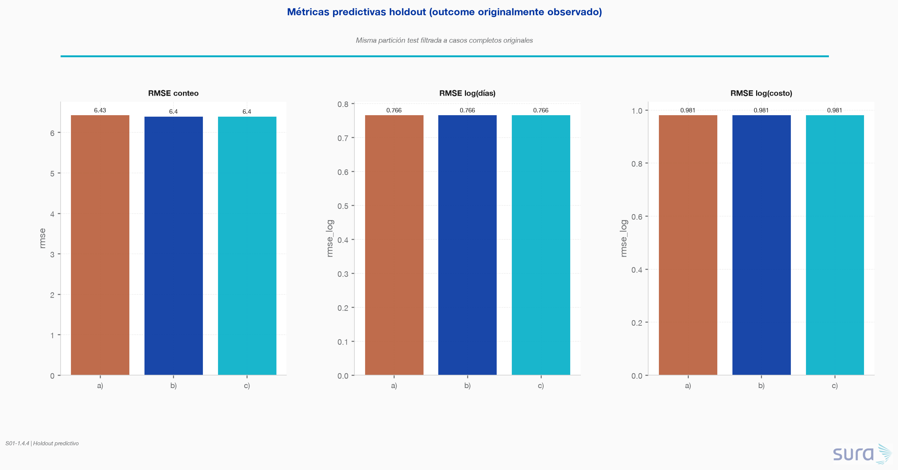

| Modelo | Métrica | (a) | (b) | (c) | Mejor |
|---|---|---:|---:|---:|---|
| Frecuencia NB | RMSE conteo | 6.429 | **6.398** | 6.396 | **b** |
| Severidad días | RMSE log | 0.7657 | **0.7657** | 0.7656 | **b** |
| Costo asistencial | RMSE log | 0.9809 | **0.9809** | 0.9809 | **b** |

- En severidad/costo, imputar filas faltantes **casi no mueve** el error sobre casos originalmente observados (las relaciones tipo/gravedad ya estaban bien identificadas).
- En frecuencia, (b)/(c) mejoran levemente el RMSE vs listwise; la ventaja de (c) sobre (b) es **despreciable** (<0.5%) y los flags no son significativos → se declara **(b)** como mejor operativo.

---

### D. Sesgo y variabilidad de coeficientes

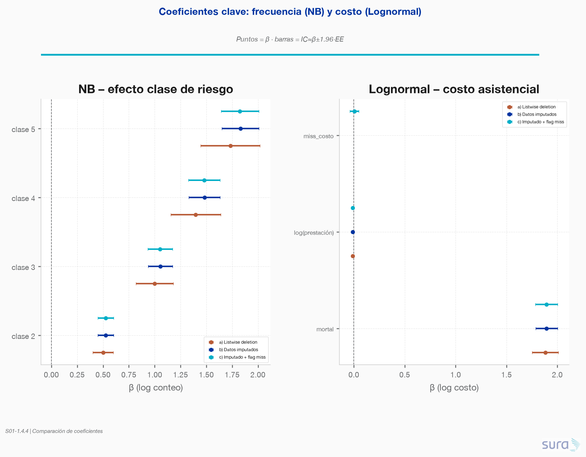

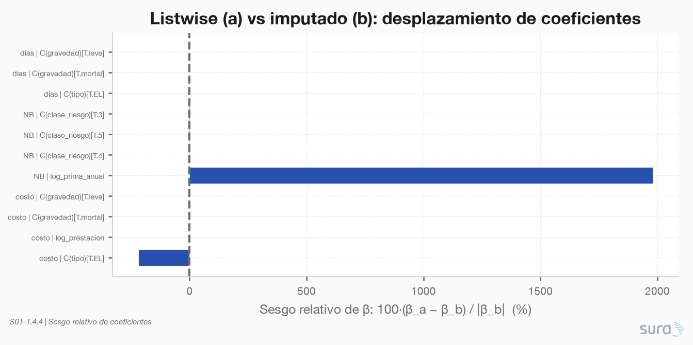

**Frecuencia (donde más importa):**
- Coefs de `clase_riesgo` 2–5 bajo listwise están ~**4.9–5.7%** por debajo de (b) (mediana \|sesgo relativo\| = **5.3%**).
- EE de listwise ~**1.5×** los de (b) (menos precisión por menor n).
- (c) ≈ (b): flags `miss_prima` / `miss_geo` **no significativos** (p≈0.78 / 0.91).

**Severidad / costo:**
- Mediana \|sesgo relativo\| a vs b: **0.17%** (días) y **0.94%** (costo) → desplazamiento despreciable.
- Ratio EE ≈ 1.02–1.04.
- Flag `miss_costo_asist` en (c): β≈0.005, **p=0.82** → no aporta señal residual detectablesobre el outcome (la imputación MAR no deja un “hueco” predictivo fuerte; la sospecha MNAR de 1.4.2 **no se traduce** en un flag informativo aquí).

---

### E. Veredicto operativo (cierre del bloque 1.4)

1. **No usar listwise deletion** como default, especialmente en el baseline de **frecuencia** (pierde 15.7% de empresas, sesga ~5% los efectos de clase y infla EE ×1.5).
2. **Preferir escenario (b) datos imputados** de 1.4.3 para S03/S05.
3. **Escenario (c)** es inocuo pero innecesario: los flags no son significativos; se pueden conservar solo para auditoría/sensibilidad, no como features obligatorias.
4. En severidad/costo el impacto predictivo de imputar vs descartar es **marginal** en holdout; el valor de imputar es conservar potencia y evitar sesgo de selección en la cola (gravedad alta).

Staging: `faltantes_impacto_coefs`, `_metricas`, `_resumen` en `data/staging/S01/`.
