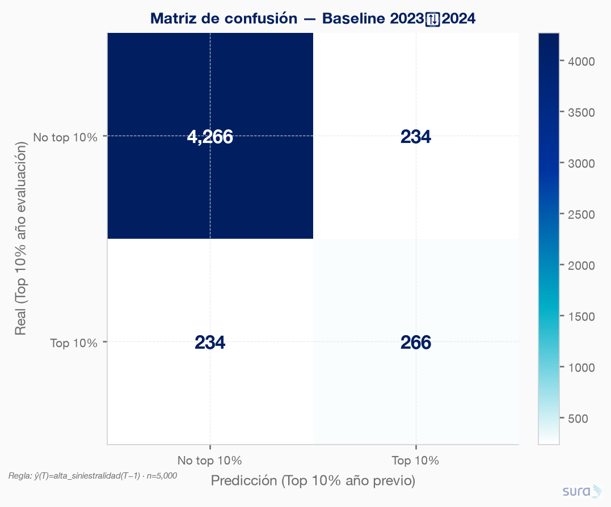
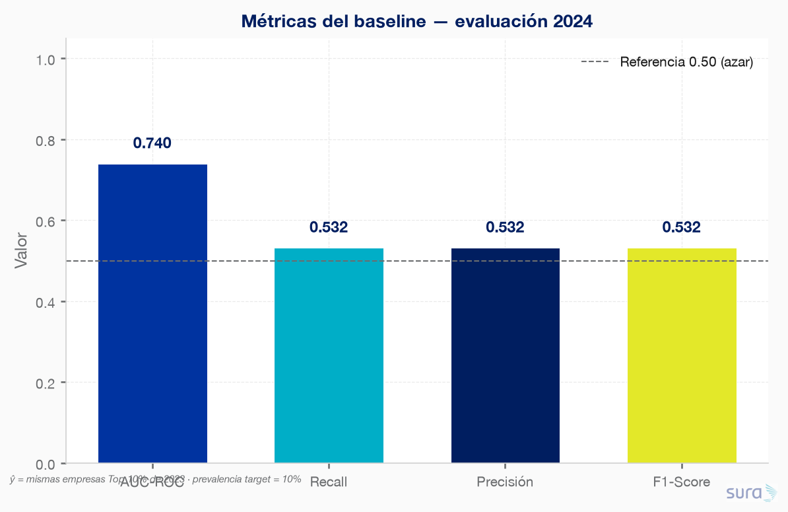
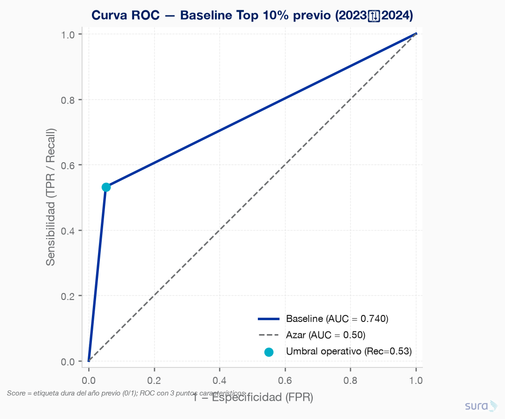
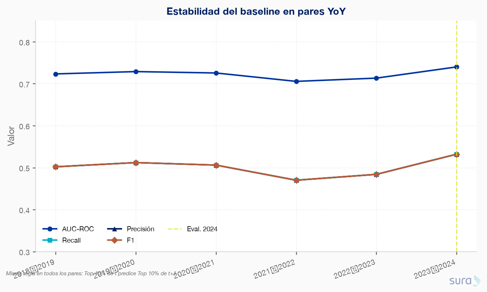
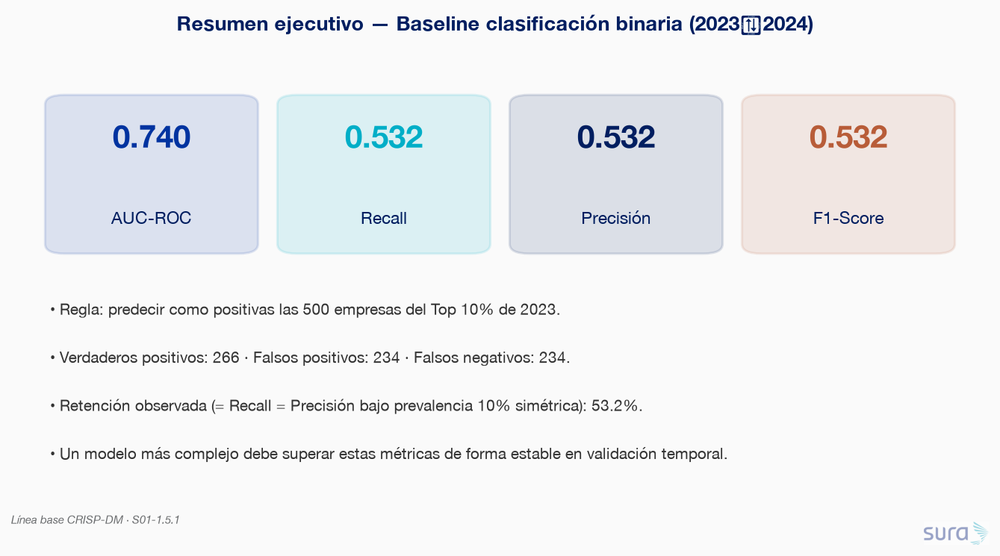

# 1.5 Definición de baseline

### Requerimiento
Definir y justificar una línea base y establecer qué debería superar un modelo más complejo para justificar su costo.

---

## 1.5.0 Definición y justificación

La línea base adoptada (alineada a CRISP-DM) es:

> **Predecir como `alta_siniestralidad = 1` en el año T a las mismas empresas que estuvieron en el Top 10% de `n_siniestros` en T−1.**

Es un baseline robusto porque:

1. **Es accionable y sin leakage:** usa solo información conocida al cierre de T−1.
2. **Ya tiene evidencia empírica (1.2 / 1.3):** la retención YoY del Top 10% es ~47–53% (lift ≈ 5× vs azar del 10%) — ver `temporal_persistencia_yoy` y `hip_p10_retencion_top10`.
3. **Es el umbral mínimo de negocio:** un modelo más costoso solo se justifica si mejora de forma estable Recall / Precisión / F1 (y AUC) frente a esta regla.

---

## 1.5.1 Cuantificación del baseline (último año)

**Script:** `code/01-cuantificacion_baseline/cuantificacion_baseline.py`  
**Inputs reutilizados:** `temporal_empresa_anio` (+ trazabilidad `temporal_persistencia_yoy`, `hip_p10_retencion_top10`).  
**Ventana de evaluación principal:** predictor = Top 10% de **2023** → target real = Top 10% de **2024** (5 000 empresas; 500 positivas).

### Regla de predicción

| Concepto | Definición |
|---|---|
| Target `y_true` | `alta_siniestralidad` en 2024 |
| Predicción `y_pred` | `alta_siniestralidad` en 2023 |
| Score para AUC | Etiqueta dura del año previo (0/1) |

### Matriz de confusión (2023 → 2024)

|  | Pred. No top 10% | Pred. Top 10% |
|---|---:|---:|
| **Real No top 10%** | TN = 4 266 | FP = 234 |
| **Real Top 10%** | FN = 234 | TP = 266 |

### Métricas principales

| Métrica | Valor | Lectura |
|---|---:|---|
| **AUC-ROC** | **0.740** | Discriminación moderada-alta vs azar (0.50) |
| **Sensibilidad (Recall)** | **0.532** | Captura el 53.2% del Top 10% real de 2024 |
| **Precisión** | **0.532** | De las 500 alertadas, 53.2% sí entran al Top 10% |
| **F1-Score** | **0.532** | Balance precisión–recall |

> **Nota metodológica:** con exactamente 500 predichas y 500 reales positivas, Recall = Precisión = F1 = tasa de retención del Top 10%. El AUC con score binario 0/1 equivale a (TPR + TNR) / 2 = (0.532 + 0.948) / 2 = 0.740.

### Estabilidad histórica (misma regla en todos los pares)

| Par | AUC-ROC | Recall | Precisión | F1 |
|---|---:|---:|---:|---:|
| 2018→2019 | 0.723 | 0.502 | 0.502 | 0.502 |
| 2019→2020 | 0.729 | 0.512 | 0.512 | 0.512 |
| 2020→2021 | 0.726 | 0.506 | 0.506 | 0.506 |
| 2021→2022 | 0.706 | 0.470 | 0.470 | 0.470 |
| 2022→2023 | 0.713 | 0.484 | 0.484 | 0.484 |
| **2023→2024** ★ | **0.740** | **0.532** | **0.532** | **0.532** |

Rango histórico F1 ≈ **0.47–0.53**; el último año es el más favorable de la serie, no un outlier extremo.

---

## Hallazgos y umbral para S03

1. **El baseline ya es fuerte:** Recall/Precisión/F1 ≈ **0.53** y AUC ≈ **0.74** en 2024. No es un “modelo nulo” débil; captura más de la mitad del Top 10% sin features adicionales.
2. **Costo de error simétrico bajo esta regla:** 234 falsos positivos y 234 falsos negativos — la mitad del Top 10% de 2024 son empresas “nuevas” que el baseline no ve.
3. **Espacio de mejora claro para un modelo más complejo:**
   - Subir **Recall** (detectar entrantes al Top 10%) sin destruir Precisión.
   - Mejorar **AUC** con scores calibrados (no solo etiqueta 0/1 del año previo), tipicamente vía `log_lag_n_siniestros`, `clase_riesgo` y features de 1.3/1.4.
4. **Criterio de justificación de costo (propuesta operativa):** un modelo candidato debe superar el baseline en validación temporal en al menos:
   - **F1 > 0.53** (o media histórica ~0.50) de forma estable en ≥2 folds temporales, **y**
   - **AUC-ROC > 0.74**,  
   con énfasis de negocio en Recall del decil superior (concentración de costo ~56.5%).

### Artefactos generados

| Artefacto | Ruta |
|---|---|
| Predicciones empresa (2024) | `data/staging/S01/baseline_predicciones.parquet` |
| Métricas YoY | `data/staging/S01/baseline_metricas.parquet` |
| Confusión (celdas) | `data/staging/S01/baseline_confusion.parquet` |
| CSV espejo | `results/baseline_*.csv` |
| Figuras | `results/imgs/01_baseline_*.png` |

## 1.5.2 Justificación del costo de un modelo más complejo

De por si el modelo baseline es capaz de predicir aprox. el 50% de las empresas que van a estar en el top 10% del año siguiente, lo que se traduce en un recall del 50%, para justificar el costo de un modelo más complejo, este debe ser capaz de predecir al menos el 80% de las empresas que van a estar en el top 10% del año siguiente, lo que se traduce en un recall del 80%.

