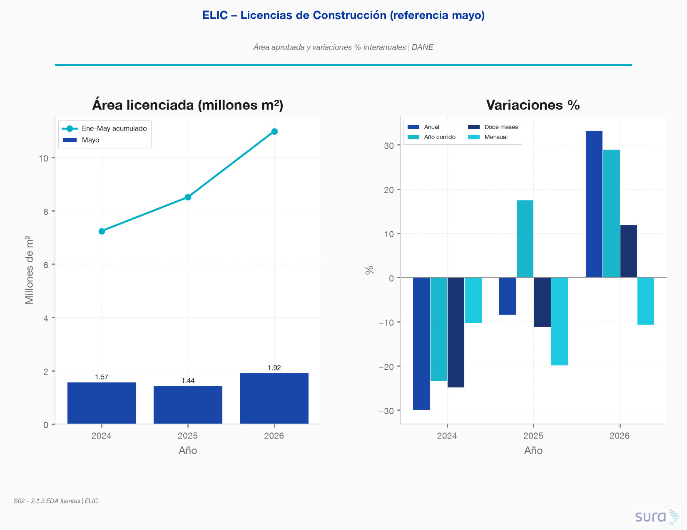
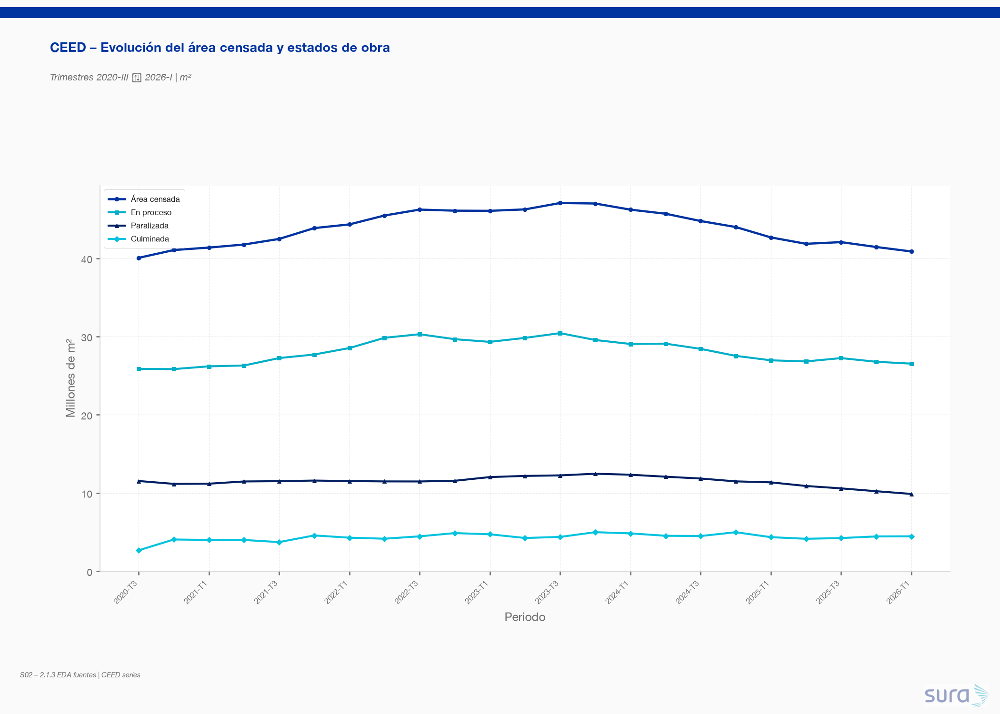
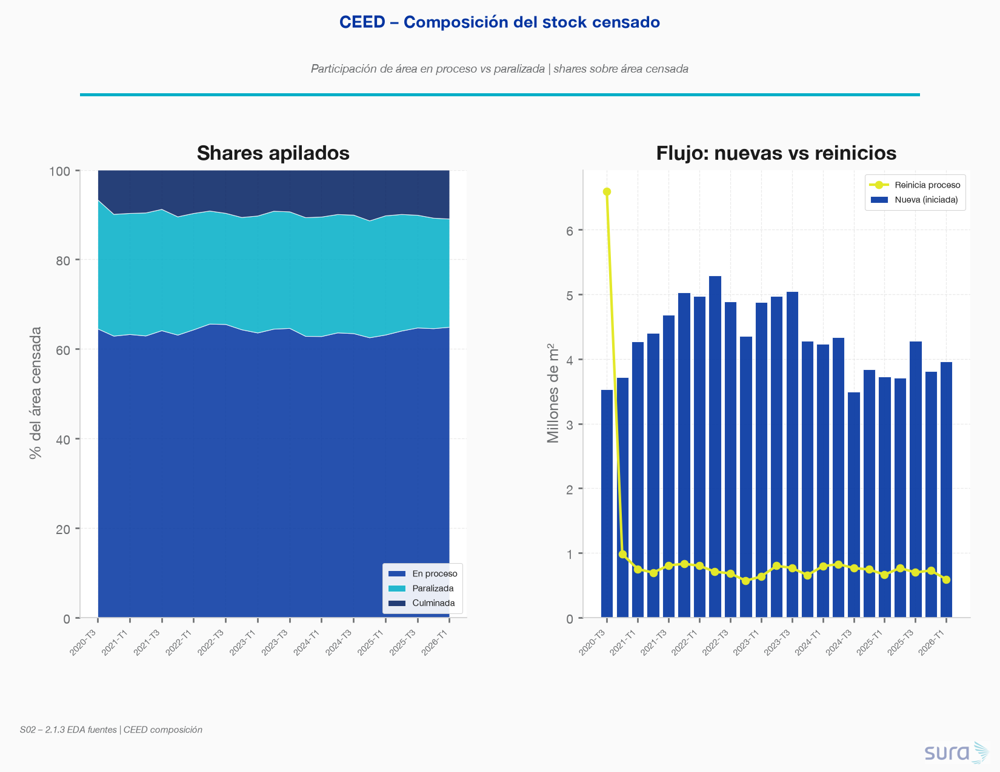
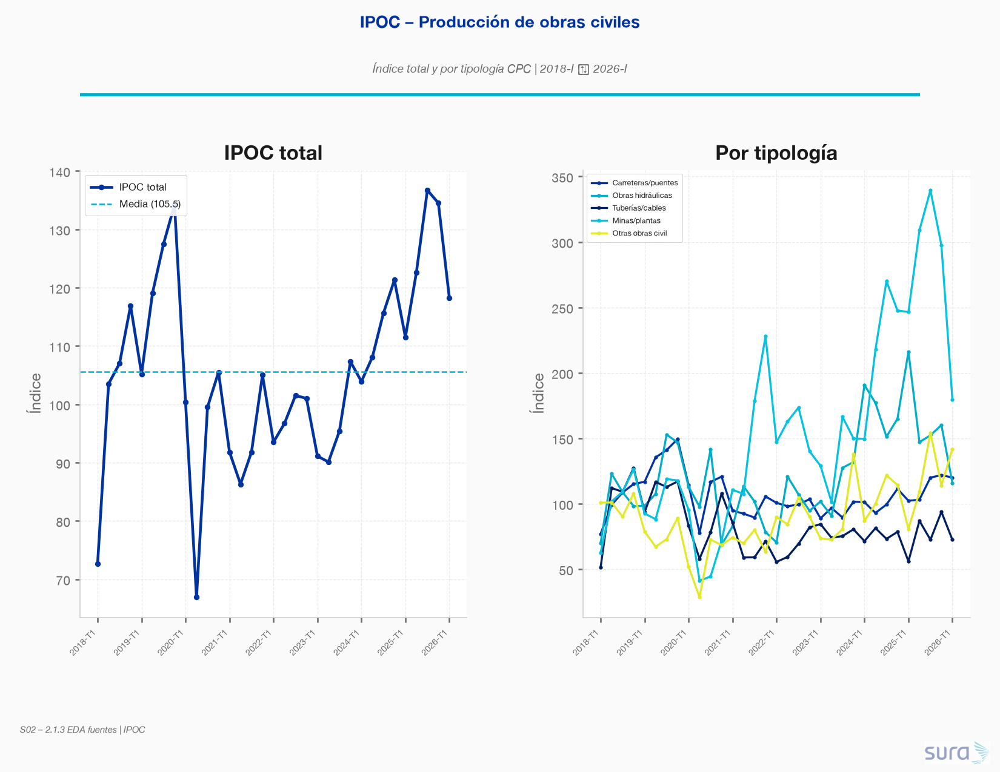
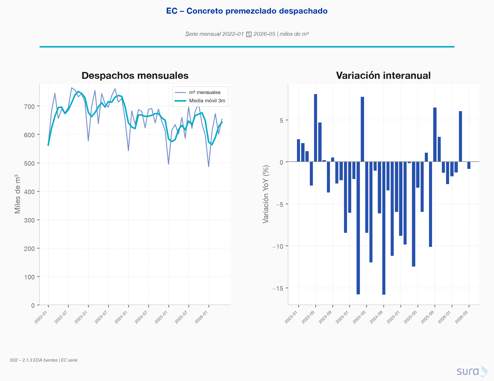
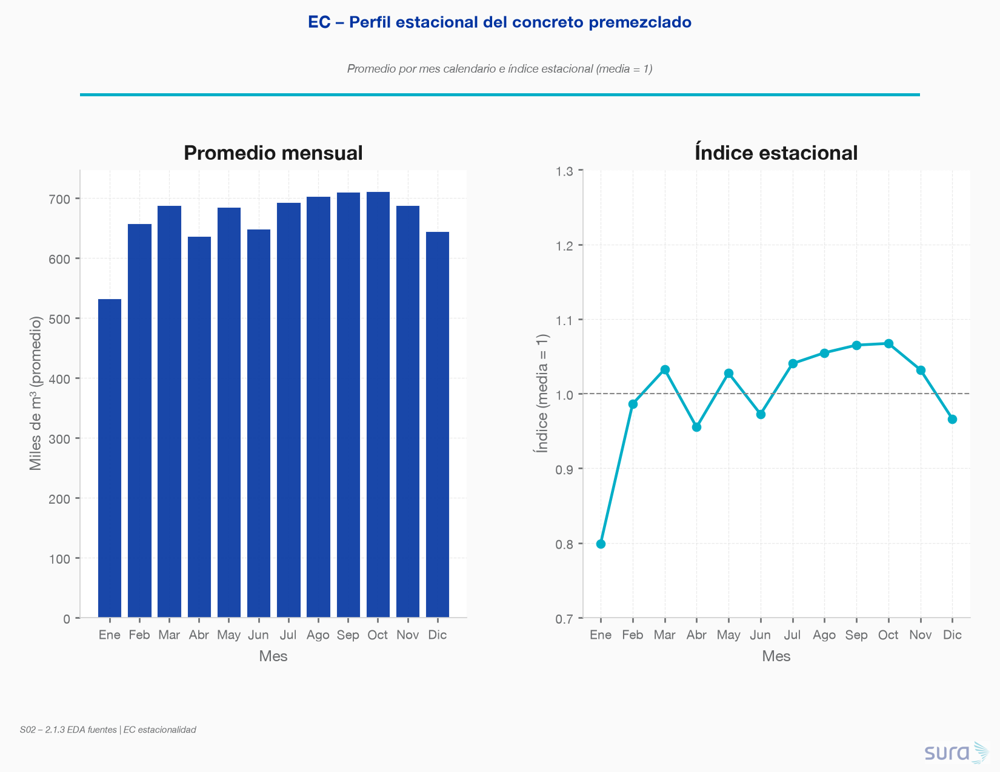
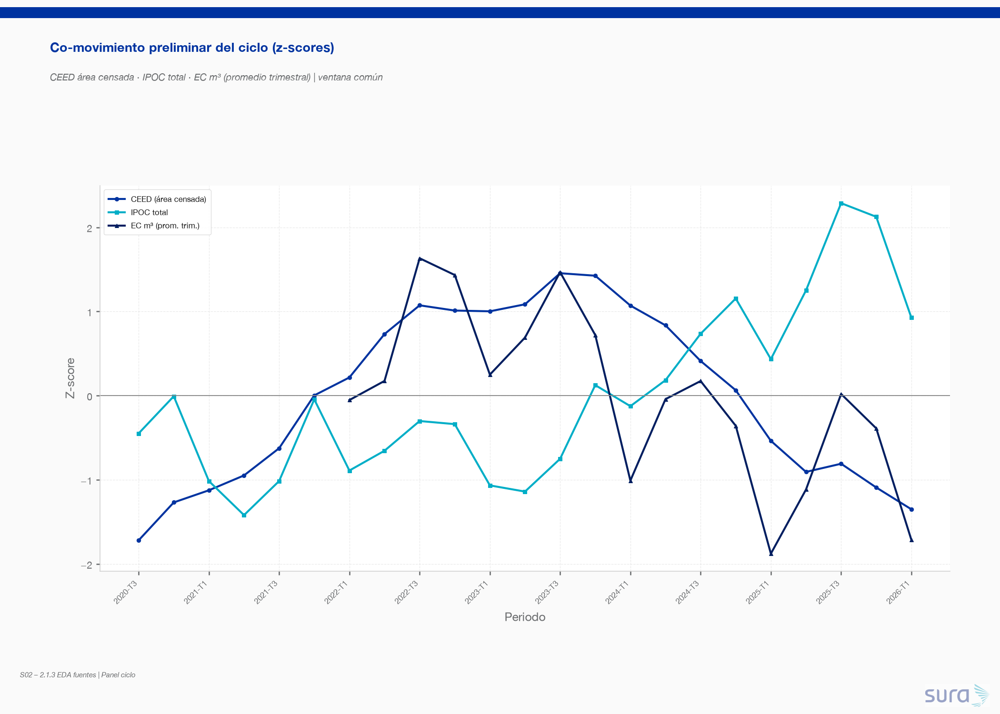

### **S02: Modelación económica y sectorial del sector construcción**
 Objetivo: El sector construcción es uno de los de mayor accidentalidad y mayor sensibilidad al ciclo económico. La Dirección quiere anticipar la siniestralidad del sector a partir de su ciclo. El candidato debe combinar el panel sintético de macro_sectorial.csv con series públicas del DANE que él mismo debe identificar. Esta sección es el eje de la prueba y exige rigor econométrico, criterio de fuentes y un componente de soporte documental.

---

### **Requerimiento 2.1**
Caracterizar el ciclo del sector construcción. Identificar y justificar al menos tres series públicas del DANE pertinentes para el ciclo del sector y construya con ellas un indicador líder. Discutir el rezago de publicación de cada fuente y su implicación para el análisis

---

## 2.1.1 Listado de fuentes del DANE pertinentes para el ciclo del sector construcción

> **Referencia completa de la investigación:** `sections/S02-Modelacion_Economica_Sectorial/2_1_Caracterizacion/resources/deep_research_DANE.md`
> **Infografía:** `sections/S02-Modelacion_Economica_Sectorial/2_1_Caracterizacion/results/imgs/01_infografia_DANE.png`
El DANE cuenta con cinco operaciones estadísticas activas que permiten seguir el ciclo del sector constructor colombiano desde la intención formal hasta la ejecución física, pasando por costos e insumos. Cada fuente captura una fase distinta del ciclo y opera con frecuencias y rezagos diferenciados que deben considerarse al integrar series de tiempo.
---
### Tabla resumen de fuentes
| Operación Estadística | Sigla | Tipo | Frecuencia | Rezago | Fase del Ciclo | Indicador principal |
|---|---|---|---|---|---|---|
| Estadísticas de Licencias de Construcción | **ELIC** | Censo / Registro administrativo | Mensual | ~45 días | **Líder** – Expectativa / Intención formal | m² de área aprobada; unidades de vivienda VIS / No VIS |
| Censo de Edificaciones | **CEED** | Censo de cobertura geográfica | Trimestral | ~45 días | **Coincidente** – Ejecución física en edificación | m² área causada, iniciada y culminada |
| Indicador de Producción de Obras Civiles | **IPOC** | Encuesta de muestra de contratos | Trimestral | 45–50 días | **Coincidente** – Ejecución de infraestructura pesada | Índice de producción real por tipología CPC v2.1 |
| Índice de Costos de la Construcción de Edificaciones | **ICOCED** | Índice de precios de entrada | Mensual | ~25–28 días | **Precios de insumos** – Costos de entrada | Variación % de costos: materiales, mano de obra, maquinaria, servicios especializados |
| Estadísticas de Concreto Premezclado | **EC** | Censo de productores especializados | Mensual | 35–40 días | **Coincidente** – Abastecimiento físico inmediato | Miles de m³ de concreto despachado por destino |
---
### Descripción de cada fuente
#### 1. ELIC – Estadísticas de Licencias de Construcción
- **Rol en el ciclo:** Indicador **líder**. Registra la intención formal de construcción a través de los actos administrativos aprobados por los curadores urbanos. Una variación positiva sostenida en área licenciada anticipa con 6 a 18 meses de rezago un incremento en obras iniciadas (CEED).
- **Cobertura geográfica:** 1.104 municipios (desde enero 2024, incorporando Nuevo Belén de Bajirá).
- **Nota metodológica clave:** Las series sufren revisiones retrospectivas frecuentes por radicación extemporánea de licencias físicas. La categorización VIS fue ajustada en agosto 2019 (tope de 135 a 150 SMMLV en municipios CONPES 3819/2014).
- **Fuente DANE:** https://www.dane.gov.co/index.php/estadisticas-por-tema/construccion/licencias-de-construccion
#### 2. CEED – Censo de Edificaciones
- **Rol en el ciclo:** Indicador **coincidente** de ejecución real en terreno (contrasta con las expectativas de la ELIC). El indicador estructural es el **área causada** (m² efectivamente construidos en el trimestre).
- **Cobertura geográfica:** 91 municipios prioritarios (ampliado en mayo 2022 con 25 nuevos municipios).
- **Control de calidad:** Cálculo diario de indicadores de calidad operativa por responsable de proceso; validación de consistencia en campo.
- **Fuente DANE:** https://www.dane.gov.co/index.php/estadisticas-por-tema/construccion/censo-de-edificaciones
#### 3. IPOC – Indicador de Producción de Obras Civiles
- **Rol en el ciclo:** Mide la evolución trimestral de la **infraestructura pesada** (carreteras, puentes, tuberías, puertos, energía, hidráulica) a partir del avance técnico físico efectivo reportado por contratistas. Reemplazó al antiguo IIOC (que medía flujos presupuestales, no ejecución real).
- **Deflación:** Utiliza el ICOCIV (Índice de Costos de Obras Civiles, publicación mensual) para convertir valores nominales a precios constantes; el DANE trimestraliza el ICOCIV promediando los tres meses del trimestre.
- **Validación institucional:** Comité Interno DANE + Comité Externo (gremios, academia, gobierno) convocado 3 días hábiles antes de la difusión.
- **Fuente DANE:** https://www.dane.gov.co/index.php/estadisticas-por-tema/construccion/indicador-de-produccion-de-obras-civiles-ipoc
#### 4. ICOCED – Índice de Costos de la Construcción de Edificaciones
- **Rol en el ciclo:** Mide la **variación de precios de los insumos** de edificación formal en 10 destinos constructivos (vs. 3 del antiguo ICCV). Es el índice de referencia para reajuste de contratos civiles.
- **Renovación metodológica (2022):** El DANE retiró en 2019 la certificación de calidad al ICCV por más de 10 años sin actualizar la canasta (incumplía estándares OCDE/FMI). La nueva canasta ICOCED incorpora **Servicios Especializados con ponderador del 21,9%** (subcontratistas de redes eléctricas, hidráulicas y acabados), antes no contemplados.
- **Calidad del dato:** El **Índice de No Imputación (INI)** mide la proporción de precios recolectados efectivamente vs. imputados. Un INI ≥ 98,9% (típico en publicaciones maduras) garantiza menos del 1,1% de datos estimados.
- **Cobertura:** 57 municipios de recolección; publicación en 10 destinos constructivos.
- **Fuente DANE:** https://www.dane.gov.co/index.php/estadisticas-por-tema/precios-y-costos/indice-de-costos-de-la-construccion-de-edificaciones-icoced
#### 5. EC – Estadísticas de Concreto Premezclado
- **Rol en el ciclo:** Sensor físico de **reacción más rápida**. El concreto no es almacenable (debe verterse de inmediato), por lo que sus despachos mensuales reflejan en tiempo real la intensidad de la fase de cimentación y estructura, permitiendo anticipar la variable "área causada" del CEED antes de la publicación trimestral.
- **Cifras provisionales:** Las series operan como **provisionales durante 2 años** antes de consolidarse como definitivas (margen para capturar nuevas empresas que ingresan al directorio muestral).
- **Ampliación (junio 2021):** Se incorporó la medición de concreto destinado a obras civiles, además de edificaciones.
- **Fuente DANE:** https://www.dane.gov.co/index.php/component/content/article/1831-guia-de-las-operaciones-estadisticas
---
### Fuente de síntesis: Boletín IEAC
El DANE consolida el diagnóstico del sector en el boletín **Indicadores Económicos Alrededor de la Construcción (IEAC)**, publicación trimestral que integra 14 investigaciones estadísticas internas y externas en cuatro ejes: **macroeconomía** (PIB, empleo), **oferta** (CEED, ELIC), **demanda** (créditos de vivienda) y **precios** (ICOCED, ICOCIV, IPP, índice de precios de vivienda nueva). Es el principal insumo de diagnóstico para ministerios, gremios y analistas.
- **Boletín más reciente consultado:** IV Trim 2025 (publicado marzo 2026)
- **URL:** https://www.dane.gov.co/files/operaciones/IEAC/bol-IEAC-IVtrim2025.pdf
---
### Interacciones clave entre fuentes (dinámicas de transmisión temporal)
```
ELIC (Mensual) ──[6–18 meses]──▶ CEED área iniciada/causada (Trimestral)
                                       ▲
EC (Mensual, despachos concreto) ──────┘  [anticipación coincidente]
ICOCED (Mensual, costos insumos) ──▶ Deflación / Reajuste contractual
IPOC (Trimestral) + ICOCIV (Mensual deflactor) ──▶ Producción real en infraestructura
```
- Un alza sostenida en ELIC (área licenciada) predice expansión futura en CEED (área causada) con retardo de 6–18 meses.
- Un incremento mensual en EC (concreto despachado) anticipa aceleración en el valor agregado constructor antes de que el PIB trimestral sea publicado.
- El ICOCED sirve de base para cláusulas de reajuste de precios en licitaciones de largo aliento, con soporte jurídico del INI.


## 2.1.2 Fuentes seleccionadas
1. ELIC: Fuente 'https://www.dane.gov.co/index.php/estadisticas-por-tema/construccion/licencias-de-construccion'. Guardado en 'sections/S02-Modelacion_Economica_Sectorial/2_1_Caracterizacion/resources/ELIC-2025-2026.csv'
2. CEED & IPOC: Desde mi punto de vistas estas dos fuentes son complementarias y forma una visión completa sobre la construcción y edificación en el pais, por esta razón  selecciono ambas. Fuentes: 'https://www.dane.gov.co/index.php/estadisticas-por-tema/construccion/censo-de-edificaciones/ceed-historicos', 'https://www.dane.gov.co/index.php/estadisticas-por-tema/construccion/indicador-de-produccion-de-obras-civiles-ipoc'. Guardados en 'sections/S02-Modelacion_Economica_Sectorial/2_1_Caracterizacion/resources/CEED-2020-2026.csv' y 'sections/S02-Modelacion_Economica_Sectorial/2_1_Caracterizacion/resources/IPOC-2018-2026.csv'
3. EC (Estadistica de concreto premezclado): Lo considero más idóneo que el ICOCED, porque puede verse menos interferido por factores externos al sector de construcción. Fuente: 'https://www.dane.gov.co/index.php/estadisticas-por-tema/construccion/estadisticas-de-concreto-premezclado'. Guardado en 'sections/S02-Modelacion_Economica_Sectorial/2_1_Caracterizacion/resources/EC-2022-2026.csv'


## 2.1.3. Análisis exploratorio preliminar de cada fuente

> **Script:** `sections/S02-Modelacion_Economica_Sectorial/2_1_Caracterizacion/code/03-EDA_fuentes/eda_fuentes.py`
> **Staging:** `data/staging/S02/` (documentado en `docs/staging_data.md` #52–57)
> **Figuras:** `results/imgs/03_*.png`

Se limpiaron y exploraron las cuatro fuentes de 2.1.2. Los números con separador de miles se parsearon a enteros/flotantes; se añadieron claves temporales (`periodo`, `fecha`) y metadatos de rezago.

| Fuente | Obs. | Frecuencia | Ventana | Indicador clave (último) | Rezago ~ |
|---|---|---|---|---|---|
| **ELIC** | 3 | Anual (ref. mayo) | 2024–2026 | 1.92 M m² en mayo-2026 (+33.2% anual) | 45 d |
| **CEED** | 23 | Trimestral | 2020-III → 2026-I | 40.9 M m² área censada (2026-I) | 45 d |
| **IPOC** | 33 | Trimestral | 2018-I → 2026-I | Índice 118.2 (2026-I); media hist. 105.0 | 48 d |
| **EC** | 53 | Mensual | 2022-01 → 2026-05 | 653 617 m³ (may-2026; YoY −0.9%) | 38 d |

---

### ELIC – Licencias (señal líder, historial corto)



- **Recuperación 2026:** el área de mayo pasa de 1.44 M m² (2025) a **1.92 M m²** (+33.2% anual). El acumulado ene–mayo crece de forma sostenida (7.2 → 8.5 → **11.0 M m²**).
- **2024 fue el piso del ciclo de licencias** (−30% anual; −24.9% en doce meses).
- **Limitación crítica:** n=3 (snapshot de referencia mayo). No permite estimar estacionalidad ni rezagos mensuales ELIC→CEED; para el indicador líder habrá que complementar con series históricas más largas o usar ELIC solo como ancla cualitativa / validación externa.

---

### CEED – Censo de edificaciones (coincidente edificación)





- El **área censada** expandió desde ~40 M m² (2020-III) hasta un **máximo ~47 M m² hacia 2023-IV / 2024-I**, y luego contrajo hasta **40.9 M m² en 2026-I**.
- El stock **en proceso** (~64–65% del censado) acompaña el ciclo; el área **paralizada** es estable en torno a **24–27%** del stock (último 24.2%) — no es el motor de la contracción reciente.
- `proceso_nueva_m2` (flujo de iniciaciones) es el candidato natural a componente coincidente del indicador compuesto.

---

### IPOC – Obras civiles (coincidente infraestructura)



- Serie más larga (33 trimestres). Caída marcada en 2020; **repunte fuerte 2024–2025** (máx. 136.7) con corrección a 118.2 en 2026-I.
- Heterogeneidad tipológica alta: **Minas/plantas** domina la volatilidad reciente (pico ~300 en 2025); Tuberías/cables permanece rezagado (último 72.5 vs media 82.1).
- **Implicación:** el IPOC total no se mueve al unísono con CEED en 2024–2025 (infraestructura vs edificación en fases distintas del ciclo).

---

### EC – Concreto premezclado (coincidente de alta frecuencia)





- Media ~664 k m³/mes. Tendencia suave a la baja desde el pico 2023; YoY con tramos negativos prolongados (mín. −15.8%).
- **Estacionalidad relevante:** amplitud del índice **26.8 pp** (valle enero, pico octubre) — a diferencia del portafolio ARL (S01), aquí el mes **sí** importa para nowcast.
- Mejor rezago de publicación (~38 días) → candidato prioritario a bridge de alta frecuencia hacia CEED trimestral.

---

### Co-movimiento preliminar (panel trimestral)



Correlación Spearman en la ventana solapada (`panel_fuentes_trimestral`):

|  | CEED área censada | IPOC total | EC m³ (prom. trim.) |
|---|---|---|---|
| **CEED** | 1.00 | **−0.72** | **+0.79** |
| **IPOC** | −0.72 | 1.00 | −0.57 |
| **EC** | +0.79 | −0.57 | 1.00 |

- **CEED y EC co-mueven** (ρ≈0.79): el concreto anticipa / acompaña la edificación — base sólida para un indicador líder/coincidente de alta frecuencia.
- **IPOC diverge** de CEED/EC en 2024–2025 (ρ≈−0.72): no mezclar IPOC en el mismo factor sin ajustar por desfase o tipología; mejor tratarlo como **bloque obras civiles** separado.
- **ELIC 2026 (+33% anual)** sugiere intención de recuperación en edificación que aún no se refleja plenamente en CEED/EC del 2026-I / may-2026 — coherente con el rezago 6–18 meses ELIC→CEED documentado en 2.1.1.

### Implicaciones para el indicador líder (siguiente paso)

1. **Núcleo propuesto:** ELIC (intención, con la salvedad de n corto) + EC (bridge mensual) → anticipar CEED (`proceso_nueva` / área causada).
2. **IPOC en paralelo** para el ciclo de infraestructura, no como sustituto de edificación.
3. **Rezagos de publicación:** EC (~38 d) llega antes que CEED/ELIC (~45 d) e IPOC (~48 d); el nowcast debe privilegiar EC cuando el trimestre CEED aún no está publicado.
4. Staging listo en `data/staging/S02/` para 2.2 (relaciones) y 2.3 (nowcast).

---

## 2.1.4 Síntesis consolidada de la caracterización sectorial

### Hallazgos estructurales del ciclo

El análisis conjunto de las cuatro fuentes DANE seleccionadas (ELIC, CEED, IPOC, EC) revela un ciclo constructor con tres características estructurales que condicionan todo el modelado posterior:

1. **Segmentación dual del ciclo:** edificación (CEED/EC) e infraestructura pesada (IPOC) operan con dinámicas desacopladas. La correlación Spearman CEED–IPOC es **−0.72** en la ventana 2020–2026-I, lo que indica que no existe un factor cíclico unificado. Construir un indicador compuesto que mezcle ambas dimensiones sin ajuste por desfase produciría señales contradictorias.

2. **ELIC como señal líder con latencia larga:** la intención formal de construcción (área licenciada) anticipa la ejecución real (área causada CEED) con **6 a 18 meses** de rezago. El repunte de ELIC 2026 (+33.2% anual en mayo) aún no se ha trasladado a CEED 2026-I ni a EC mayo-2026 (−0.9% YoY), comportamiento consistente con ese retardo documentado.

3. **EC como puente de alta frecuencia:** el concreto premezclado (mensual, rezago ~38 días) es el sensor de reacción más rápida del ciclo físico. Su estacionalidad marcada (amplitud 26.8 pp, valle enero / pico octubre) y su correlación con CEED (ρ ≈ +0.79) lo posicionan como el candidato prioritario para anticipar el área causada trimestral antes de que CEED sea publicado.

---

### Rezago de publicación de cada fuente e implicaciones para el análisis

La tabla siguiente sintetiza el estado de disponibilidad real de cada fuente en el momento en que se ejecuta el pipeline de modelado (referencia: fecha de proceso = primera semana del mes siguiente al trimestre de interés).

| Fuente | Frecuencia | Rezago nominal | Último dato disponible (referencia: jul 2026) | Implicación crítica |
|---|---|---|---|---|
| **ELIC** | Mensual | ~45 días | Mayo 2026 (publicado ~15 jun) | Disponible antes de CEED; pero n=3 puntos anuales en el staging actual limita el uso estadístico directo |
| **CEED** | Trimestral | ~45 días | 2026-I (publicado ~15 may) | Rezago efectivo de **4.5 meses** respecto al trimestre de análisis; es la variable objetivo natural del nowcast |
| **IPOC** | Trimestral | 48–50 días | 2026-I (publicado ~19 may) | Timing similar a CEED; útil para el bloque infraestructura en 2.2 pero **no** como predictor en tiempo real de CEED |
| **EC** | Mensual | ~38 días | Mayo 2026 (publicado ~8 jun) | **Llegada más temprana** entre todas las fuentes; 7 días antes que ELIC, ~37 días antes que CEED; ancla del nowcast (2.3) |

**Implicaciones específicas para 2.2 – Modelamiento de relaciones:**

- El rezago ELIC→CEED de 6–18 meses convierte a ELIC en un **predictor desfasado** (no contemporáneo) en los modelos de relación; los modelos VAR/ECM deben incluir lags de 2 a 6 trimestres de ELIC.
- IPOC e infraestructura deben tratarse en un **bloque separado** (ecuación independiente o modelo de factor) para no contaminar la señal de edificación. La correlación negativa IPOC–CEED sugiere que ambos compiten por los mismos insumos (mano de obra, concreto) en fases opuestas del ciclo presupuestal.
- El ICOCED (costos de insumos), aunque no se incluyó como fuente principal en 2.1.2, sigue siendo relevante como **variable de control de precios** en los modelos de relación; puede incorporarse desde `macro_sectorial.csv` que ya contiene series de costos deflactadas.

**Implicaciones específicas para 2.3 – Modelo nowcast:**

- La **jerarquía de llegada de datos** define la arquitectura del nowcast: EC (día ~38) → ELIC (día ~45) → CEED/IPOC (días ~45–50). En la práctica, al momento de producir el nowcast del trimestre T, se dispone de EC del mes T−1 y T (parcial), mientras que CEED para T aún no ha sido publicado. Este es el gap exacto que el modelo debe cubrir.
- La **estacionalidad de EC** (amplitud 26.8 pp) debe modelarse explícitamente (STL, X-13, o dummies estacionales) antes de usarlo como regresor; de lo contrario, el nowcast heredará sesgos estacionales sistemáticos.
- La **provisionalidad de 2 años en EC** (series se consolidan con nuevas empresas) implica que los últimos 8 trimestres de EC deben tratarse como revisables; el modelo nowcast debe entrenarse sobre la serie revisada y validarse sobre el período provisional para cuantificar el **revision risk**.
- La **ventana corta de ELIC** (n=3 en staging) requiere una decisión explícita en 2.3: (a) usar ELIC solo como validación cualitativa de la dirección del ciclo, o (b) ampliar el staging descargando la serie histórica completa desde la API DANE (disponible desde 2014 en formato mensual). Se recomienda la opción (b) si se requiere estabilidad en los coeficientes del modelo puente.

---

### Contratos de datos hacia S02 (2.2 y 2.3)

Los datasets de staging producidos en 2.1.3 y disponibles en `data/staging/S02/` son la fuente de verdad para las subsecciones siguientes:

| Dataset | Contenido | Uso en 2.2 | Uso en 2.3 |
|---|---|---|---|
| `panel_fuentes_trimestral` | CEED + IPOC + EC (media trim.) alineados en tiempo | Variables dependientes e independientes del VAR/ECM | Variable objetivo (CEED) y predictores desfasados |
| `ec_mensual_clean` | EC mensual con fecha y metadatos de rezago | Control de estacionalidad | Bridge variable principal del nowcast |
| `elic_anual_ref` | ELIC anual (3 puntos mayo) | Señal ancla cualitativa | Validación de dirección del ciclo |
| `ipoc_trimestral_clean` | IPOC con tipologías desagregadas | Bloque infraestructura separado | Predictor auxiliar de obras civiles |

> **Nota de reproducibilidad:** Todos los datasets fueron generados con semilla `RANDOM_SEED = 42` y rutas relativas desde la raíz del proyecto. Ver script `sections/S02-Modelacion_Economica_Sectorial/2_1_Caracterizacion/code/03-EDA_fuentes/eda_fuentes.py`.