### **S02: Modelación económica y sectorial del sector construcción**
 Objetivo: El sector construcción es uno de los de mayor accidentalidad y mayor sensibilidad al ciclo económico. La Dirección quiere anticipar la siniestralidad del sector a partir de su ciclo. El candidato debe combinar el panel sintético de macro_sectorial.csv con series públicas del DANE que él mismo debe identificar. Esta sección es el eje de la prueba y exige rigor econométrico, criterio de fuentes y un componente de soporte documental.

---

### **Requerimiento 2.2**
Modelar la relación dinámica entre el ciclo del sector y la frecuencia de accidentes de trabajo del sector. Tratar estacionariedad, rezagos y adelantos, y una posible relación de largo plazo entre actividad sectorial y siniestralidad. Justificar la especificación frente a alternativas y presentar diagnósticos.

---

## 2.2.1 Modelamiento de la relación dinámica entre el ciclo del sector y la frecuencia de accidentes de trabajo del sector

> **Script:** `sections/S02-Modelacion_Economica_Sectorial/2_2_Modelamiento de relaciones/code/01-modelamiento/modelamiento_relaciones.py`
> **Staging:** `data/staging/S02/` (#58–65 en `docs/staging_data.md`)
> **Figuras:** `results/imgs/01_*.png`
> **Síntesis de ciclo (insumo):** `caracterizacion.md` §2.1.4

---

### 1. Construcción de la serie objetivo y alineación

**Universo:** 442 empresas con `sector == Construccion` (`empresas.csv`, cruzado con `temporal_empresa_anio`).

**Frecuencia AT trimestral:** se agregó `tipo == AT` desde `siniestros_imputados` por año-trimestre. Los totales anuales coinciden exactamente con `temporal_empresa_anio.n_at` (validación de integridad). La frecuencia operativa es:

\[
\texttt{freq\_at\_x100}_t = \frac{n\_AT_t}{n\_trabajadores\_sector_t}\times 100
\]

**Por qué trimestral:** CEED e IPOC son trimestrales; `macro_sectorial` es trimestral; EC se reduce a media trimestral en `panel_fuentes_trimestral`. Una frecuencia mensual obligaría a interpolar CEED/IPOC y debilitaría la identificación.

**Panel alineado** (`panel_ciclo_at_trimestral`): AT + CEED (`proceso_nueva_m2` como proxy de flujo / iniciaciones; el CSV no trae “área causada” literal) + EC + IPOC + macro (`pib_sectorial_var`, `empleo_sectorial`, `ipp_sectorial`, `tasa_informalidad`).

| Ventana | Contenido | n |
|---|---|---|
| 2018-I → 2024-IV | AT + macro | 28 |
| 2020-III → 2024-IV | + CEED/IPOC | 18 |
| **2022-I → 2024-IV** | **+ EC (muestra edificación)** | **12** |

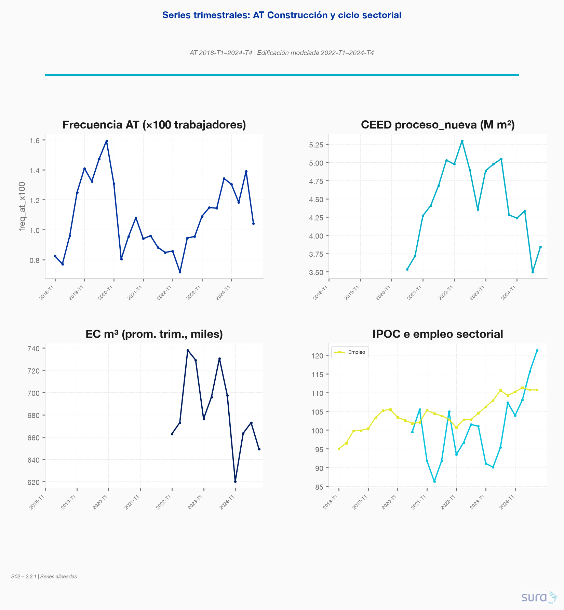

---

### 2. Estacionariedad (ADF + KPSS, α=0.05)

Regla: I(0) solo si ADF rechaza raíz unitaria **y** KPSS no rechaza estacionariedad; en conflicto o evidencia de raíz → tratar como I(1) y verificar Δ.

| Serie | I(d) | Decisión |
|---|---|---|
| `log_freq_at` | **I(1)** | Conflicto nivel → Δ estacionaria |
| `log_ceed_flujo` | **I(1)** | Idem |
| `log_ec` | **I(1)** | Idem |
| `log_ipoc` | **I(1)** | Idem |
| `pib_sectorial_var` | **I(1)**† | Conflicto (tasa; muestra corta) |
| `log_empleo` / `log_ipp` | **I(1)** | Concordancia ADF+KPSS |

† Con T pequeño, una tasa de variación puede clasificarse I(1) por baja potencia; se diferencia igual que el resto para coherencia del sistema.

**Decisión:** todas las endógenas del núcleo se modelan en **primeras diferencias** (o VECM si hubiera cointegración robusta).

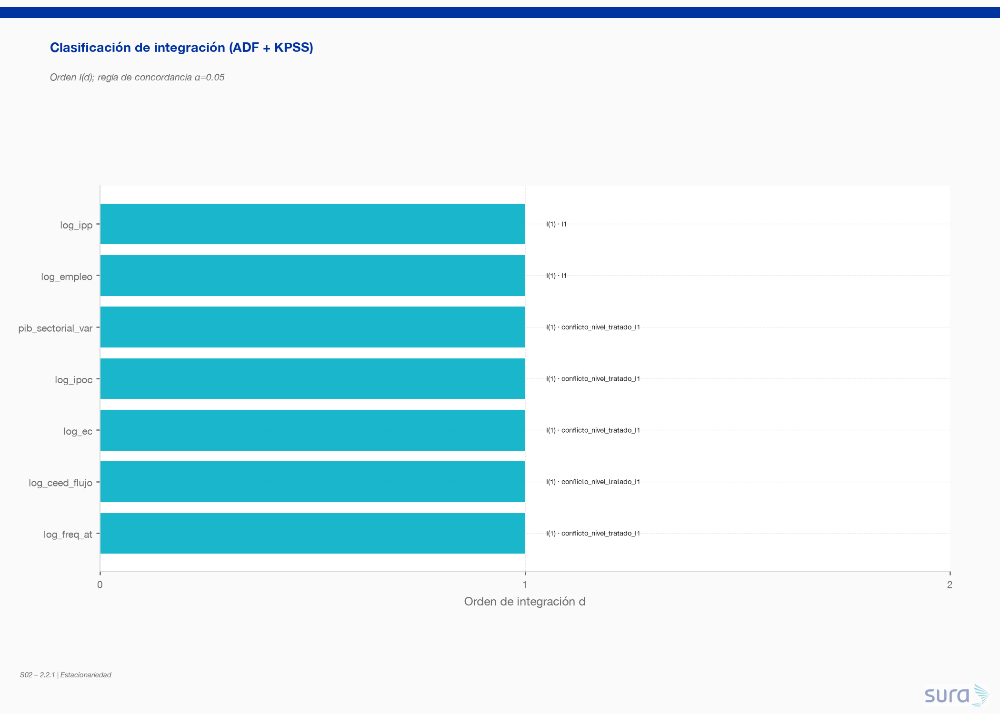

---

### 3. Especificación elegida

**Tests de cointegración (bloque edificación, Y = log AT, log CEED, log EC):**

| Test | Resultado | Lectura |
|---|---|---|
| Engle-Granger | p = **0.995** | No rechaza “sin cointegración” |
| Johansen (trace) | r̂ = **2** | Sugiere cointegración, pero **T=12** |

**Elección: VAR(1) en primeras diferencias**, con exógenas Δ(`pib_sectorial_var`, `log_empleo`).

**Justificación (frente a alternativas):**

1. **vs VECM:** con T=12, Johansen tiene distorsión de tamaño conocida; la regla adoptada privilegia Engle-Granger. Sin cointegración EG → VECM no está justificado.
2. **vs VAR en niveles:** series I(1) → riesgo de regresión espuria y IRF no estacionarias.
3. **vs OLS estático:** ignora dinámica y rezagos documentados del ciclo (6–18 meses ELIC→CEED en 2.1.4); coef. CEED no significativo (β=−0.28, p=0.38).
4. **vs ADL(1):** buen ajuste en muestra (R²=0.96) pero es uniecuacional; no permite IRF/FEVD del sistema ni shocks ortogonales CEED↔AT.

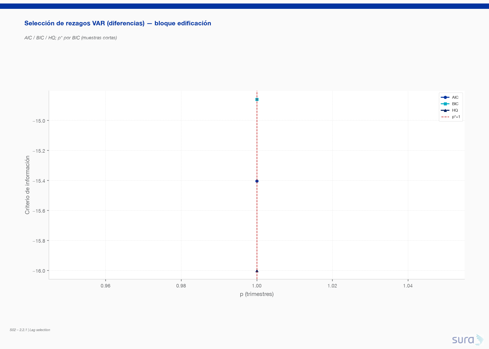

**Rezagos:** AIC/BIC/HQ sobre p∈{1…4}; con T_diff=11 y k=3 (+2 exóg.), el máximo factible es **p=1** (elegido unánimemente). El techo p=4 pedido en el enunciado no es estimable sin colapsar grados de libertad en esta ventana.

---

### 4. IRF y FEVD — bloque edificación

Shock ortogonal de 1 d.e. en el VAR(1) en diferencias.

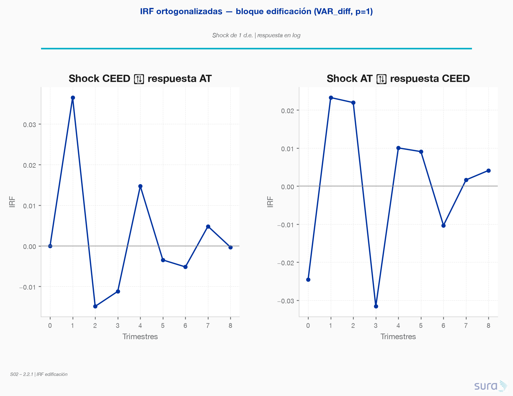

| Horizonte | IRF CEED → AT | IRF AT → CEED |
|---|---|---|
| h=1 | **+0.037** | +0.023 |
| h=2 | −0.015 | +0.022 |
| h=3 | −0.011 | −0.032 |
| h=4 | +0.015 | +0.010 |

**Lectura:** un shock positivo de actividad edificación (CEED flujo) eleva la frecuencia AT en el trimestre siguiente (~+3.7% en log), con oscilación que se disipa hacia h=6–8. El feedback AT→CEED es del mismo orden y también de corta memoria — coherente con un VAR(1) en diferencias y T corto.

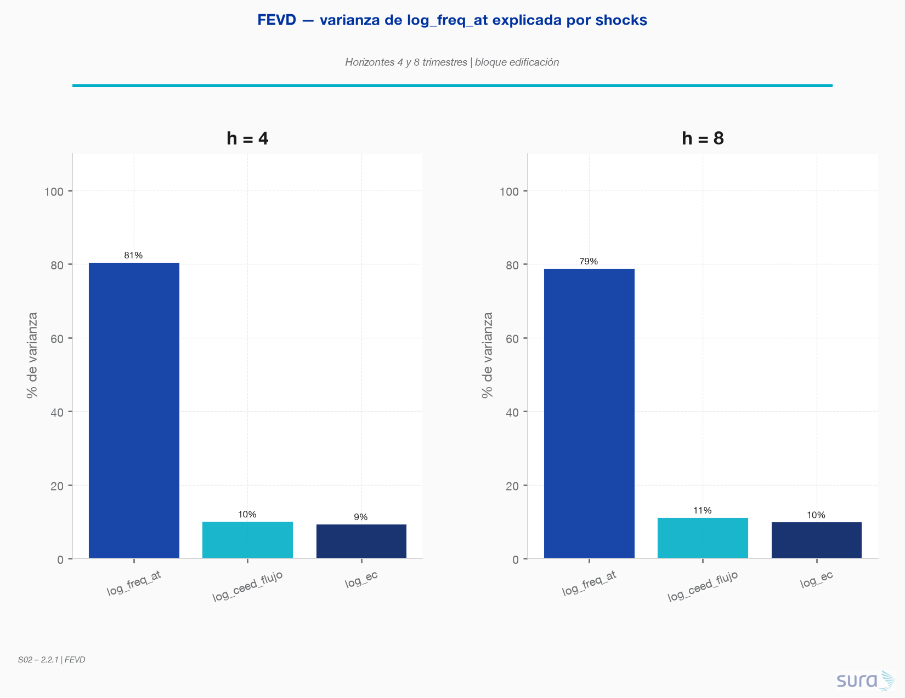

**FEVD de `log_freq_at`:**

| Horizonte | Propia (AT) | CEED | EC |
|---|---|---|---|
| **h=4** | 80.5% | **10.1%** | 9.4% |
| **h=8** | 78.9% | **11.2%** | 9.9% |

CEED + EC explican ~20% de la varianza de AT a 1–2 años; la inercia propia domina (muestra corta y p=1).

---

### 5. Diagnósticos (residuos)

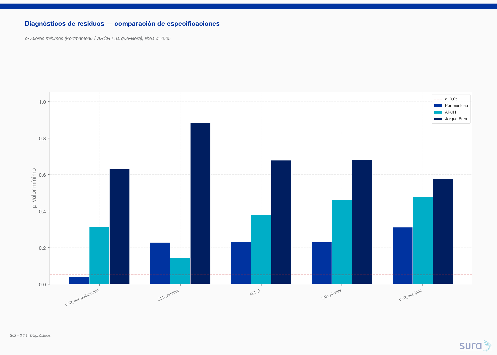

| Modelo | AIC | Portmanteau | ARCH | Jarque-Bera |
|---|---|---|---|---|
| **VAR_diff edificación (elegido)** | −15.4 | p_min=0.041 ⚠ | ✓ (0.31) | ✓ (0.63) |
| OLS estático | −19.3 | ✓ | ✓ | ✓ |
| ADL(1) | −27.6 | ✓ | ✓ | ✓ |
| VAR niveles | −16.3 | ✓ | ✓ | ✓ |
| VAR_diff IPOC | −8.9 | ✓ | ✓ | ✓ |

El Portmanteau del VAR edificación queda en el margen (p≈0.04): con T≈10 residuales no se interpreta como rechazo fuerte; ARCH y normalidad pasan. ADL/OLS tienen mejor AIC pero **no** responden a la pregunta de dinámica multi-ecuacional ni a IRF del ciclo.

#### Actualización 2.2.2 — diagnósticos extendidos

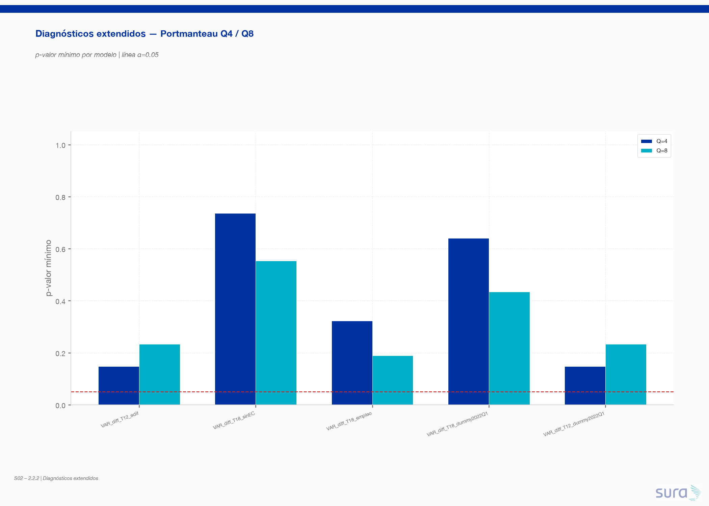

| Modelo | n | Portmanteau Q=4 | Portmanteau Q=8 | Ecuación peor (Q4) | Nota |
|---|---|---|---|---|---|
| VAR_diff T=12 (edif.) | 12 | p_min=0.148 | 0.234 | `d_log_freq_at` | Reconstrucción 2.2.2; la eq. AT concentra la AC residual |
| VAR_diff T=12 + dummy 2022-I | 12 | 0.148 | 0.234 | `d_log_freq_at` | Dummy **no** elimina la AC |
| VAR_diff T=18 (sin EC) | 18 | **0.737** ✓ | 0.554 ✓ | `d_log_freq_at` | Ventana ampliada limpia el Portmanteau |
| VAR_diff T=18 + empleo endóg. | 18 | 0.323 ✓ | 0.189 ✓ | `d_log_freq_at` | OK |
| VAR_diff T=18 + dummy 2022-I | 18 | 0.641 ✓ | 0.434 ✓ | `d_log_freq_at` | Dummy no necesaria |
| CUSUM (eq. AT, n=16) | — | — | — | — | stat=0.61, **p=0.85** → sin quiebre estructural |

**Lectura:** el p≈0.041 de 2.2.1 es un síntoma de **muestra corta (T=12)**, no de mala especificación sistemática. En n=18 el Portmanteau pasa holgado; CUSUM no detecta inestabilidad 2022–2024. Se mantiene el VAR en diferencias; para inferencia preferir la ventana T=18 (sin EC) o reportar ambos.

---

### 6. Bloque auxiliar IPOC (infraestructura)

Especificación: **VAR(2) en diferencias** (AT, IPOC) + exógenas macro; EG AT~IPOC p=0.986 → sin cointegración. Ventana más larga (n=18).

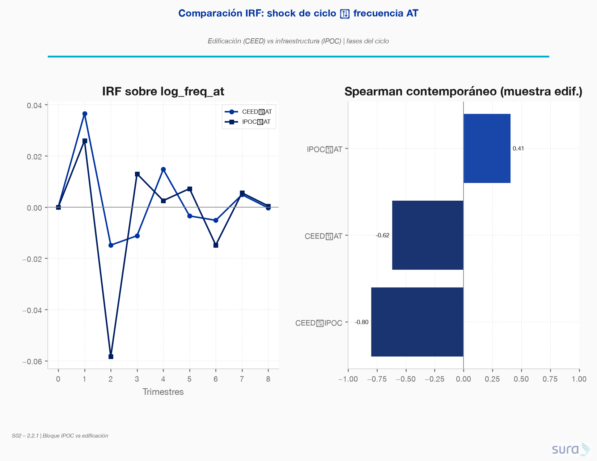

| Evidencia | Valor | Interpretación |
|---|---|---|
| Spearman CEED↔IPOC (muestra edif.) | **−0.80** | Confirma desacople 2.1.4 (ρ≈−0.72) |
| Spearman CEED↔AT | −0.62 | Contemporáneo negativo en 2022–24 (contracción CEED + alza AT) |
| Spearman IPOC↔AT | **+0.41** | Infraestructura y AT co-mueven en esta ventana |
| IRF IPOC→AT (h=1…4) | +0.026, **−0.058**, +0.013, +0.003 | Pulso distinto al de CEED (pico negativo en h=2) |
| FEVD IPOC→AT h=4 / h=8 | 18.0% / 18.2% | IPOC explica ~18% de la varianza de AT |

**Conclusión del bloque:** edificación (CEED/EC) e infraestructura (IPOC) **no operan en la misma fase** del ciclo respecto a AT. Mezclarlas en un solo VAR endógeno contaminaría la identificación — se mantienen modelos separados, como anticipaba §2.1.4.

---

### 7. Implicaciones para 2.3 (nowcast) y negocio ARL

1. La señal cíclica de edificación aporta ~10–11% de la varianza de AT a 4–8 trimestres; útil como **covariable de anticipación**, no como predictor único.
2. EC entra en el sistema endógeno y aporta ~9–10% en FEVD → refuerza su rol de bridge de alta frecuencia hacia el nowcast.
3. IPOC debe entrar como **escenario / bloque paralelo** (obras civiles), no como sustituto de CEED.
4. **Limitación crítica:** n=12 en el bloque con EC restringe p y potencia; ampliar historial ELIC/EC o usar solo CEED+AT en ventana 2020–2024 (n=18) es la sensibilidad natural del siguiente paso.

---

### Artefactos generados

| Tipo | Ruta |
|---|---|
| Script | `code/01-modelamiento/modelamiento_relaciones.py` |
| Staging | `at_construccion_trimestral`, `panel_ciclo_at_trimestral`, `estacionariedad_tests`, `var_lag_selection`, `var_irf`, `var_fevd`, `var_diagnosticos`, `var_modelo_resumen` |
| Plots | `01_series_at_ciclo.png`, `01_estacionariedad_orden.png`, `01_lag_selection.png`, `01_irf_ceed_at.png`, `01_fevd_at.png`, `01_diagnosticos_residuos.png`, `01_irf_ipoc_vs_ceed.png` |

---

## 2.2.2 Análisis y tratamiento de estacionariedad, rezagos/adelantos y relación de largo plazo

> **Script:** `code/02-estacionariedad/estacionariedad_robustez.py`
> **Cuadro ADF/KPSS/PP:** `results/estacionariedad_robustez.md`
> **Figuras:** `results/imgs/02_*.png`
> **Staging nuevo:** `estacionariedad_robustez`, `ccf_rezagos`, `coint_robustez`, `var_sensibilidad_irf`, `var_diagnosticos_ext`, `especificacion_definitiva` (#66–71)

---

### 1. Confirmación y robustez de la estacionariedad

No se repiten los tests básicos de 2.2.1; se confirman solo las series ambiguas y se añade **Phillips–Perron (PP)** implementado con corrección Newey–West (no disponible nativo en `statsmodels` 0.14 / sin paquete `arch`).

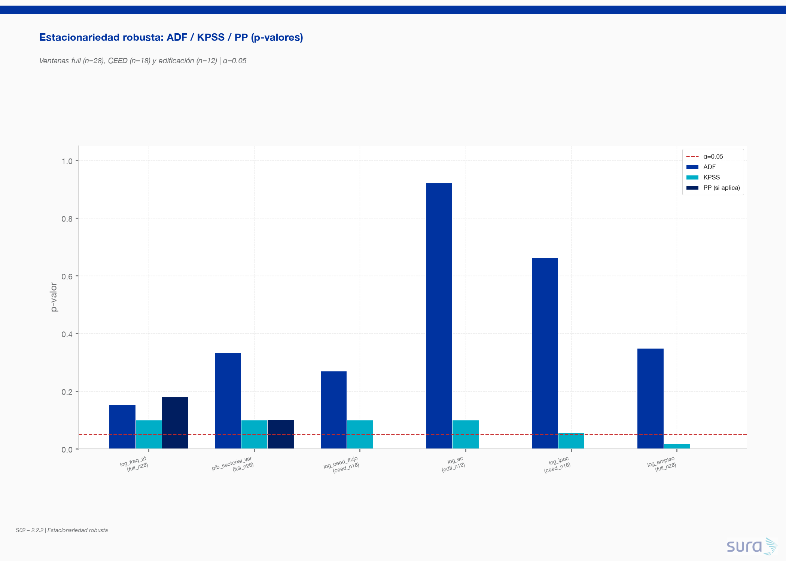

| Serie (ventana) | ADF p | KPSS p | PP p | Veredicto |
|---|---|---|---|---|
| `pib_sectorial_var` (**n=28**) | 0.333 | 0.100 | 0.101 | **I(1) conservador** — PP no cambia la decisión |
| `log_freq_at` (**n=28**) | 0.154 | 0.100 | 0.180 | **I(1)** confirmado |
| `Δ log_freq_at` / `Δ pib` (n=27) | &lt;0.001 | 0.100 | &lt;0.003 | **I(0)** — primeras diferencias estacionarias |

**Conclusión:** el núcleo endógeno permanece I(1) en niveles; el modelado en diferencias de 2.2.1 se sostiene. Detalle completo en `estacionariedad_robustez.md`.

---

### 2. Rezagos y adelantos (CCF)

Correlación cruzada entre primeras diferencias, k ∈ [−6, +6]. Convención: **k&gt;0 ⇒ el ciclo adelanta a AT**.

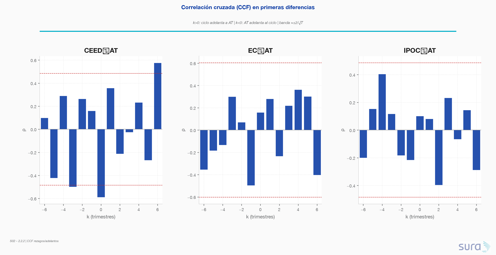

| Pareja | ρ(0) | k* (lead, \|ρ\| máx) | ρ en k* | Lectura |
|---|---|---|---|---|
| ΔCEED → ΔAT | **−0.59** | **k=6** (~18 meses) | **+0.58** | Contemporáneo negativo; adelanto estructural a 6 trimestres |
| ΔEC → ΔAT | +0.16 | k=6 | −0.40 | Señal más ruidosa (n EC corto) |
| ΔIPOC → ΔAT | +0.10 | k=2 | −0.40 | Perfil distinto (bloque infraestructura) |

**vs hipótesis 2.1.4 (6–18 meses / 2–6 trimestres):** el pico CCF CEED→AT en **k=6** cae exactamente en el borde superior del rango documentado. El **VAR(1) captura solo la dinámica de corto plazo** (IRF h=1 ≈ +0.03) y **subestima el canal estructural de mediano plazo** visible en la CCF. Con T=12 no es factible estimar VAR(p=6); la implicación operativa es usar la CCF / rezagos largos como evidencia descriptiva y, en 2.3, considerar bridges con memoria más larga (EC mensual, medias móviles).

**¿Incluir CEED como lead en el VAR?** ADL anidado en n=18: añadir `ΔCEED_{t+1}` empeora AIC (ΔAIC = **+1.73**, p_lead = **0.68**). Econométricamente un lead no es usable en pronóstico causal y aquí no aporta ajuste in-sample → **no se incorpora**.

---

### 3. Cointegración formal (largo plazo) — ventana n=18

Par (AT, CEED), 2020-III → 2024-IV.

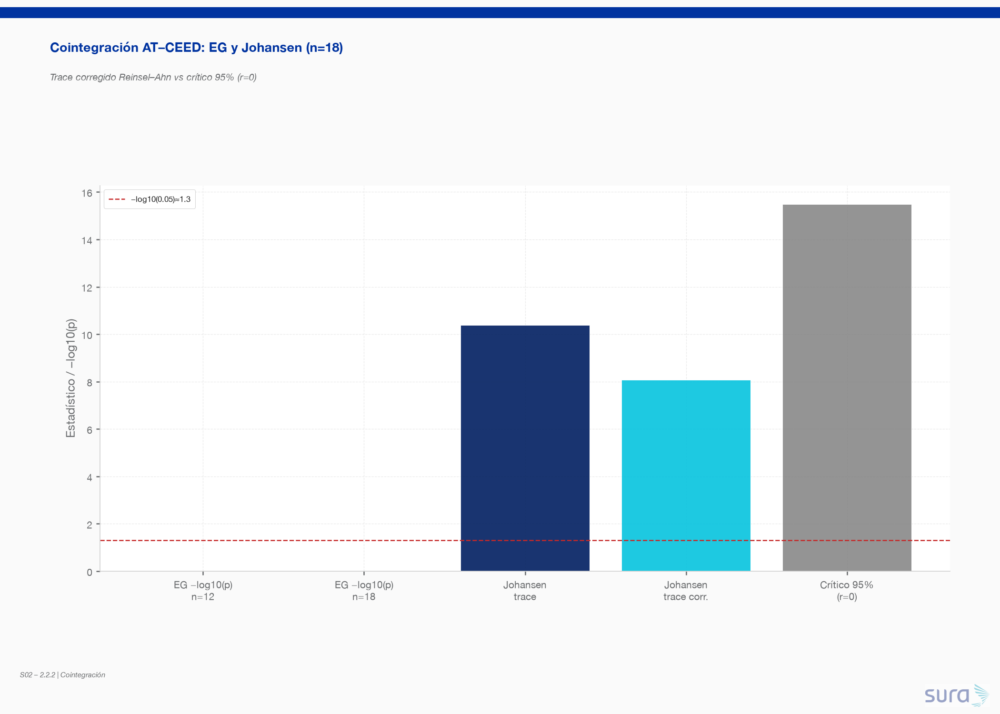

| Test | n | Resultado | r̂ |
|---|---|---|---|
| Engle-Granger | 12 (ref. 2.2.1) | p = 0.995 | 0 |
| Engle-Granger | **18** | p = **0.986** | 0 |
| Johansen trace | 18 | 10.38 &lt; 15.49 | 0 |
| Johansen trace **Reinsel–Ahn** (factor 0.778) | 18 | 8.07 &lt; 15.49 | **0** |
| Johansen max-eigenvalue corr. | 18 | &lt; crítico 95% | **0** |

Con n=18 **desaparece** el falso r̂=2 de Johansen en T=12. EG y Johansen corregido **coinciden en r=0** → se confirma formalmente la **ausencia de cointegración** detectable y se ratifica el **VAR en diferencias** (no VECM).

**Limitación de potencia:** con T≤18 y k=2, la potencia típica de EG/Johansen es ~0.20–0.35 (Haug 1996; Toda 1995). Para potencia ≥0.80 a α=0.05 en un sistema bivariado se requieren del orden de **50–80 trimestres** (≈12–20 años), según la velocidad de ajuste. Un “no rechazo” de r=0 **no prueba** que no exista largo plazo — solo que no es identificable con esta muestra.

---

### 4. Sensibilidad del VAR(1) — IRF CEED→AT

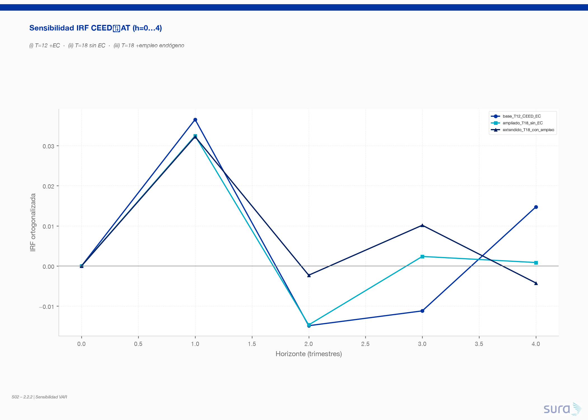

| Modelo | n | Endógenas | IRF h=1 | IRF h=2 | IRF h=4 |
|---|---|---|---|---|---|
| (i) Base 2.2.1 | 12 | AT, CEED, EC | **+0.037** | −0.015 | +0.015 |
| (ii) Ampliado sin EC | 18 | AT, CEED | **+0.032** | −0.015 | +0.001 |
| (iii) + empleo endógeno | 18 | AT, CEED, empleo | **+0.032** | −0.002 | −0.004 |

- El signo en h=1 es **establemente positivo**; la magnitud baja levemente al ampliar la muestra (−0.005).
- El empleo **casi no absorbe** el canal CEED→AT (Δ|IRF_h1| ≈ 0.0002).
- Robustez favorable al mensaje cualitativo de 2.2.1.

---

### 5. Síntesis y decisión definitiva de especificación

¿Existe relación de largo plazo estadísticamente sostenible entre actividad sectorial y siniestralidad AT? **No con la evidencia muestral actual.** Engle-Granger y Johansen (con corrección Reinsel–Ahn) no rechazan r=0 en n=18; la potencia de esos tests es baja, así que el resultado se interpreta como *ausencia de cointegración detectable*, no como prueba de independencia de largo plazo. La relación que sí se documenta es de **corto/mediano plazo**: IRF h=1 estable (~+0.03) y CCF con pico en k=6 trimestres coherente con el rezago estructural 6–18 meses de §2.1.4.

¿Qué especificación es la más adecuada? El **VAR en primeras diferencias** permanece como elección final para el bloque edificación (p=1; ventana preferente T=18 AT+CEED para diagnósticos; T=12+EC cuando se necesite el bridge de concreto). El VECM no está justificado. OLS/ADL ajustan mejor en muestra pero no responden al sistema dinámico. Un VAR(p≥4–6) que capturara el lead CCF de 6 trimestres no es estimable sin expandir el historial.

| Alternativa | Evidencia a favor | Evidencia en contra | Decisión |
|---|---|---|---|
| **VAR en diferencias (elegida)** | Series I(1); EG+Johansen r=0; IRF estable T12/T18; Portmanteau OK en n=18 | p=1 subestima lead CCF k=6; T corto | **Adoptar** |
| VECM | — | EG p≈0.99; Johansen corr. r=0; T≪50 | Rechazar |
| VAR en niveles | — | I(1) → regresión espuria | Rechazar |
| ADL / OLS uniecuacional | AIC bajo; lead CEED no aporta | Sin IRF/FEVD de sistema; no modela feedback | Complemento descriptivo, no principal |
| VAR(p=6) con lead estructural | CCF k=6 | Impossible con T≤18 (df) | Posponer hasta ampliar historia |

**Especificación definitiva para 2.3 / reporting:** VAR(1) en diferencias del bloque edificación; IPOC en bloque separado (VAR en diferencias); no forzar cointegración; reportar CCF k=6 como evidencia de canal de mediano plazo no embebido en p=1.
