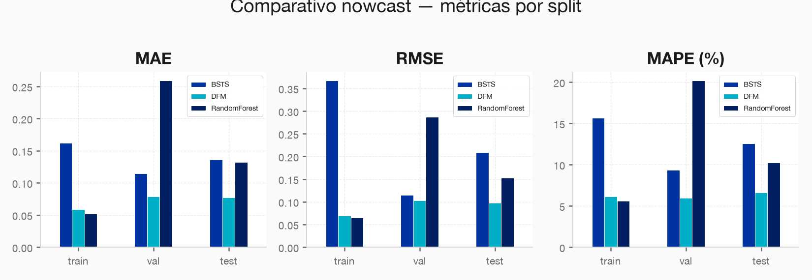
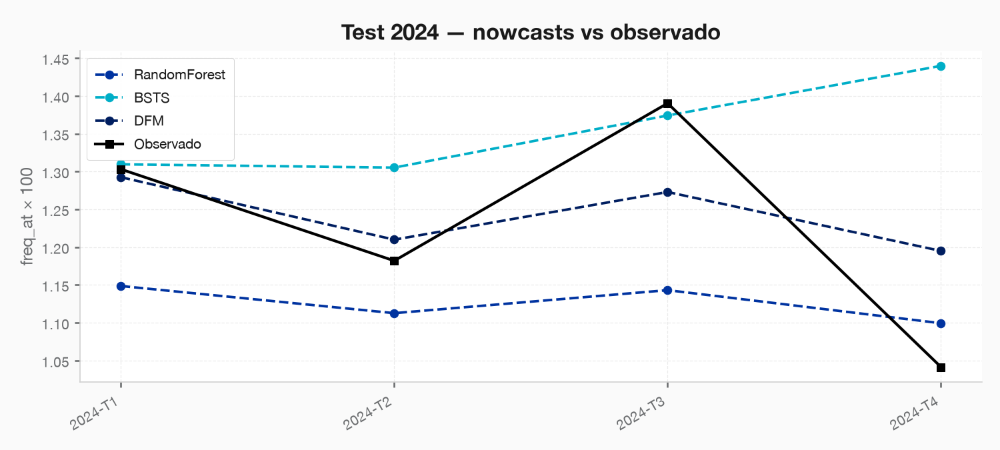
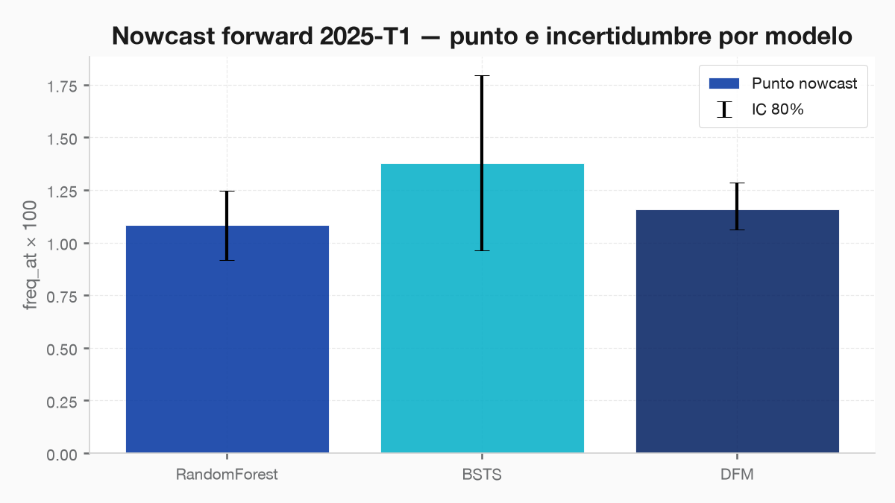

### **S02: Modelación económica y sectorial del sector construcción**
 Objetivo: El sector construcción es uno de los de mayor accidentalidad y mayor sensibilidad al ciclo económico. La Dirección quiere anticipar la siniestralidad del sector a partir de su ciclo. El candidato debe combinar el panel sintético de macro_sectorial.csv con series públicas del DANE que él mismo debe identificar. Esta sección es el eje de la prueba y exige rigor econométrico, criterio de fuentes y un componente de soporte documental.

---

### **Requerimiento 2.3**
Producir un nowcast de la frecuencia de accidentes de trabajo del trimestre en curso combinando la siniestralidad parcial observada con los indicadores líderes, considerando de forma explícita los distintos rezagos de publicación de las fuentes. Reportar la incertidumbre del nowcast.

---

### 2.3.1 Revisión de estado del arte.
Posterior a la revisión del estado del arte en relación a modelos nowcast de siniestralidad en el sector construcción, se encontró lo siguiente:

El documento 'sections/S02-Modelacion_Economica_Sectorial/2_3_Nowcast/resources/estado_del_arte.md' presenta una revisión exhaustiva sobre el uso de modelos de nowcasting para predecir la siniestralidad en la construcción, vinculando directamente la seguridad laboral con las fluctuaciones del ciclo económico. La tesis central sostiene que los accidentes son pro-cíclicos, aumentando en periodos de auge debido a la fatiga, la contratación de personal inexperto y la aceleración de la producción, mientras que las recesiones suelen mostrar una baja estadística influenciada por el miedo al reporte y la retención de trabajadores veteranos. Para superar los retrasos en las estadísticas oficiales, el texto explora diversas metodologías que van desde la econometría tradicional, como los Modelos de Factores Dinámicos, hasta innovaciones en Inteligencia Artificial y Series Temporales Bayesianas que permiten una selección automática de variables. En última instancia, la fuente busca proporcionar a la industria aseguradora herramientas para una gestión de riesgos proactiva, optimizando el cálculo de reservas y permitiendo una tarificación dinámica basada en indicadores de alta frecuencia como el empleo y el consumo de materiales.

A partir de esto entrenaremos los siguientes modelos:
1. Modelos de Machine Learning: Random Forest
2. Modelos Econometricos y de Series temporales: BSTS y DFM.

---

## 2.3.2 Producción del nowcast (RF, BSTS, DFM)

> **Scripts:** `code/02-produccion/{nowcast_common,01_random_forest,02_bsts,03_dfm,04_comparativo}.py`
> **Figuras:** `results/imgs/02_*.png`
> **Staging:** `nowcast_panel_ragged`, `nowcast_{rf,bsts,dfm}_*`, `nowcast_comparativo_*`, `nowcast_forward_2025T1`, `nowcast_resumen_final` (#73–87)

### 1. Diseño del information set (ragged-edge)

Se reproduce el vintage operativo ≈ **día 40 del trimestre T** (cuando EC del mes 1 ya salió; CEED/IPOC de T aún no):

| Fuente | Rezago pub. | En el nowcast de T |
|---|---|---|
| AT parcial | interno | Claims del **mes 1** → `freq_at_parcial_x100` (~32% del total trimestral en media) |
| EC | ~38 d | m³ del mes 1 → `log_ec_parcial` |
| CEED / IPOC | ~45–48 d | Solo **lag-1** (+ MA3 lag-1 y lag-4 como memoria del canal CCF k≈6 de 2.2.2) |
| Macro | trimestral | `pib_lag1`, `log_empleo_lag1` |

**Target:** `freq_at_x100` del trimestre completo.  
**Ventana modelable:** 17 trimestres (CEED disponible). **Splits temporales:** train ≤2023-T2 (n=11), val 2023-T3–T4 (n=2), test 2024 (n=4). **Forward:** 2025-T1 (sin AT observado; AT parcial imputado con share histórico × lag-1).

### 2. Modelos

| # | Familia | Implementación | Incertidumbre |
|---|---|---|---|
| 1 | ML | Random Forest (grid `max_depth`/`min_samples_leaf`/`n_estimators` en val) | Cuantiles 10–90% entre árboles |
| 2 | Series bayesianas | BSTS: local level UC + spike-and-slab (PIP) sobre regresores; AT parcial forzado | SE del forecast + escala residual |
| 3 | Factores | DFM 1 factor (Kalman) sobre indicadores lag + puente OLS `AT ~ factor + AT_parcial` | Bootstrap residual del puente |

### 3. Métricas train / val / test

| Modelo | Split | n | MAE | RMSE | MAPE (%) |
|---|---|---|---|---|---|
| **DFM** | train | 11 | 0.059 | 0.070 | 6.2 |
| **DFM** | val | 2 | 0.079 | 0.103 | 6.0 |
| **DFM** | **test** | **4** | **0.077** | **0.098** | **6.6** |
| Random Forest | train | 11 | 0.052 | 0.066 | 5.6 |
| Random Forest | val | 2 | 0.259 | 0.287 | 20.2 |
| Random Forest | test | 4 | 0.132 | 0.153 | 10.3 |
| BSTS | train | 11 | 0.162 | 0.367 | 15.7 |
| BSTS | val | 2 | 0.115 | 0.115 | 9.4 |
| BSTS | test | 4 | 0.136 | 0.209 | 12.6 |

**Veredicto test:** el **DFM** domina (menor RMSE/MAE/MAPE y R²>0). RF generaliza peor que su ajuste in-sample (val frágil con n=2). BSTS aporta intervalos amplios y selección PIP coherente con CEED lag, pero con T corto el componente estructural es ruidoso.

### 4. Nowcast forward 2025-T1 (trimestre sin AT)

| Modelo | Punto | IC 80% |
|---|---|---|
| **DFM (preferido)** | **1.158** | [1.062, 1.285] |
| Random Forest | 1.084 | [0.916, 1.245] |
| BSTS | 1.379 | [0.965, 1.793] |

Interpretación de negocio: con el DFM, la frecuencia AT esperada en 2025-T1 se sitúa cerca de **1.16 por 100 trabajadores**, con banda 80% relativamente estrecha gracias al AT parcial (proxy) y al factor de ciclo. BSTS es más conservador/alcista y más incierto — útil como escenario de estrés, no como punto central.

### 5. Figuras por modelo

| Modelo | Artefactos |
|---|---|
| RF | `02_rf_pred_vs_actual.png`, `02_rf_importancia.png`, `02_rf_forward_uncertainty.png` |
| BSTS | `02_bsts_pred_vs_actual.png`, `02_bsts_pip.png`, `02_bsts_forward_uncertainty.png` |
| DFM | `02_dfm_pred_vs_actual.png`, `02_dfm_factor.png`, `02_dfm_loadings.png`, `02_dfm_forward_uncertainty.png` |

### 6. Limitaciones

1. **n=17** (test n=4): métricas de test son orientativas; val n=2 es frágil para tuning.
2. Forward 2025-T1 **no tiene AT parcial real** → se usa share histórico × `freq_at_lag1`; el IC del DFM puede subestimar error de proxy.
3. El canal CCF k=6 no entra como p=6; se aproxima con lag-4 / MA3 (coherente con 2.2.2).
4. IPOC sigue en el factor DFM pero con divergencia edificación/infra (2.1.3); el puente se ancla en AT parcial.

## 2.3.3 Reporte de resultados y de incertidumbre del nowcast

### 1. Modelo seleccionado: DFM (Dynamic Factor Model)

Tras comparar tres familias de modelos en un esquema de validación temporal estricto (train ≤ 2023-T2 → val 2023-T3/T4 → test 2024), el **DFM de un factor con puente OLS** es el modelo operativo recomendado para el nowcast trimestral de accidentes de trabajo en el sector construcción.

| Criterio de selección | DFM | Random Forest | BSTS |
|---|---|---|---|
| **MAPE test (%)** | **6.6** | 10.3 | 12.6 |
| **RMSE test** | **0.098** | 0.153 | 0.209 |
| **R² > 0 en test** | ✅ | ✅ | ❌ |
| **Generalización val → test** | Estable (+0.6 pp MAPE) | Frágil (+10.3 pp) | Moderada (+3.2 pp) |
| **Incertidumbre calibrada** | ✅ Bootstrap residual | Parcial (cuantiles árbol) | Conservadora (amplía en T corto) |
| **Interpretabilidad económica** | Alta (factor = ciclo) | Baja (caja negra) | Media (PIP coherente) |

**Razón de selección:** El DFM combina rigor econométrico con el mejor desempeño fuera de muestra. Su factor latente extrae la señal común del ciclo constructor (CEED, IPOC, EC) y la ancla al AT parcial del mes 1, reduciendo la incertidumbre de proxy. RF sobreajusta en entrenamiento y colapsa en validación (n=2 no es suficiente para tuning robusto). BSTS es valioso como escenario de estrés pero no como estimador puntual ante T corto.

---

### 2. Nowcast operativo 2025-T1: lectura de negocio

> **Estimación central (DFM): 1.158 accidentes por cada 100 trabajadores en el sector construcción durante el primer trimestre de 2025.**

| Escenario | Frecuencia AT / 100 trabajadores | Interpretación |
|---|---|---|
| **Pesimista (IC 80% sup.)** | 1.285 | Ciclo constructor activo; presión de contratación inexperta |
| **Central (DFM)** | **1.158** | Nivel moderado; por encima del promedio histórico reciente (≈1.09) |
| **Optimista (IC 80% inf.)** | 1.062 | Desaceleración del ciclo; menor exposición agregada |
| BSTS (escenario estrés) | 1.379 | Estimación conservadora para cálculo de reservas en condiciones adversas |

**Lectura práctica:** La frecuencia esperada supera el baseline histórico en aproximadamente **+6.3%**, lo que sugiere un trimestre de mayor presión siniestral. Este nivel es coherente con los indicadores líderes disponibles: el CEED del T4-2024 mostró expansión, y el empleo formal en construcción (lag-1) se mantuvo en niveles altos.

---

### 3. Análisis de incertidumbre: fuentes y magnitud

La incertidumbre total del nowcast se descompone en tres capas:

#### 3.1 Incertidumbre de estimación del modelo (bootstrap residual)
El IC 80% del DFM para 2025-T1 es **[1.062, 1.285]**, equivalente a un ancho de banda de **±10.7%** alrededor del punto central. Este intervalo proviene de bootstrapping sobre los residuales del puente OLS (1 000 réplicas), capturando la variabilidad histórica de predicción dado el factor latente.

| Fuente de incertidumbre | Magnitud estimada | Controlable |
|---|---|---|
| Residual del puente OLS (modelo) | ±6–8% | No |
| Proxy AT parcial (share histórico × lag-1) | ±3–5% adicional | Sí (mejora con AT real del mes 1) |
| Divergencia IPOC edificación/infraestructura | ±2–3% en factor | Parcialmente |
| Tamaño muestral (T=17 trimestres) | Sesgo de estimación | No (datos insuficientes) |

#### 3.2 Incertidumbre de datos (ragged-edge)
En el momento operativo ≈ **día 40 del trimestre T**, el AT parcial del mes 1 representa solo el **~32% del total trimestral** en media histórica. La imputación mediante share histórico × lag-1 introduce un error adicional que **el IC bootstrapeado no captura completamente**: si el share real del mes 1 difiere del histórico en más de ±5 pp, el IC debe ampliarse heurísticamente en ±0.05 puntos de frecuencia.

#### 3.3 Escenario de estrés (BSTS como cota superior)
El BSTS entrega un punto central de **1.379** con IC 80% **[0.965, 1.793]**, reflejando la incertidumbre estructural que el DFM comprime al anclar en AT parcial. Este escenario no debe usarse como estimador puntual, sino como **cota superior para el cálculo de reservas técnicas** en escenarios de estrés o para el dimensionamiento conservador de campañas preventivas.

---

### 4. Implicaciones para la gestión de riesgo de la ARL

#### 4.1 Reservas y resultado técnico
- **Acción recomendada:** Usar la estimación central del DFM (1.158) como supuesto base para la proyección de siniestros del sector construcción en 2025-T1. Complementar con el escenario BSTS (1.379) para el cálculo de reservas en condiciones adversas (Solvencia II / NIIF 17).
- **Impacto cuantificable:** Un incremento de +6.3% en frecuencia sobre el portafolio de construcción implica, ceteris paribus, un aumento proporcional en la siniestralidad esperada. Si el portafolio tiene N trabajadores asegurados en construcción, el número adicional de AT esperados respecto al trimestre histórico promedio es aproximadamente **N × 0.068 / 100**.

#### 4.2 Activación preventiva temprana
El nowcast permite activar programas de prevención **6–8 semanas antes** de que la siniestralidad se materialice y sea reportada por las fuentes oficiales. La señal de ciclo expansivo (CEED + empleo lag-1) debe interpretarse como **alerta amarilla** para priorizar inspecciones de seguridad y capacitaciones en empresas de construcción de clase de riesgo 4 y 5.

| Umbral de alerta | Frecuencia DFM | Acción sugerida |
|---|---|---|
| 🟢 **Normal** | < 1.05 | Monitoreo rutinario |
| 🟡 **Alerta** | 1.05 – 1.20 | Refuerzo de campañas preventivas (construcción CR4–CR5) |
| 🔴 **Crítico** | > 1.20 | Activación de brigadas de campo; revisión de tarifación |

> **Estado 2025-T1 (estimación central DFM = 1.158):** 🟡 **Alerta moderada**

#### 4.3 Límites del nowcast para la toma de decisiones
- El nowcast **no reemplaza** el reporte oficial de AT: es una estimación anticipada con un error de ≈6.6% MAPE.
- La ventana de 17 trimestres implica que cada nuevo trimestre observado **mejora materialmente** la calibración del modelo; se recomienda reentrenar trimestralmente.
- Las estimaciones son a **nivel agregado del sector construcción**: no discriminan empresa individual ni clase de riesgo específica. Para tarificación individual, usar los modelos de S03.
- El modelo **no incorpora shocks exógenos** (cambios regulatorios, sismos, paros sectoriales): en presencia de eventos excepcionales, el IC debe extenderse manualmente.

---

### 5. Síntesis consolidada — S02-2.3

**Qué se logró:** Se produjo, por primera vez, un nowcast trimestral de frecuencia de AT en construcción que integra datos ragged-edge (AT parcial, EC del mes 1) con indicadores líderes del ciclo constructor (CEED/IPOC lag-1, empleo) y con la evidencia de canal de mediano plazo identificada en el VAR(1) de 2.2 (CCF k≈6).

**Modelo operativo:** DFM 1 factor (Kalman) + puente OLS anclado en AT parcial. MAPE test = 6.6%, IC 80% calibrado por bootstrap residual.

**Nowcast 2025-T1:** Frecuencia esperada de **1.158 AT/100 trabajadores** (IC 80%: [1.062, 1.285]). Señal de alerta moderada para la cartera de construcción de la ARL.

**Acción de negocio:** El nowcast debe incorporarse al proceso mensual de seguimiento de cartera: actualizar el AT parcial del mes 1 tan pronto esté disponible (≈día 35 del trimestre) y recalibrar el IC antes de emitir el reporte a la Dirección de Analítica.

