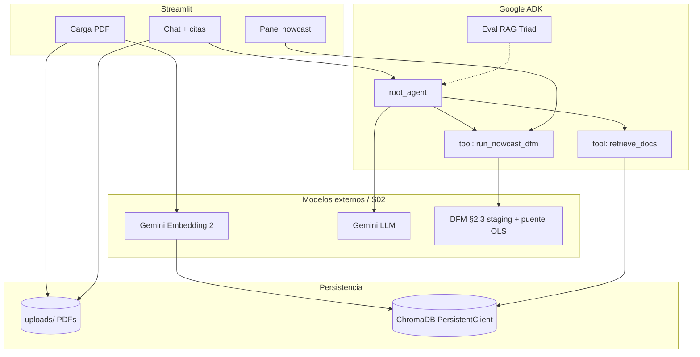
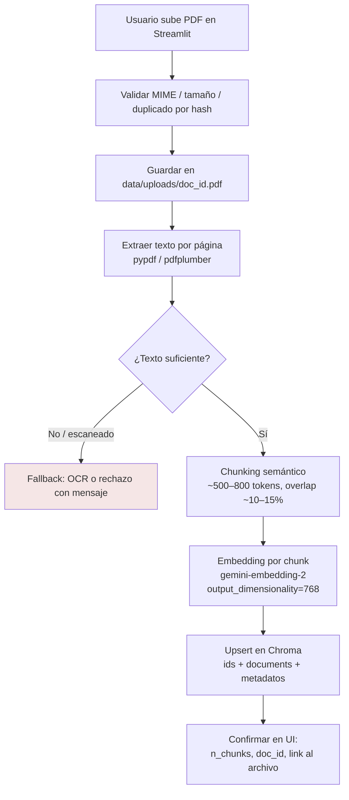
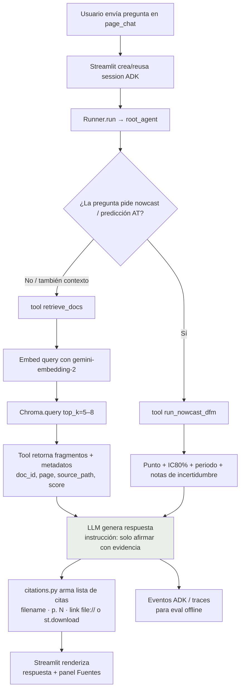
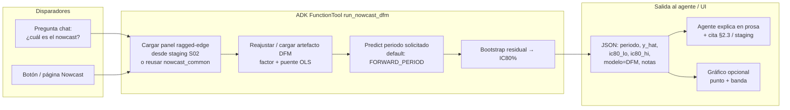
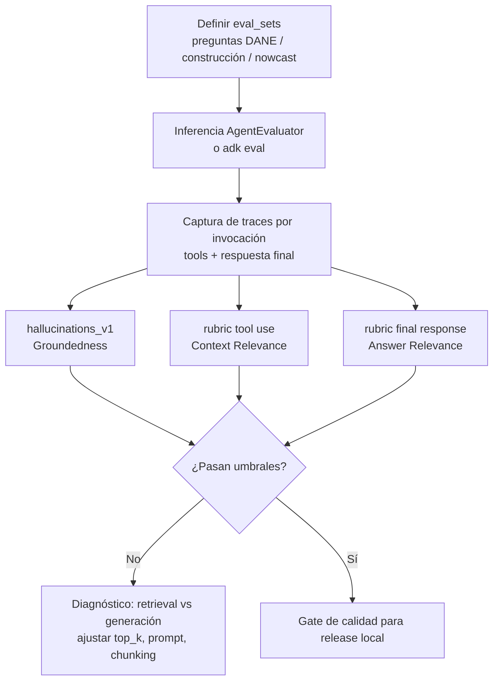

### **S02: Modelación económica y sectorial del sector construcción**
 Objetivo: El sector construcción es uno de los de mayor accidentalidad y mayor sensibilidad al ciclo económico. La Dirección quiere anticipar la siniestralidad del sector a partir de su ciclo. El candidato debe combinar el panel sintético de macro_sectorial.csv con series públicas del DANE que él mismo debe identificar. Esta sección es el eje de la prueba y exige rigor econométrico, criterio de fuentes y un componente de soporte documental.

---

### **Requerimiento 2.4**
El analista sectorial necesita apoyarse en un asistente que recupere información de un corpus documental y genere respuestas fundamentadas en él. Construir ese sistema de recuperación y generación aumentada, RAG, para que responda preguntas sobre un corpus de boletines del DANE y estudios del sector construcción. Debe recuperar los fragmentos pertinentes, fundamentar y citar cada respuesta en su fuente, y contar con una estrategia de evaluación de la calidad de las respuestas y de mitigación de alucinaciones. El asistente debe quedar integrado al flujo de la modelación anterior como herramienta de soporte a la investigación sectorial, no como pieza aislada.

---

### 2.4.1 Arquitectura

> **Decisión:** Asistente RAG en `apps/Asistente_RAG` con **Streamlit** (UI), **Google ADK** (agente + tools + eval), **ChromaDB PersistentClient** (vector store + persistencia local) y **Gemini Embedding 2** (`gemini-embedding-2`) para indexación. El nowcast DFM de §2.3 se expone como tool ADK, no como app separada.

#### Qué revisar primero

1. Stack y responsabilidades por capa.
2. Estructura de carpetas propuesta.
3. Tres flujos (ingestión → chat con citas → nowcast DFM).
4. Evaluación RAG Triad con métricas predefinidas de ADK (traces + E2E).

#### Fuera de alcance de este ítem

- Implementación de código / despliegue productivo.
- Entrenamiento nuevo del DFM (se reutiliza el artefacto de §2.3.2–2.3.3).
- Corpus inicial: se asume carga vía UI; el seed de boletines DANE es un paso posterior.

---

## 1. Stack y responsabilidades

| Capa | Tecnología | Rol |
|---|---|---|
| Frontend | Streamlit | Carga PDF, chat, visualización de citas/links, panel nowcast |
| Orquestación agente | Google ADK (`Agent`, `Runner`, `FunctionTool`) | Razonamiento, selección de tools, sesión |
| LLM respuesta | Gemini (p. ej. `gemini-2.5-flash` / `gemini-flash-latest`) | Generación condicionada a contexto recuperado |
| Embeddings | Gemini Embedding 2 (`gemini-embedding-2`) | Vectores de chunks (y query); dim. recomendada 768 o 1536 (MRL) |
| Memoria vectorial + persistencia | ChromaDB `PersistentClient` | Colección de chunks + metadatos; disco local bajo `apps/Asistente_RAG/data/chroma` |
| Persistencia de archivos | Filesystem | PDFs originales en `data/uploads/` para links de citas |
| Nowcast | DFM §2.3 (`03_dfm.py` + staging S02) | Tool `run_nowcast_dfm` → punto + IC80% |
| Evaluación | ADK Eval (`AgentEvaluator`, `EvalConfig`, criterios prebuilt) | RAG Triad a nivel trace y E2E |

**Por qué no Vertex AI RAG corpus:** el requerimiento fija ChromaDB local como store y persistencia; ADK se usa con tools propias sobre Chroma, no con `VertexAiRagRetrieval`.

---

## 2. Estructura objetivo en `apps/Asistente_RAG`

```text
apps/Asistente_RAG/
├── app.py                          # Entry Streamlit (páginas)
├── .env.example                    # GOOGLE_API_KEY / GEMINI_API_KEY
├── config/
│   └── settings.py                 # paths, modelo, top_k, dim embeddings
├── agents/
│   ├── root_agent.py               # Agent ADK + tools
│   └── prompts.py                  # instrucciones (citar, no inventar, when-to-nowcast)
├── tools/
│   ├── retrieve_docs.py            # FunctionTool → Chroma query
│   └── nowcast_dfm.py              # FunctionTool → predicción DFM
├── services/
│   ├── embeddings.py               # cliente Gemini Embedding 2 + EmbeddingFunction Chroma
│   ├── ingestion.py                # PDF → chunk → embed → upsert
│   ├── chroma_store.py             # PersistentClient / colección
│   └── citations.py                # metadatos → citas + URLs/paths Streamlit
├── ui/
│   ├── page_upload.py              # carga PDF + progreso ingestión
│   ├── page_chat.py                # chat + citas clickeables
│   └── page_nowcast.py             # (opcional) vista dedicada DFM
├── eval/
│   ├── eval_config_rag_triad.json  # criterios ADK mapeados a Triad
│   ├── eval_sets/                  # casos E2E (preguntas + trayectorias esperadas)
│   └── run_eval.py                 # wrapper AgentEvaluator / `adk eval`
├── data/
│   ├── chroma/                     # persistencia Chroma (gitignored)
│   └── uploads/                    # PDFs fuente (gitignored)
└── README.md
```

**Contrato de metadatos por chunk (Chroma):**

| Campo | Uso |
|---|---|
| `doc_id` | Identificador estable del PDF |
| `filename` | Nombre original |
| `source_path` | Ruta relativa en `data/uploads/` (link de cita) |
| `page` | Página(s) del fragmento |
| `chunk_id` | Índice dentro del documento |
| `title` | Título / asunto si se extrae |
| `ingested_at` | Timestamp |

---

## 3. Vista de componentes



---

## 4. Flujo de ingestión de documentos

**Objetivo:** PDF subido → chunks indexados en Chroma con embeddings Gemini Embedding 2 → archivo original disponible para citas.



### Decisiones de ingestión

| Tema | Decisión |
|---|---|
| Modelo | `gemini-embedding-2` (estable); no `gemini-embedding-001` |
| Dimensión | 768 por defecto (balance calidad/costo; MRL permite subir a 1536) |
| Chunking | Texto por página + ventanas con overlap; un chunk = unidad de cita |
| PDF nativo multimodal | Opcional para PDFs cortos (≤6 págs.): embed del PDF completo como complemento; el camino principal es chunking de texto para boletines largos DANE |
| Idempotencia | `doc_id` = hash de contenido; re-upload reemplaza chunks previos del mismo hash |
| Colección Chroma | Una colección `sector_construccion_rag` (cosine) |

---

## 5. Flujograma de respuesta a preguntas (chat + citas)

**Objetivo:** Pregunta → retrieval → respuesta fundamentada con citas y link al PDF.



### Contrato de respuesta en UI

1. **Cuerpo:** respuesta en lenguaje natural (ES), con referencias inline `[1]`, `[2]`.
2. **Panel Fuentes:** cada cita muestra `filename`, página, score de similitud y **link** al PDF en `data/uploads/` (abrir / descargar).
3. **Mitigación de alucinación (runtime):**
   - Instrucción del agente: si `retrieve_docs` no aporta evidencia, decir “no encontré soporte en el corpus” en lugar de inventar.
   - Umbral mínimo de similitud (p. ej. distancia cosine / score) para descartar chunks irrelevantes.
   - Nowcast solo vía tool; no inventar números de frecuencia AT.

---

## 6. Flujo de integración del modelo nowcast (DFM)

**Fuente canónica:** §2.3.2–2.3.3 — DFM 1 factor + puente OLS; forward operativo 2025-T1 = **1.158** [1.062, 1.285] IC80%.



### Decisiones de integración DFM

| Tema | Decisión |
|---|---|
| Superficie | Tool ADK `run_nowcast_dfm(period: str \| None)` invocable desde chat o UI dedicada |
| Código | Reutilizar `nowcast_common.build_ragged_panel` + lógica de `03_dfm.py` (import path o módulo compartido bajo `apps/.../tools/dfm_adapter.py`) |
| Datos | Leer `data/staging/S02/` (`nowcast_panel_ragged`, `nowcast_forward_2025T1`, etc.); no duplicar ETL |
| Incertidumbre | Siempre devolver IC80%; el agente debe verbalizar la banda, no solo el punto |
| RF / BSTS | Fuera del tool operativo; disponibles solo como contraste documental vía RAG si están en el corpus |

---

## 7. Metodología de evaluación — RAG Triad (ADK)

El **RAG Triad** (Context Relevance · Groundedness · Answer Relevance) se implementa con **criterios predefinidos de ADK** (`PrebuiltMetrics` / `EvalConfig`), en dos capas:

| Capa | Qué mide | Cómo |
|---|---|---|
| **Traces (por invocación)** | Calidad de un turno: tools llamados, grounding de la respuesta vs tool outputs | Eventos del `Runner` + métricas ADK sobre la invocación |
| **E2E (eval sets)** | Casos de regresión: pregunta → trayectoria de tools → respuesta | `AgentEvaluator` / CLI `adk eval` sobre `eval/eval_sets/` |

### Mapeo Triad → métricas predefinidas ADK

| Pilar RAG Triad | Métrica ADK predefinida | Umbral sugerido (v1) | Notas |
|---|---|---|---|
| **Groundedness** | `hallucinations_v1` | ≥ 0.80 | LLM-as-judge: oraciones de la respuesta vs contexto (instrucciones + tool results). Mitigación directa de alucinaciones. |
| **Answer Relevance** | `rubric_based_final_response_quality_v1` | ≥ 0.75 | Rúbricas sí/no: “responde la pregunta”, “incluye citas”, “no inventa cifras AT”. |
| **Context Relevance** | `rubric_based_tool_use_quality_v1` + `tool_trajectory_avg_score` | ≥ 0.75 / = 1.0 en golden paths | Rúbricas sobre si `retrieve_docs` trajo fragmentos pertinentes; trayectoria esperada (llamar retrieve / nowcast cuando corresponde). |
| Complemento E2E (opcional) | `final_response_match_v2` | ≥ 0.70 | Solo en casos con respuesta de referencia (golden answers). |
| Seguridad | `safety_v1` | pass | Bloqueo de contenido dañino. |

Ejemplo de `eval/eval_config_rag_triad.json` (esqueleto):

```json
{
  "criteria": {
    "hallucinations_v1": {
      "threshold": 0.8,
      "judge_model_options": {
        "judge_model": "gemini-2.5-flash",
        "num_samples": 5
      },
      "evaluate_intermediate_nl_responses": false
    },
    "rubric_based_final_response_quality_v1": {
      "threshold": 0.75,
      "judge_model_options": { "judge_model": "gemini-2.5-flash", "num_samples": 5 },
      "rubrics": [
        { "rubric_id": "ar_1", "rubric_content": "La respuesta aborda directamente la pregunta del usuario." },
        { "rubric_id": "ar_2", "rubric_content": "La respuesta cita o apunta a fuentes del corpus cuando afirma hechos documentales." },
        { "rubric_id": "ar_3", "rubric_content": "Si no hay evidencia recuperada, la respuesta lo declara explícitamente." }
      ]
    },
    "rubric_based_tool_use_quality_v1": {
      "threshold": 0.75,
      "judge_model_options": { "judge_model": "gemini-2.5-flash", "num_samples": 5 },
      "rubrics": [
        { "rubric_id": "cr_1", "rubric_content": "Se invocó retrieve_docs cuando la pregunta requiere evidencia documental." },
        { "rubric_id": "cr_2", "rubric_content": "Los fragmentos retornados por la tool son relevantes a la consulta." },
        { "rubric_id": "cr_3", "rubric_content": "Se invocó run_nowcast_dfm solo cuando la pregunta pide predicción/nowcast de AT." }
      ]
    },
    "tool_trajectory_avg_score": {
      "threshold": 1.0,
      "match_type": "IN_ORDER"
    },
    "safety_v1": { "threshold": 0.9 }
  }
}
```

### Flujo de evaluación (traces + E2E)



### Mitigación de alucinaciones (cierre del requerimiento 2.4)

| Momento | Mecanismo |
|---|---|
| Runtime | Prompt estricto + umbral de retrieval + tool-only para cifras nowcast |
| Trace | `hallucinations_v1` sobre tool outputs |
| E2E | Eval sets con casos “sin evidencia” (debe abstenerse) y casos nowcast (debe llamar DFM) |
| Producto | Citas obligatorias con link al PDF; sin fuente → no afirmar |

---

## 8. Variables de entorno y dependencias nuevas (preview)

| Variable | Uso |
|---|---|
| `GOOGLE_API_KEY` / `GEMINI_API_KEY` | Gemini LLM + Embedding 2 |
| `ASISTENTE_RAG_ROOT` | Override de paths (opcional) |
| `CHROMA_PATH` | Default `apps/Asistente_RAG/data/chroma` |

Dependencias a añadir en implementación (no en este ítem): `google-adk`, `chromadb`, `streamlit`, `google-genai`, `pypdf` (u OCR si se habilita).

---


### 2.4.2 Construcción

Asistente RAG disponible en 'apps/Asistente_RAG'
