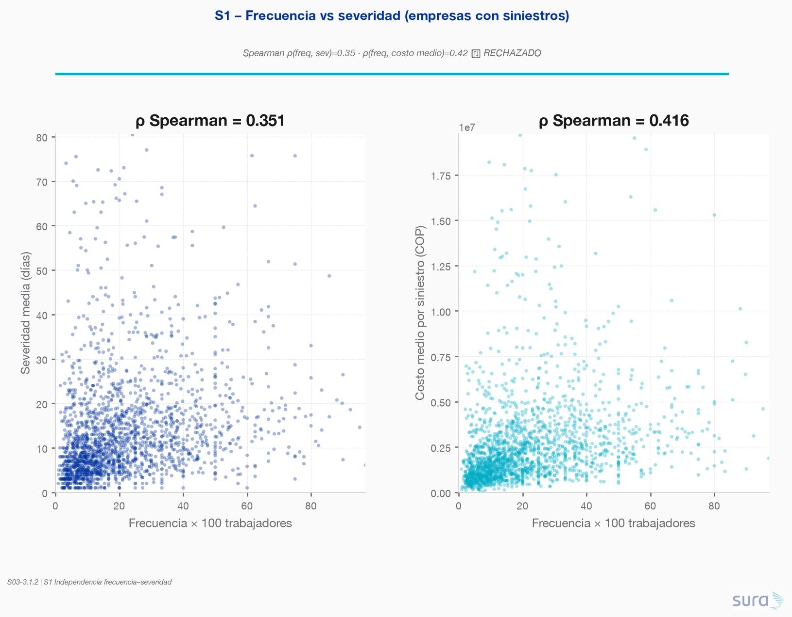
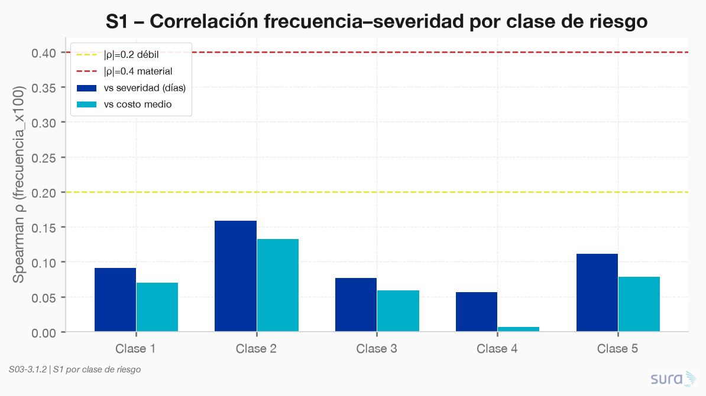
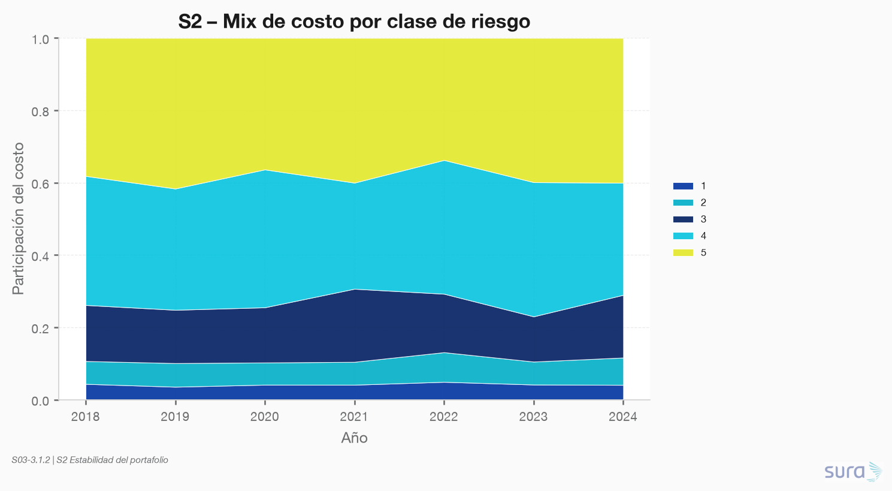
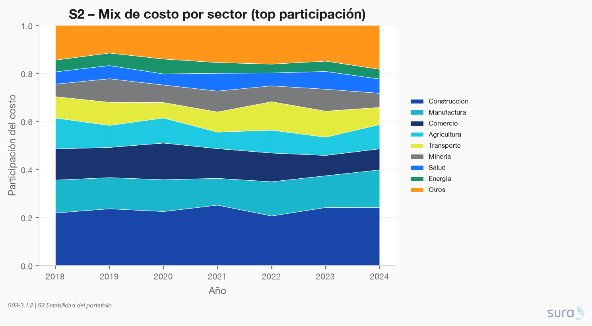
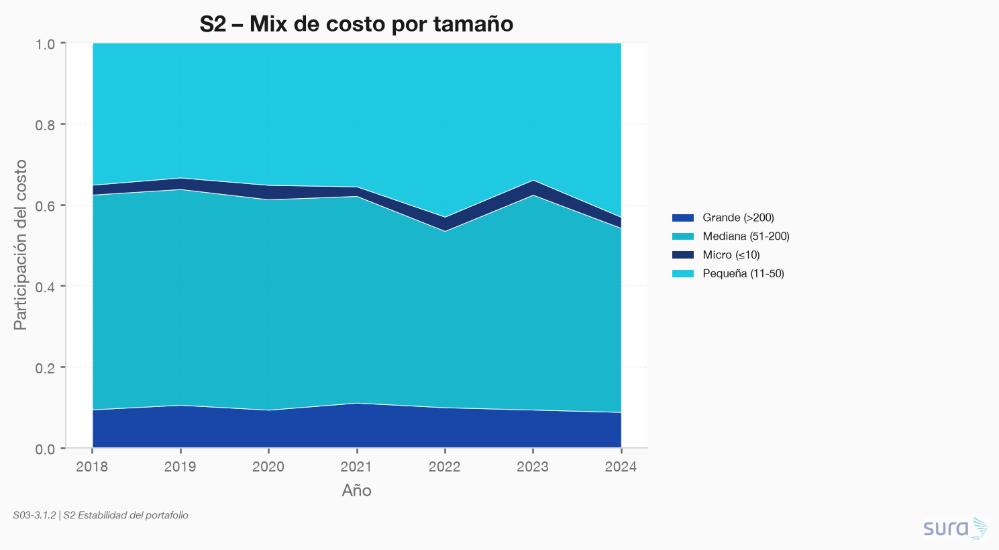
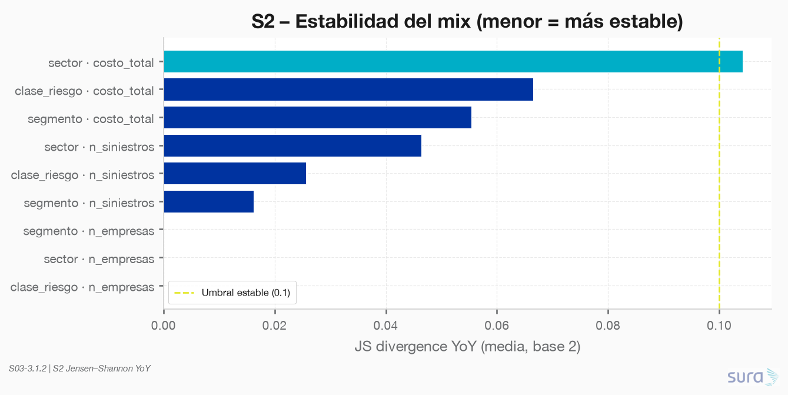
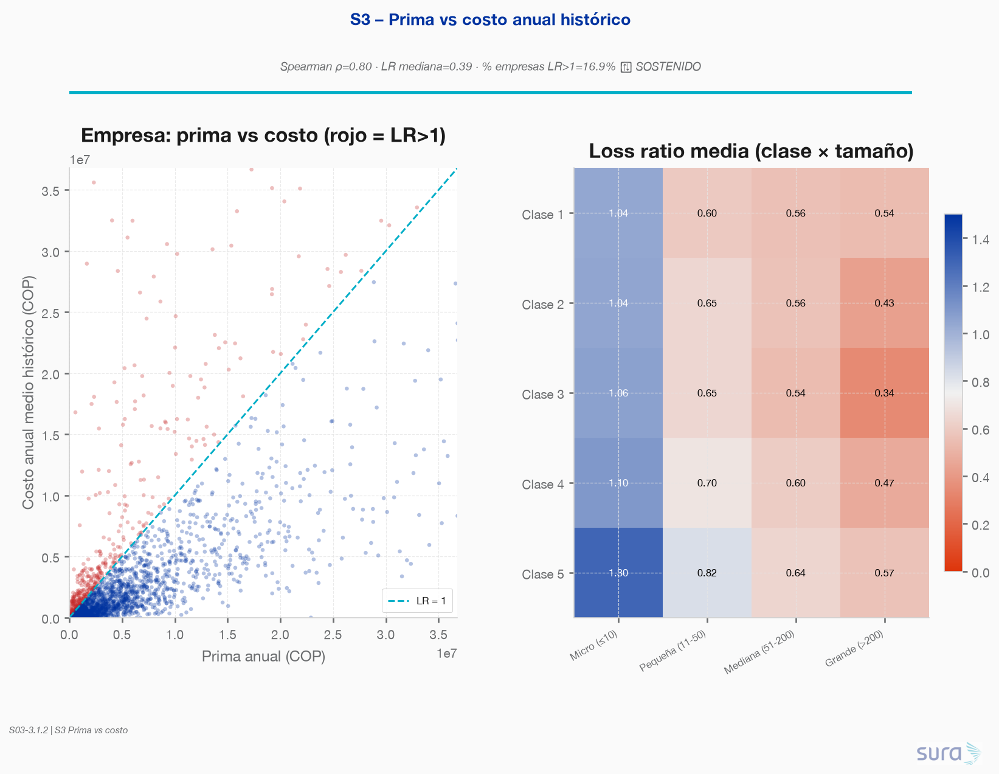
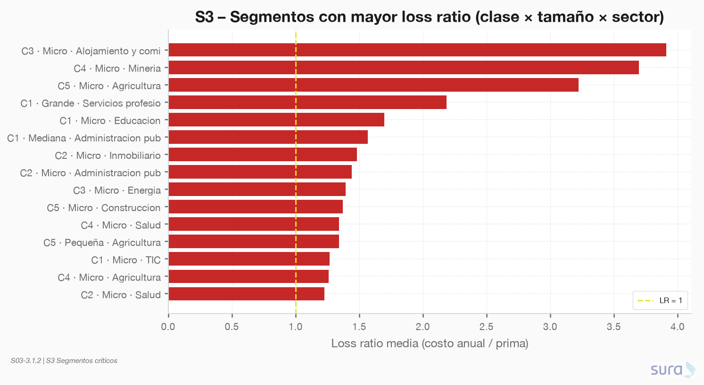

### **S03: Modelación para reto de negocio**
Objetivo: El reto de negocio: la Dirección necesita anticipar el resultado técnico del portafolio y decidir dónde ajustar la suscripción y la tarifa. Usted debe modelar el costo esperado de siniestralidad y convertirlo en una recomendación.

---

### **Requerimiento 3.1**
Formular de forma explícita la pregunta de negocio que va a responder y las decisiones que su modelo debe soportar. Enunciar los supuestos que adopta y cómo los validará.

---

#### 3.1.1 Definición de pregunta de negocio

**Mi pregunta de negocio:**

¿Cuál es el costo esperado de siniestralidad del próximo año por empresa y para el portafolio, y en qué segmentos (clase de riesgo × sector × tamaño) la prima esperada no cubre ese costo, de modo que la Dirección deba ajustar suscripción o tarifa?

**Decisiones que soporta:**
1. Ajuste de suscripción: identificar empresas con alto costo esperado y ajustar la suscripción para reducir el riesgo.
2. Ajuste de tarifa: identificar segmentos con alto costo esperado y ajustar la tarifa para cubrir el riesgo.

**Supuestos a validar:**
1. Independencia frecuencia-severidad (o débil dependencia): Se valida mediante analisis de correlación; si hay dependencia, modelaré severidad condicionada.
2. Estabilidad del portafolio (mix sector/clase similar a histórico): Se valida comparando la distribución historica.
3. La prima de suscripción refleja adecuadamente el riesgo: Se valida comparando prima vs. costo esperado histórico por segmento.

---

#### 3.1.2 Validación de supuestos

**Script:** `code/01-supuestos/01-supuestos.py`  
**Staging:** `data/staging/S03/supuestos_*.parquet`  
**Figuras:** `results/imgs/01_S1_*.png`, `01_S2_*.png`, `01_S3_*.png`

---

##### Resumen de veredictos

| Supuesto | Evidencia clave | Veredicto | Implicación para S03 |
|---|---|---|---|
| **S1** Independencia frecuencia–severidad | Spearman ρ(freq, sev)=**0.35**; ρ(freq, costo medio)=**0.42** (p≪0.001) | **RECHAZADO** | No modelar severidad independiente: condicionar a frecuencia o a factores comunes (clase × tamaño). |
| **S2** Estabilidad del portafolio | JS YoY media (siniestros+costo, 3 dims)=**0.052** < 0.10 | **SOSTENIDO** | Usar el mix histórico reciente (ancla 2024) como proxy del próximo año. |
| **S3** Prima refleja el riesgo | Spearman ρ(prima, costo anual)=**0.80**; LR mediana=**0.39**; **16.9%** empresas con LR>1; **25/148** segmentos con LR media>1 | **SOSTENIDO** (con bolsas de insuficiencia) | La tarifa rankea bien el riesgo, pero el modelo debe señalar segmentos donde la prima no cubre el costo. |

---

##### S1 – Independencia frecuencia–severidad

**Método:** correlación Spearman/Pearson a nivel empresa (n=4 625 con siniestros) y panel anual; estratificación por clase de riesgo y tamaño.

**Hallazgos:**
- La dependencia es **material** (|ρ| ≥ 0.40 en frecuencia vs. costo medio; moderada vs. días de incapacidad).
- Se replica por clase de riesgo: no es un artefacto de un solo estrato.
- A nivel panel anual la asociación se atenúa (ρ≈0.16–0.23) pero permanece significativa.

**Decisión de modelado:** rechazar independencia. En S03, preferir severidad/costo medio **condicionado** (p. ej. por clase × tamaño, o residualizando respecto a frecuencia).

---

##### S2 – Estabilidad del portafolio

**Método:** shares anuales de empresas, siniestros y costo por `clase_riesgo`, `sector` y `segmento` (2018–2024); distancia Jensen–Shannon (base 2) YoY y vs. 2024.

**Hallazgos:**
- El share de **empresas** es idéntico entre años (panel balanceado con atributos fijos) → no informa el supuesto de negocio.
- El mix de **siniestros** es muy estable (JS YoY ≈ 0.02–0.05).
- El mix de **costo** es estable en clase y tamaño (JS ≈ 0.06); en **sector** es moderadamente estable (JS media ≈ 0.10, máximo ≈ 0.11).
- Agregado siniestros+costo: JS media = **0.052** → umbral de estabilidad cumplido.

**Decisión de modelado:** sostener el supuesto. Proyectar con mix 2024; stress-test opcional ± variación histórica del share sectorial de costo.

---

##### S3 – Prima vs. costo esperado histórico

**Método:** loss ratio = costo anual medio (2018–2024) / prima anual; correlación prima↔costo; agregación por `clase_riesgo × sector × tamaño`.

**Hallazgos:**
- La prima **rankea** el costo histórico (ρ Spearman = **0.80**).
- LR mediana del portafolio = **0.39** (holgura agregada), pero **16.9%** de empresas tienen LR > 1.
- **25 de 148** segmentos (clase × sector × tamaño) tienen LR media > 1. Concentración en **Micro**, clases altas y sectores como Alojamiento/comida, Minería, Agricultura, Construcción.
- Ejemplo crítico: Micro · clase 3 · Alojamiento y comida (LR media ≈ 3.9); Micro · clase 5 · Agricultura (≈ 3.2).

**Decisión de modelado:** el supuesto se sostiene a nivel portafolio (la tarifa distingue riesgo), pero **no** en todos los segmentos. El entregable de S03 debe priorizar ajuste de tarifa/suscripción donde `flag_insuficiente = 1` en `supuestos_prima_vs_costo_segmento`.

---

##### Implicaciones preliminares para el modelado (revisión)

1. **Arquitectura frecuencia + severidad:** mantener separación, pero **condicionar** severidad/costo (S1 rechazado).
2. **Horizonte / mix:** proyección del próximo año con mix reciente es razonable (S2 sostenido).
3. **Señal de negocio:** costo esperado por empresa/segmento vs. prima — el modelo aporta valor donde LR histórico > 1 aunque la prima globalmente rankee bien (S3).
4. **Próximo paso sugerido:** especificar el modelo de costo esperado (NB frecuencia + severidad condicionada) y un tablero de brecha prima–costo por segmento.

> *Hallazgos preliminares generados por `01-supuestos.py` — pendientes de revisión del analista.*
