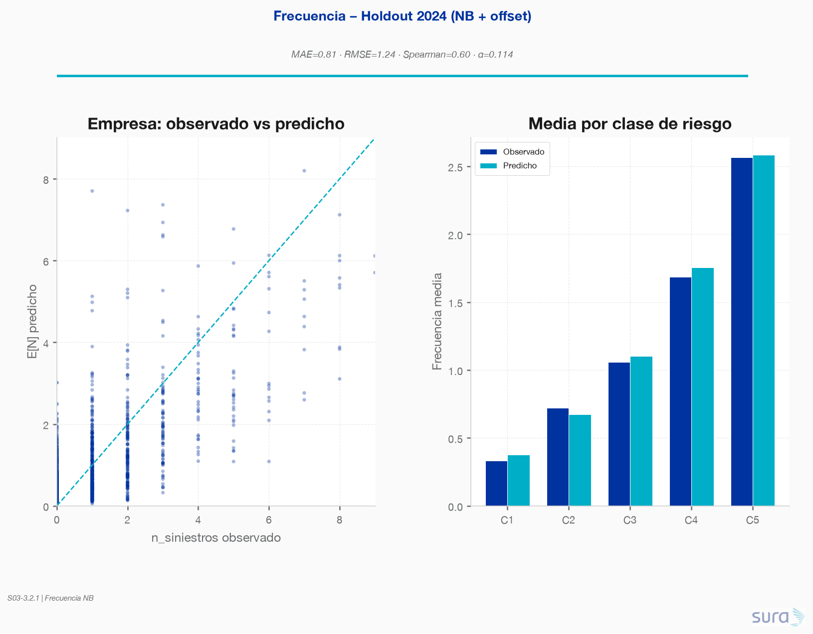
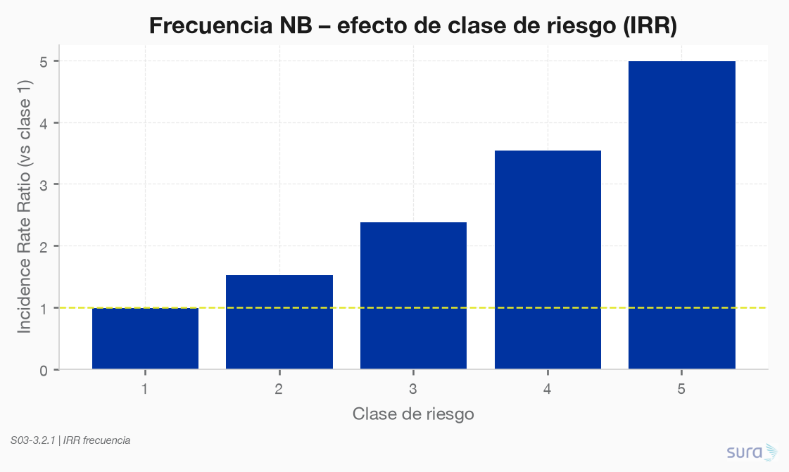
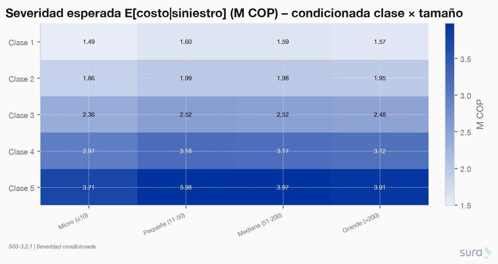
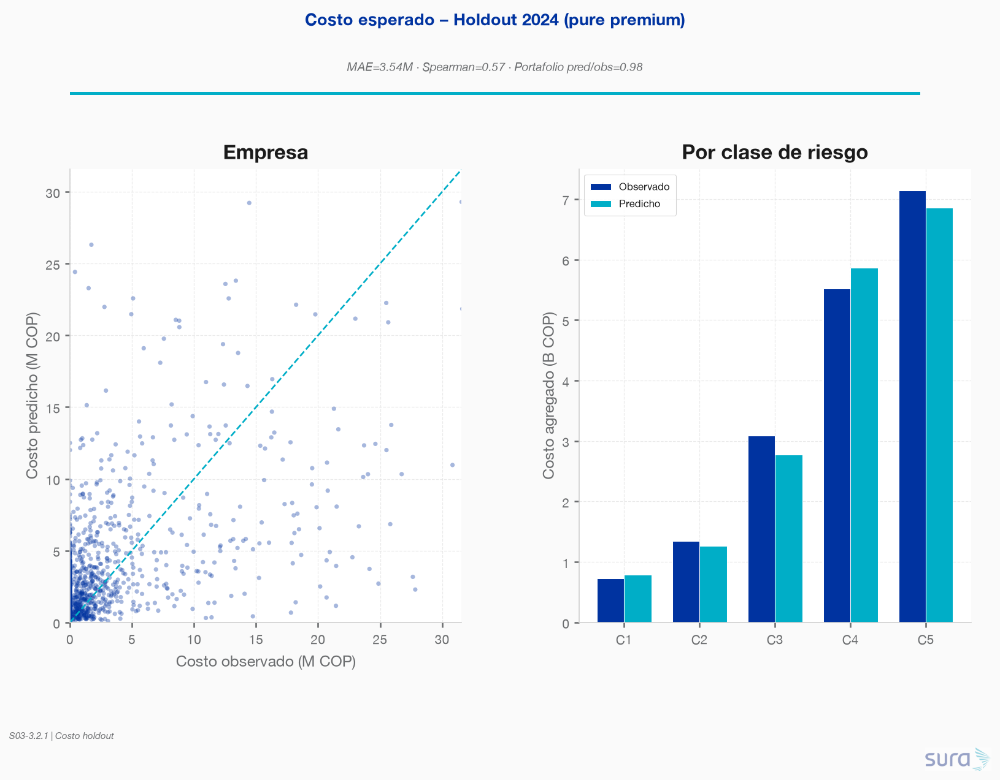
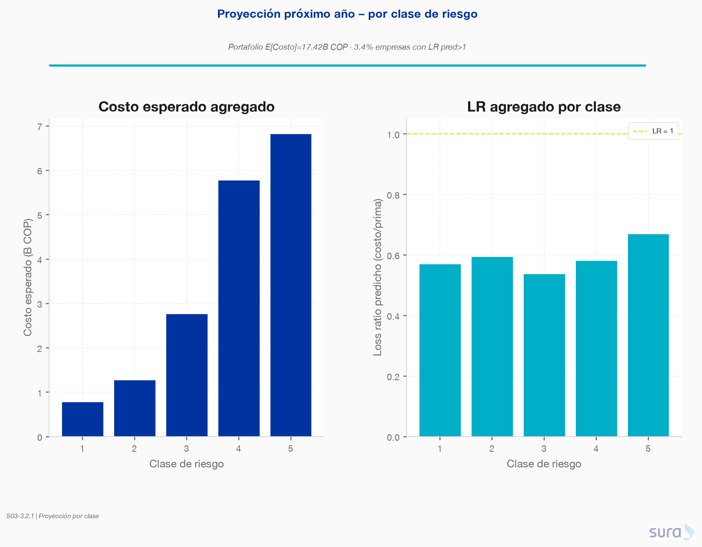
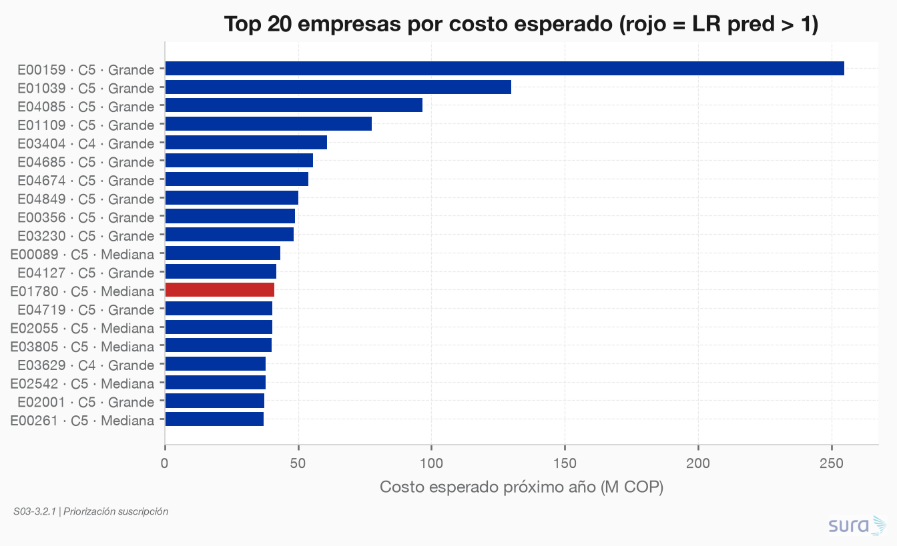
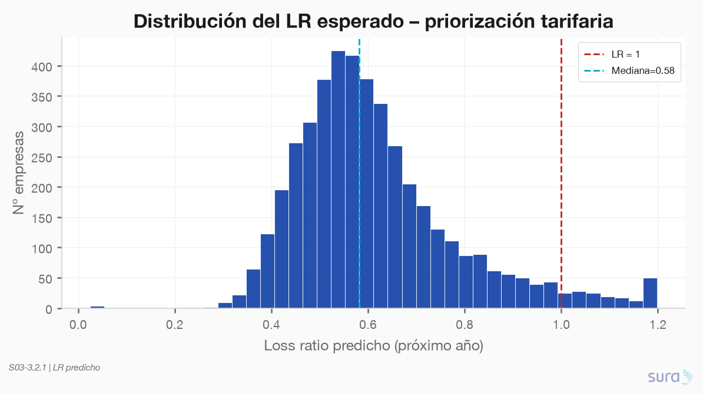

### **S03: Modelación para reto de negocio**
Objetivo: El reto de negocio: la Dirección necesita anticipar el resultado técnico del portafolio y decidir dónde ajustar la suscripción y la tarifa. Usted debe modelar el costo esperado de siniestralidad y convertirlo en una recomendación.

---

### **Requerimiento 3.2**
Modelar la frecuencia y la severidad de los siniestros para estimar el costo esperado de siniestralidad por empresa y por clase de riesgo. Justificar las distribuciones elegidas y el tratamiento de la exposición, y validar el ajuste y la capacidad predictiva del modelo.

---`

### 3.2.1. Modelado de frecuencia y severidad de siniestros

**Script:** `code/01-modelo/01-modelo.py`  
**Staging:** `data/staging/S03/modelo_*.parquet`
**Figuras:** `results/imgs/01_modelo_*.png`

---

#### Arquitectura (alineada a 3.1.2 y S01)

| Componente | Familia | Especificación | Justificación |
|---|---|---|---|
| **Frecuencia** | Binomial Negativa + offset `log(n_trabajadores)` | `n_siniestros ~ C(clase)+C(segmento)+C(sector)+log1p(lag_n)` | P1 sobredispersión; P2 sin ZI; predictores 1.2.6 |
| **Severidad** | Lognormal (OLS en log), **AT / EL separados** | `log(costo_w) ~ C(clase)+C(segmento)+C(gravedad)` | P6 AT≠EL; P12 lognormal; S1 dependencia → condicionar |
| **Pure premium** | `E[Costo]=E[N]×E[Sev\|X]` | Sev marginaliza `P(tipo\|clase)` y `P(gravedad\|clase,tipo)` | Gravedad no observable en pricing |

**Train:** 2019–2023 (requiere lag) · **Holdout:** 2024 · **Proyección:** features 2024 + lag = n_siniestros_2024 → próximo año.

α NB (MLE) = **0.114**.

---

#### Métricas holdout 2024

| Componente | MAE | Spearman | Otras |
|---|---|---|---|
| Frecuencia E[N] | **0.81** siniestros | **0.60** | mean pred 1.17 vs obs 1.14 |
| Severidad AT | **1.50 M** COP | **0.57** | R²_log = **0.54** |
| Severidad EL | **1.40 M** COP | **0.53** | R²_log = **0.57** |
| Costo empresa | **3.54 M** COP | **0.57** | Portafolio pred/obs = **0.985** |

Calibración de portafolio casi perfecta (pred **17.55 B** vs obs **17.82 B** COP).

---

#### Efectos de clase de riesgo (frecuencia)

IRR vs clase 1: C2=**1.54** · C3=**2.39** · C4=**3.56** · C5=**5.00** (todos p≪0.001).

---

#### Severidad condicionada

E[costo|siniestro] crece con clase y es mayor en Micro (heatmap clase × tamaño). La gravedad concentra el poder explicativo (R²_log ~0.54); en pricing se promedia con el mix histórico por clase×tipo.

---

#### Proyección próximo año (por clase de riesgo)

| Clase | E[N] media | E[Costo] agregado | Share costo | LR pred (agregado) |
|---|---|---|---|---|
| 1 | 0.37 | 0.78 B | 4.5% | 0.57 |
| 2 | 0.68 | 1.27 B | 7.3% | 0.60 |
| 3 | 1.10 | 2.76 B | 15.9% | 0.54 |
| 4 | 1.73 | 5.78 B | 33.2% | 0.58 |
| 5 | 2.57 | 6.82 B | 39.2% | 0.67 |
| **Total** | **5 788** siniestros | **17.42 B** COP | 100% | — |

- Empresas con LR predicho > 1: **169 (3.38%)** → candidatos prioritarios a ajuste de tarifa/suscripción.
- Clases 4–5 concentran **~72%** del costo esperado del portafolio.

---

#### Implicaciones para 3.3 / 3.4 (revisión)

1. Usar `modelo_pred_empresa` (`horizonte=proximo_anio`) como base de la proyección de portafolio.
2. Priorizar suscripción en el Top de `costo_pred` y tarifa donde `insuficiente_pred=1`.
3. Clase 5 aporta ~39% del costo esperado con LR agregado más alto (0.67) — foco de monitoreo.
4. Limitación: severidad marginaliza gravedad; un modelo de claim-by-claim con gravedad conocida es más preciso pero no aplica a pricing ex-ante.
5. Próximo paso natural (3.3): agregar intervalos / escenarios de estrés sobre el mix sectorial (S2).

### 3.2.2 Justificación de distribuciones elegidas, el tratamiento de la exposición, y validación del ajuste y la capacidad predictiva del modelo