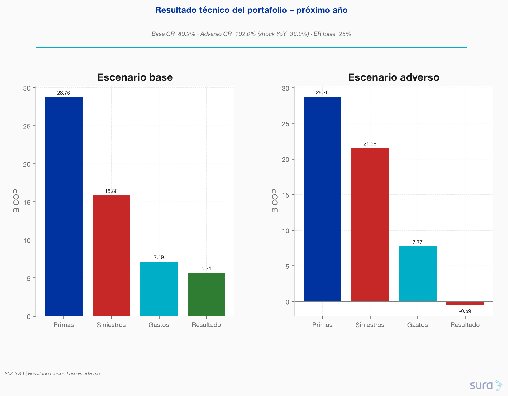
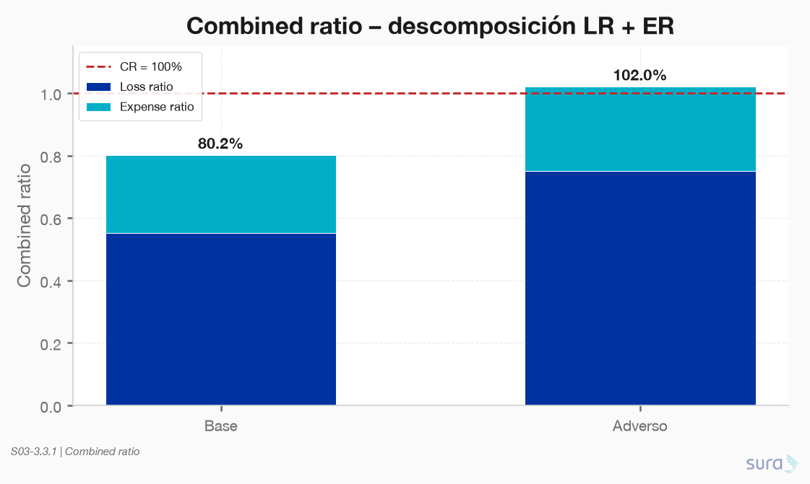
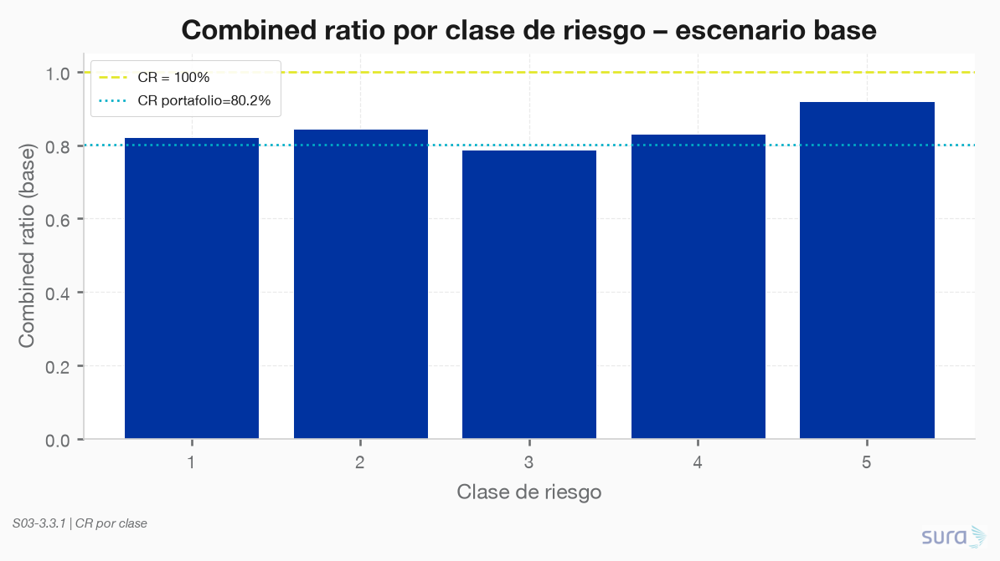
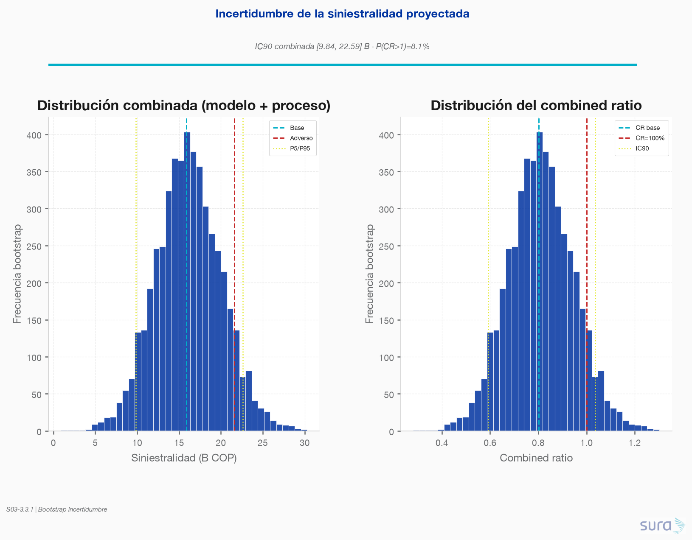
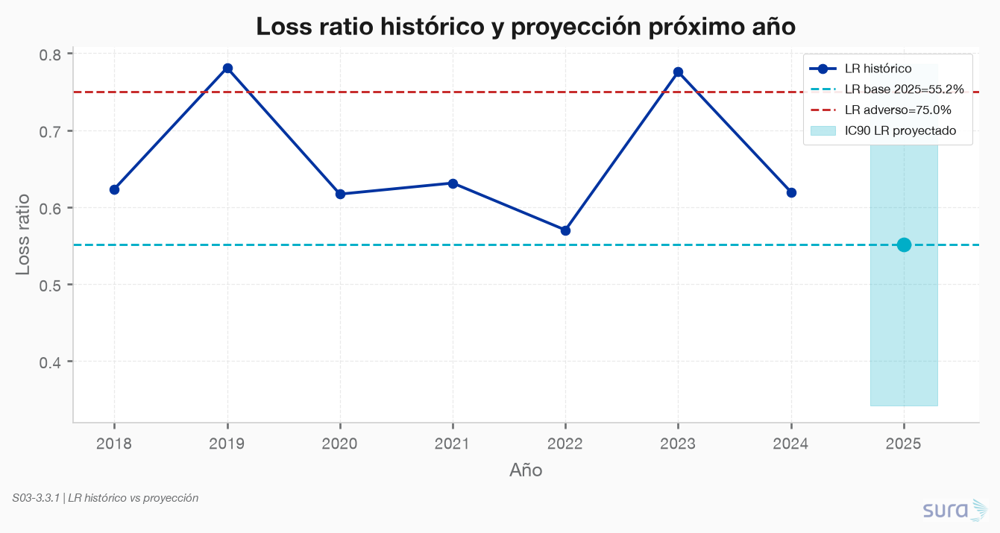
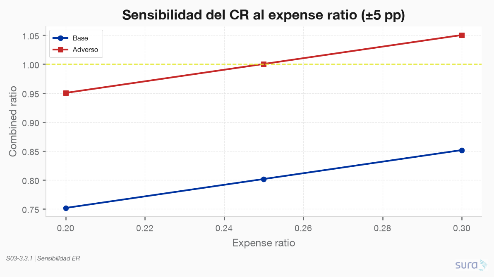

### **S03: Modelación para reto de negocio**
Objetivo: El reto de negocio: la Dirección necesita anticipar el resultado técnico del portafolio y decidir dónde ajustar la suscripción y la tarifa. Usted debe modelar el costo esperado de siniestralidad y convertirlo en una recomendación.

---

### **Requerimiento 3.3**
Proyectar el resultado técnico del portafolio para el próximo año: siniestralidad esperada frente a primas devengadas, estimar el combined ratio en un escenario base y uno adverso, y cuantificar la incertidumbre de la proyección.

---

#### 3.3.1 Proyección del resultado técnico del portafolio

**Script:** `code/01-proyeccion/01-proyeccion.py`  
**Fuente:** predicciones 3.2.1 (`modelo_pred_empresa`, `horizonte=proximo_anio`)  
**Staging:** `data/staging/S03/proyeccion_*.parquet` (#104–111)  
**Figuras:** `results/imgs/01_proyeccion_*.png`

---

##### Definiciones operativas

| Concepto | Definición en este ejercicio |
|---|---|
| **Primas devengadas** | Suma de `prima_anual` de empresas con prima > 0 (n=4 421; proxy de cartera vigente) |
| **Siniestralidad esperada** | Σ `costo_pred` del pure premium 3.2.1 |
| **Loss ratio (LR)** | Siniestralidad / primas |
| **Expense ratio (ER)** | Supuesto operativo **25%** de prima (gastos admin. + adquisición; no hay gastos en raw). Adverso: **27%** |
| **Combined ratio (CR)** | `LR + ER` |
| **Resultado técnico** | Primas − siniestros − gastos ≈ Primas × (1 − CR) |

> Universo: se excluyen empresas sin prima (no permiten LR). El E[Costo] de 3.2.1 sobre 5 000 empresas era ~17.4 B; sobre el subconjunto con prima el base es **15.86 B**.

---

##### Escenarios

| | **Base** | **Adverso** |
|---|---|---|
| Siniestralidad | **15.86 B** COP (modelo 3.2.1) | **21.58 B** COP (= base × 1.360) |
| Shock | — | Máx. YoY histórico de costo agregado (**+36.0%**, 2022→2023) |
| Loss ratio | **55.2%** | **75.0%** |
| Expense ratio | 25% | 27% |
| **Combined ratio** | **80.2%** | **102.0%** |
| Resultado técnico | **+5.71 B** COP | **−0.59 B** COP |

- **Base:** resultado técnico positivo; CR < 100% → margen para absorber volatilidad ordinaria.
- **Adverso:** CR > 100% → pérdida técnica; el shock de siniestralidad tipo 2023 + presión leve de gastos materializa un año “malo” ya observado en la serie.

---

##### Por clase de riesgo (escenario base)

El CR agregado 80.2% oculta heterogeneidad: clases altas concentran más siniestralidad relativa. Clase 5 mantiene el LR más alto del modelo 3.2.1 (~0.67 antes de ER) y sigue siendo el foco de monitoreo tarifario/suscripción.

---

##### Incertidumbre de la proyección

Tres capas (N=5 000 réplicas, semilla 42):

| Fuente | Qué captura | IC90 siniestralidad |
|---|---|---|
| **Modelo** | Bootstrap de residuos holdout 2024 | [14.9, 17.4] B |
| **Proceso** | Shocks YoY ~ N(0, σ_hist=23.9%) | [9.6, 22.0] B |
| **Combinada** | Modelo × (1 + shock proceso) | **[9.8, 22.6] B** |

Sobre la distribución **combinada** (con ER=25%):

| Métrica | Mediana | IC90 |
|---|---|---|
| Loss ratio | 55.8% | [34.2%, 78.6%] |
| Combined ratio | 80.8% | [59.2%, **103.6%**] |
| **P(CR > 100%)** | — | **8.1%** |

Interpretación: en el escenario central el portafolio es holgado (CR≈80%), pero hay ~**1 de cada 12** trayectorias simuladas con CR>100%. El escenario adverso puntual (CR=102%) cae cerca del P95 de la distribución combinada — coherente, no extremo artificial.

---

##### Sensibilidad al expense ratio

| ER | CR base | CR adverso |
|---|---|---|
| 20% | 75.2% | 95.0% |
| **25%** | **80.2%** | **102.0%*** |
| 30% | 85.2% | 105.0% |

\*Adverso usa ER=27% en la tabla principal; la grilla de sensibilidad aplica el mismo ER a ambos shocks de siniestralidad.

---

##### Implicaciones para Dirección (revisión)

1. **Base viable:** CR 80% deja ~20 pp de colchón frente a gastos+siniestralidad.
2. **Adverso accionable:** un año tipo +36% en siniestros lleva a CR≈102% y pérdida técnica (~0.6 B) — priorizar suscripción/tarifa en clases 4–5 y empresas con `insuficiente_pred=1`.
3. **Incertidumbre:** comunicar IC90 de siniestralidad [9.8, 22.6] B y P(CR>1)≈8%, no solo el punto base.
4. **Limitación:** ER es supuesto (25%); sin ledger de gastos el CR es *indicativo*. Sensibilizar ±5 pp antes de decisiones de capital.
5. **Siguiente paso (3.4):** traducir bolsas de CR/LR alto en recomendaciones concretas de ajuste tarifario y de suscripción.

