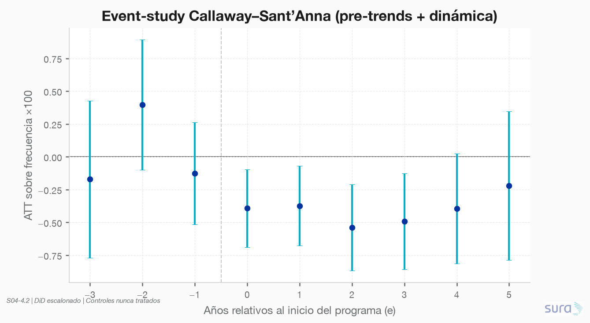
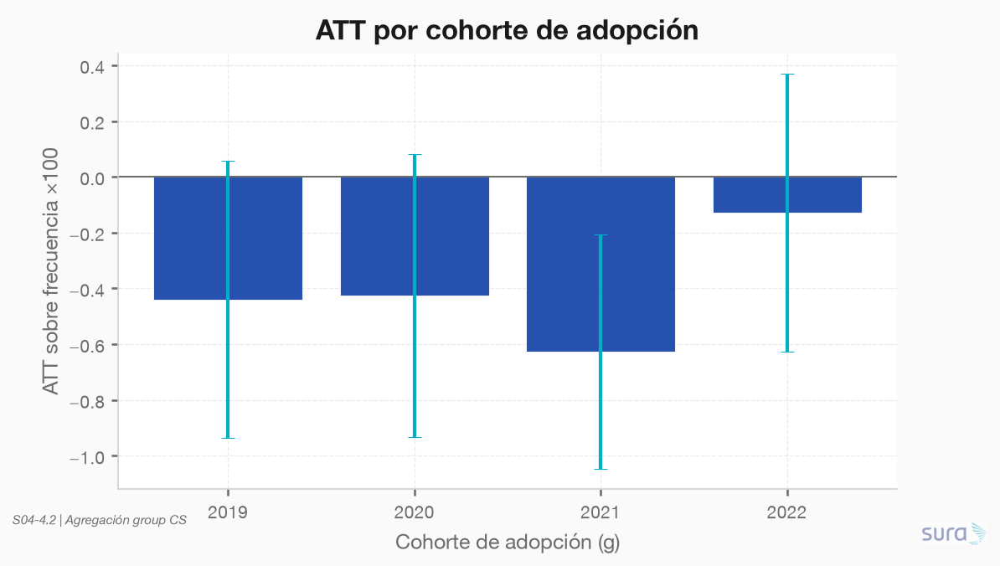
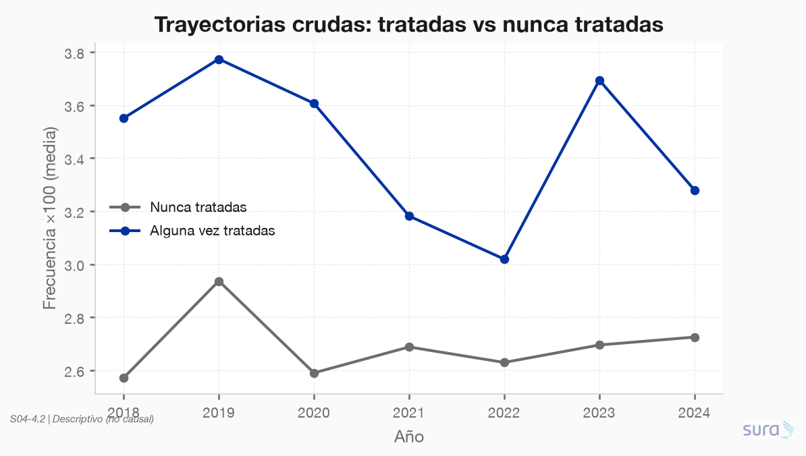
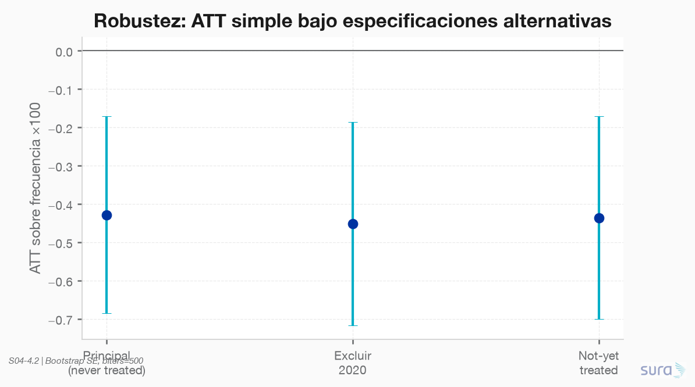
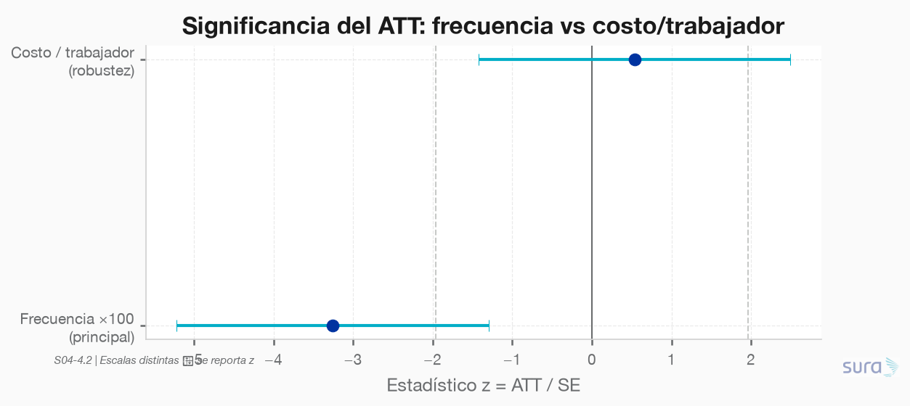

### **S04: Impacto e inferencia causal**
Objetivo: La ARL invirtió en un programa de prevención adoptado por cerca de 1500 empresas en distintos momentos entre 2019 y 2022. La adopción no fue aleatoria. Se quiere saber si el programa redujo la siniestralidad.

---

### **Requerimiento 4.2**
Implementar la estrategia de identificación causal y estimar el efecto del programa sobre las empresas tratadas, con errores estándar apropiados a la estructura de los datos. Incluir al menos una prueba de robustez.

---

#### 4.2.1 Estimación del efecto (Callaway–Sant’Anna)

**Script:** `code/01-estimacion/01-estimacion.py`  
**Estrategia:** 4.1 — DiD escalonado CS, doubly robust, controles nunca tratados  
**Staging:** `data/staging/S04/causal_*.parquet` (#112–119)  
**Figuras:** `results/imgs/01_causal_*.png`  
**SE:** bootstrap sobre influence functions (`biters=500`, semilla 42)

---

##### Diseño operativo

| Pieza | Valor en la estimación |
|---|---|
| Panel | 5 000 empresas × 2018–2024 (35 000 filas) |
| Tratadas / controles | **1 802** / **3 198** nunca tratadas |
| Cohortes g | 2019, 2020, 2021, 2022 |
| Outcome principal | `frecuencia_x100` |
| Estimador | Callaway–Sant’Anna DR (`csdid`) |
| Controles | Nunca tratadas (principal) |

---

##### Resultado principal — ATT sobre frecuencia

| Métrica | Valor |
|---|---|
| **ATT simple** | **−0.428** |
| SE bootstrap | 0.131 |
| IC 95% | [−0.686, −0.171] |
| z | −3.26 (significativo) |
| Baseline pre-tratamiento (tratadas) | 3.67 siniestros/100 trab. |
| **Efecto relativo** | **≈ −11.7%** vs baseline pre |

El programa **reduce la frecuencia de siniestralidad** de las empresas tratadas en ~0.43 puntos de `frecuencia_x100` (unas 12% respecto a su nivel pre-adopción).

**Event-study:** pre-periodos e ∈ {−3,−2,−1} no significativos (0/3) → **pre-trends OK**. Efecto negativo desde e=0; pico en e=2–3; se atenúa en e=4–5 (IC cruza 0).

**Por cohorte:** todas las cohortes tienen ATT negativo; el más claro es **2021 (−0.63)**; 2022 es el más débil (−0.13, no significativo solo).

---

##### Robustez

| Especificación | ATT | SE | IC 95% | ¿Significativo? |
|---|---|---|---|---|
| Principal (never treated) | **−0.428** | 0.131 | [−0.686, −0.171] | Sí |
| Excluir año 2020 (COVID) | **−0.452** | 0.135 | [−0.717, −0.186] | Sí |
| Control not-yet-treated | **−0.436** | 0.135 | [−0.701, −0.171] | Sí |
| Outcome `costo_por_trab` | +6 423 | 12 035 | [−17.2k, +30.0k] | **No** |

1. **Excluir 2020 / not-yet-treated:** el ATT de frecuencia se mantiene en torno a −0.43 / −0.45 → no es un artefacto de COVID ni del pool de controles.
2. **Costo por trabajador:** efecto no significativo (muy ruidoso). El canal detectable es **frecuencia**, no severidad/costo unitario en este diseño.
3. **Pre-trends (event-study):** ninguna fuga anticipada significativa → respalda tendencias paralelas.

---

##### Lectura preliminar para 4.3

- Monetizar con ATT de **frecuencia** (−0.428 sobre `frecuencia_x100`), no con el ATT de costo (no identificado con precisión).
- Traducción operativa: Δ siniestros ≈ ATT/100 × exposición de tratadas post-adopción; luego × severidad/costo medio.
- Caveat: heterogeneidad por cohorte (2022 débil); efecto dinámico se desvanece a e≥4.

---

##### Artefactos

| Archivo | Rol |
|---|---|
| `data/staging/S04/causal_panel.parquet` | Panel listo para CS / 4.3 |
| `data/staging/S04/causal_att_*.parquet` | ATT gt / simple / dynamic / group |
| `data/staging/S04/causal_robustez.parquet` | Comparativo de specs |
| `data/staging/S04/causal_resumen.parquet` | KPI ejecutivo del efecto |
