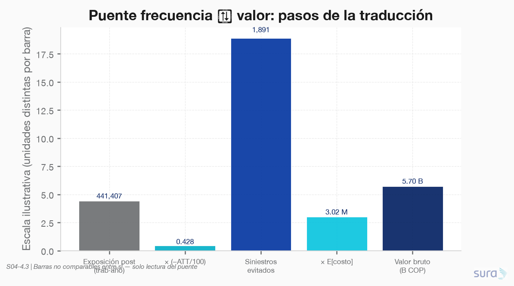
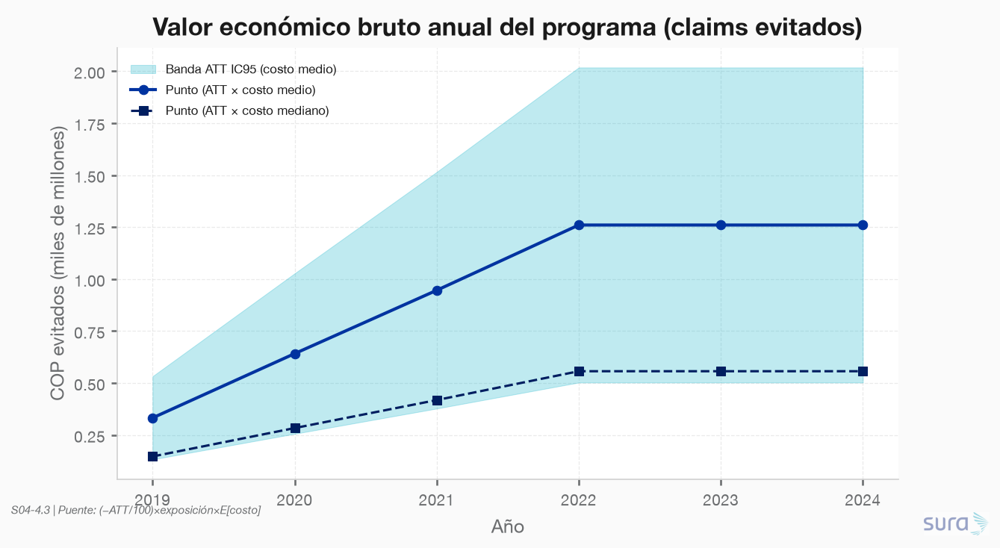
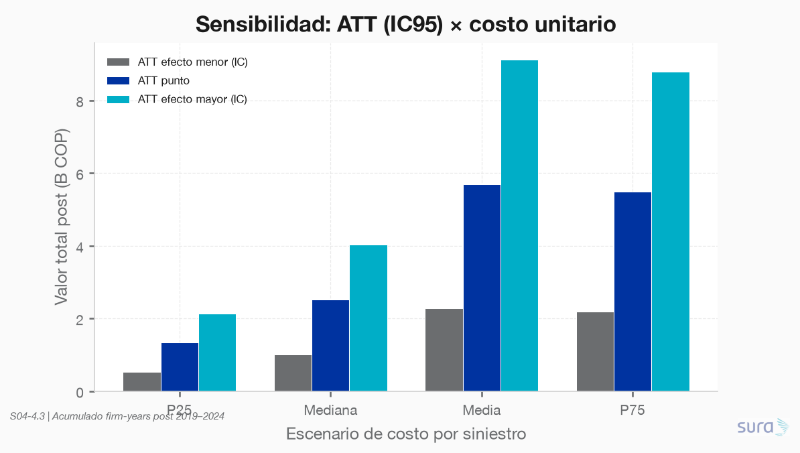
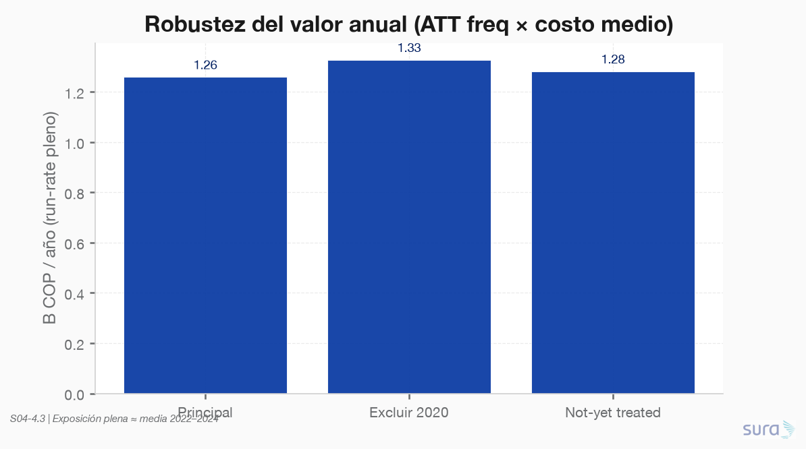
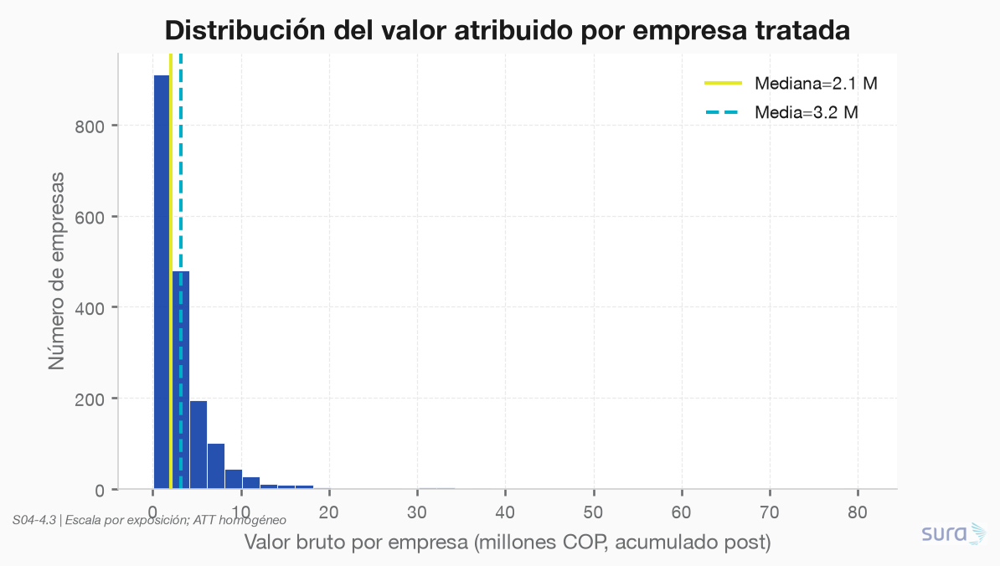

### **S04: Impacto e inferencia causal**
Objetivo: Traducir el efecto estimado del programa de prevención a valor económico y ser explícito sobre qué tan causal es la conclusión y bajo qué supuestos podría romperse.

---

### **Requerimiento 4.3**
Cuantificar / traducir el efecto estimado a valor económico; explicitar el grado de causalidad de la conclusión y las condiciones de falla.

---

#### 4.3.1 Valor económico del ATT

**Script:** `code/01-val_economico/01-val_economico.py`  
**Fuente:** ATT 4.2.1 (`causal_resumen`) + panel causal + `siniestros_tratados`  
**Staging:** `data/staging/S04/valor_economico_*.parquet` (#120–127)  
**Figuras:** `results/imgs/01_valor_*.png`

---

##### Puente frecuencia → COP

$$
\Delta N_{it} = \left(-\frac{\mathrm{ATT}}{100}\right)\times n\_trabajadores_{it},\qquad
\mathrm{Valor}_{it} = \Delta N_{it}\times \mathbb{E}[\mathrm{costo}\mid \mathrm{siniestro}]
$$

| Insumo | Valor |
|---|---|
| ATT (frecuencia ×100) | **−0.428** (IC95 [−0.686, −0.171]) |
| Efecto relativo | **≈ −11.7%** vs baseline pre de tratadas |
| E[costo\|siniestro] (tratadas, winsorizado) | Media **3.02 M** · Mediana **1.33 M** COP |
| Exposición post (trab·año) | 441 407 (1 802 empresas; 2019–2024) |
| Run-rate pleno (exp. media 2022–2024) | 97 573 trabajadores / año |

> **No es ROI neto:** no hay costo del programa en COP en los datos. Se reporta **valor bruto de claims evitados**.

---

##### Resultado monetario

| Métrica | Punto | Banda ATT (IC95) @ costo medio |
|---|---|---|
| Siniestros evitados (acum. post) | **1 891** | [754, 3 028] |
| Valor bruto acumulado @ **media** | **5.70 B** COP | **[2.27, 9.13] B** |
| Valor bruto acumulado @ **mediana** | **2.52 B** COP | — |
| **Run-rate anual pleno @ media** | **1.26 B** COP/año | **[0.50, 2.02] B**/año |
| Run-rate anual pleno @ mediana | 0.56 B COP/año | — |

La media supera a la mediana por la cola de siniestros caros: el número “actuarial” (puro premium) es el de la **media**; la mediana es una lectura más robusta a outliers.

**Robustez del valor:** con ATT de excluir-2020 / not-yet-treated el run-rate pleno @ media se mantiene ≈ **1.28–1.33 B**/año.

---

##### ¿Qué tan causal es la conclusión?

| Capa | Nivel | Lectura |
|---|---|---|
| **Reducción de frecuencia** | **Moderado–alto** | CS DR + pre-trends OK + robustez COVID/NYT. Conclusión causal creíble *condicional* a supuestos DiD. |
| **Valor en COP** | **Moderado** | Es la **traducción actuarial** del ATT de frecuencia vía E[costo], no un ATT estimado directamente en pesos (el ATT de `costo_por_trab` en 4.2 no fue significativo). |

**Conclusión operativa:** es razonable afirmar que el programa **causó** menos siniestros en las tratadas y que eso, bajo severidad histórica estable, equivale a **~1.3 B COP/año** de claims evitados en régimen pleno; no es razonable presentarlo como ROI neto ni como efecto causal preciso en COP sin el puente de severidad.

---

##### Supuestos y cómo se rompen

| ID | Supuesto | Se rompe si… | Efecto en el valor |
|---|---|---|---|
| S1 | Tendencias paralelas | Shocks diferenciales no observados (cultura SST, selección) | Sesga el ATT y, en la misma proporción, los COP |
| S2 | No anticipación | Cambio de comportamiento antes de `fecha_inicio` | Atribución incorrecta al programa |
| S3 | SUTVA | Spillovers entre empresas | Controles contaminados → ATT atenuado → valor subestimado |
| S4 | Severidad constante | El programa cambia la mix de gravedad | COP divergen del canal frecuencia; mean≫median |
| S5 | ATT promedio escalable | Heterogeneidad (cohorte 2022 débil) o decaimiento e≥4 | Sobreestima en años lejanos / cohortes débiles |
| S6 | Valor bruto ≠ ROI | Costo operativo del programa > claims evitados | El “ahorro” puede ser negativo en neto |

Detalle en staging: `valor_economico_supuestos.parquet`, `valor_economico_credibilidad.parquet`.

---

##### Lectura para Dirección

1. **Impacto central:** ~**1.3 B COP/año** de siniestralidad evitada (banda **0.5–2.0 B**) con adopción plena de las 1 802 tratadas.
2. **Usar con cautela la media vs mediana:** 5.7 B acumulados @ media vs 2.5 B @ mediana — comunicar ambos.
3. **No vender como ROI** hasta incorporar costo del programa.
4. **Priorizar expansión** donde la frecuencia responda (evidencia más fuerte en cohortes 2019–2021); monitorear cohorte 2022 y horizontes e≥4.

---

##### Artefactos

| Archivo | Rol |
|---|---|
| `data/staging/S04/valor_economico_resumen.parquet` | KPI ejecutivo |
| `data/staging/S04/valor_economico_anual.parquet` | Serie anual |
| `data/staging/S04/valor_economico_empresa.parquet` | Atribución por empresa |
| `data/staging/S04/valor_economico_escenarios.parquet` | Sensibilidad ATT × costo |
| `data/staging/S04/valor_economico_supuestos.parquet` | Condiciones de falla |
