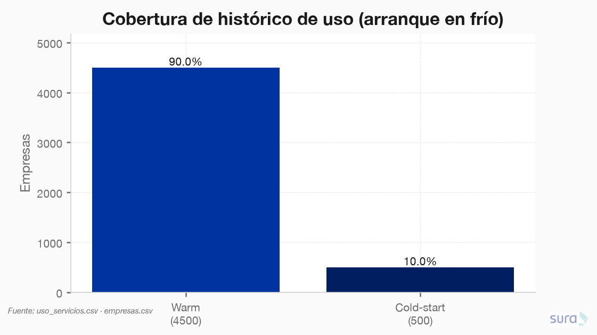
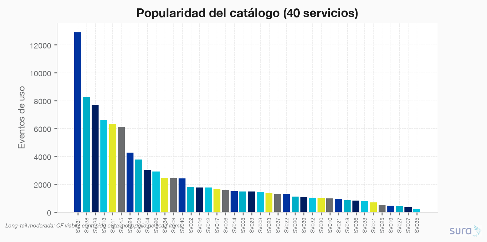
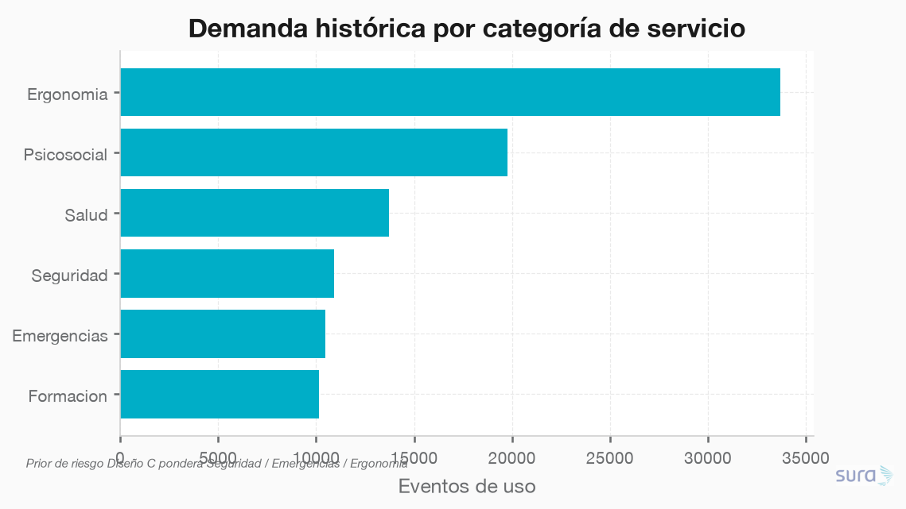
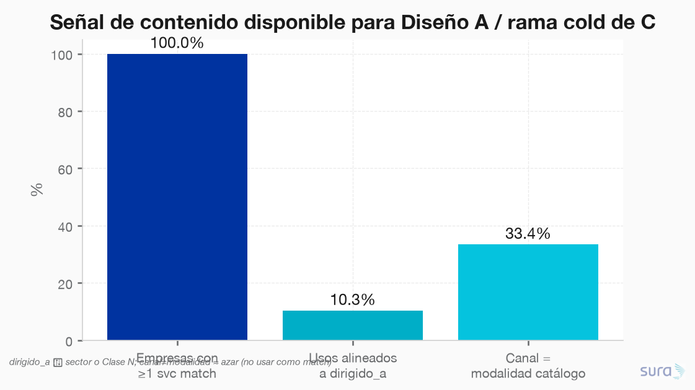
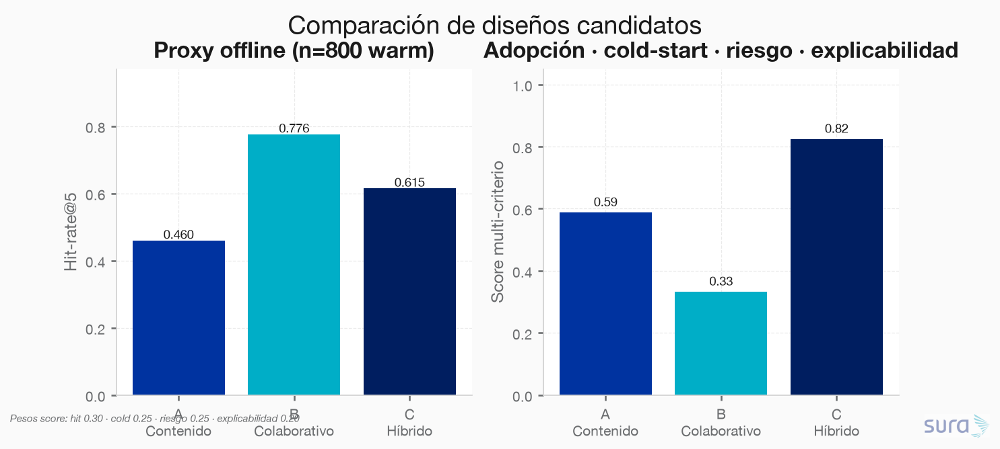
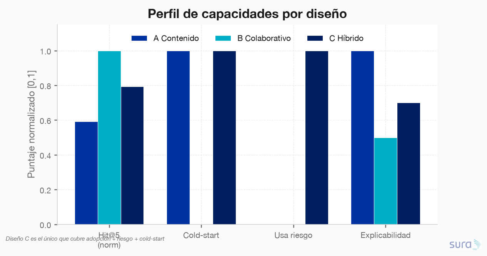

### **S05: Sistema de recomendación de servicios**
Objetivo: El área quiere recomendar a cada empresa los servicios de prevención con mayor probabilidad de ser adoptados y de reducir su riesgo. Dispone del histórico de uso en uso_servicios.csv, de los atributos de los servicios en catalogo_servicios.csv y de los atributos de las empresas en empresas.csv, que en conjunto permiten construir el recomendador y resolver el arranque en frío de empresas sin histórico.

---

### **Requerimiento 5.1**
Diseñar el recomendador: elegir y justificar el enfoque más adecuado dadas las características del problema y de los datos disponibles.

---

#### 5.1.1 Tres diseños candidatos (para elección)

**Script:** `code/01-diseños/01-diseños.py`  
**Fuentes:** `uso_servicios.csv` · `catalogo_servicios.csv` · `empresas.csv` (+ `empresas_imputadas` S01, `modelo_pred_empresa` S03)  
**Staging:** `data/staging/S05/recomendador_*.parquet` (#128–139)  
**Figuras:** `results/imgs/01_diseño_*.png`

> **Estado:** análisis de viabilidad + proxies offline. La implementación del prototipo queda para **5.2**, tras elegir uno de los tres diseños.

---

##### Hallazgos de datos que condicionan el diseño

| Hecho | Valor | Implicación |
|---|---|---|
| Empresas / con histórico / sin histórico | 5 000 / 4 500 / **500 (10%)** | El cold-start **no es marginal**: cualquier diseño puro-CF deja 500 empresas sin score |
| Catálogo | **40** servicios, 6 categorías | Catálogo pequeño → contenido y CF item–item son ambos tractables |
| Eventos de uso | 98 736 (2022–2024) | Señal implícita suficiente; sin ratings explícitos |
| Densidad matriz warm | **25.3%** | CF colaborativo es viable (no es sparse extremo) |
| Servicios distintos / empresa (mediana) | **10** | Historial rico para vecinos item–item |
| Reuso del mismo par empresa–servicio | 46% | Feedback implícito con intensidad (`log1p(n_usos)`) aporta señal |
| Match contenido `dirigido_a` ↔ sector/clase | **100%** empresas con ≥1 svc; solo **10.3%** de usos históricos alineados | Contenido cubre cold-start, pero **no basta solo** para rankear adopción real |
| Canal uso = modalidad catálogo | ≈33% (azar en 3 niveles) | No usar canal como feature de match |

**Lectura:** hay señal colaborativa fuerte en warm users, features de contenido suficientes para arranque en frío, y un objetivo de negocio **dual** (adopción + reducción de riesgo) que ningún diseño mono-señal cubre completo.

---

##### Diseño A — Contenido + popularidad de segmento

| Dimensión | Detalle |
|---|---|
| **Familia** | Content-based + popularity |
| **Score** | Boost si `dirigido_a ∈ {sector, Clase N}` + popularidad del servicio dentro del sector |
| **Cold-start** | Nativo (todas las empresas tienen sector/clase) |
| **Warm** | Débil: poca personalización individual |
| **Riesgo** | Indirecto (vía clase / dirigido_a) |
| **Complejidad** | Baja — reglas + tablas, sin ML |
| **Stack 5.2** | Pandas joins; top-K por segmento |
| **Hit-rate@5 proxy** | **0.46** (n=800 warm, leave-one-out) |
| **Pros** | Explicable, auditable, go-live rápido, cubre el 10% cold |
| **Contras** | Sesgo a head items; ignora co-consumo; débil vs objetivo de adopción real (solo 10% de usos históricos coinciden con `dirigido_a`) |

**Elegir A si:** prioridad es explicabilidad regulatoria / go-live en días y se acepta menor lift de adopción.

---

##### Diseño B — Filtrado colaborativo item–item

| Dimensión | Detalle |
|---|---|
| **Familia** | Collaborative filtering (implícito) |
| **Score** | Suma de similitudes coseno item–item sobre servicios ya usados (`log1p(n_usos)`) |
| **Cold-start** | **No nativo** — requiere fallback (popularidad o rama A) |
| **Warm** | Fuerte: captura co-adopción |
| **Riesgo** | Ausente |
| **Complejidad** | Media |
| **Stack 5.2** | Similaridad item–item / ALS (`implicit`) / LightFM sin features |
| **Hit-rate@5 proxy** | **0.78** (mejor adopción pura) |
| **Diagnóstico CF** | Matriz 4 500×40, nnz=45 492; similitud media top-5 items ≈ **0.50** |
| **Pros** | Máximo lift de adopción en empresas con histórico |
| **Contras** | 500 cold sin score; **no** optimiza reducción de riesgo; menos explicable que A |

**Elegir B si:** el KPI primario es adopción en warm y el cold-start se resuelve con un fallback simple (no es el foco).

---

##### Diseño C — Híbrido adopción × riesgo (enrutamiento warm/cold)

| Dimensión | Detalle |
|---|---|
| **Familia** | Hybrid (CF + content + risk re-rank) |
| **Score** | \(\alpha\cdot \mathrm{score}_{adopcion} + (1-\alpha)\cdot \mathrm{score}_{riesgo}\) |
| **Rama warm** | CF item–item (+ mezcla ligera de contenido); \(\alpha\approx 0.55\) |
| **Rama cold** | Contenido + popularidad de segmento + prior de riesgo; \(\alpha\approx 0.35\) |
| **Prior de riesgo** | Peso por categoría (Seguridad > Emergencias > Ergonomía > …) × `clase_riesgo`; reutiliza `costo_pred` S03 como feature de empresa |
| **Cold-start** | Nativo vía rama contenido |
| **Warm** | Fuerte (CF) con re-rank hacia servicios de mayor potencial preventivo |
| **Complejidad** | Media–alta (dos ramas + calibración de \(\alpha\)) |
| **Stack 5.2** | LightFM / two-tower **o** CF + LTR; features empresa de S01/S03 |
| **Hit-rate@5 proxy** | **0.62** (cede un poco de adopción vs B a cambio de riesgo + cold) |
| **Pros** | Único diseño alineado al enunciado: **adopción Y riesgo** + cold-start |
| **Contras** | Más piezas que calibrar; hay que validar que el término de riesgo no degrade adopción en exceso |

**Elegir C si:** se quiere cumplir el objetivo dual del área y dejar listo el camino a producción (5.3) con política warm/cold explícita.

---

##### Comparación cuantitativa (proxies 5.1 — no son métricas finales de 5.2)

| Criterio | A Contenido | B Colaborativo | C Híbrido |
|---|---:|---:|---:|
| Hit-rate@5 (warm LOO) | 0.46 | **0.78** | 0.62 |
| Cold-start nativo | Sí | No | Sí |
| Usa historial | No | Sí | Sí |
| Usa señal de riesgo | No | No | **Sí** |
| Explicabilidad (0–1) | **1.0** | 0.5 | 0.7 |
| Score multi-criterio* | 0.59 | 0.33 | **0.82** |

\*Pesos: hit-rate 0.30 · cold-start 0.25 · usa riesgo 0.25 · explicabilidad 0.20.

---

##### Sugerencia (no decisión final)

Con los datos y el enunciado (adopción **y** reducción de riesgo **y** cold-start del 10%), el diseño con mejor alineación es:

> **Diseño C — Híbrido adopción × riesgo con enrutamiento warm/cold.**

- B gana en adopción pura, pero falla el cold-start y el objetivo de riesgo.  
- A resuelve cold-start y es explicable, pero subutiliza la señal colaborativa (densidad 25%) y la evidencia de que el match `dirigido_a` solo explica ~10% del uso real.  
- C combina ambas señales y añade el término de riesgo (S03 `costo_pred` + prior por categoría).

**Tu decisión:** Diseño C — Híbrido adopción × riesgo con enrutamiento warm/cold.

---

##### Contrato hacia 5.2 (tras elección)

| Artefacto staging | Uso en prototipo |
|---|---|
| `recomendador_interacciones` | Matriz implícita / train–test temporal |
| `recomendador_empresas_features` | Features cold + `es_cold` + `score_riesgo_s03` |
| `recomendador_catalogo_enriquecido` | Features de ítem + popularidad |
| `recomendador_item_neighbors` | Baseline item–item / explicación |
| `recomendador_diseños_fichas` | Spec del diseño elegido |

**Evaluación sugerida en 5.2:** split temporal (train ≤2023 / test 2024), métricas Ranking (HR@K, NDCG@K, coverage) **y** lift de riesgo esperado (Δ `costo_pred` de servicios recomendados vs baseline popularidad), con reporte separado warm vs cold.

