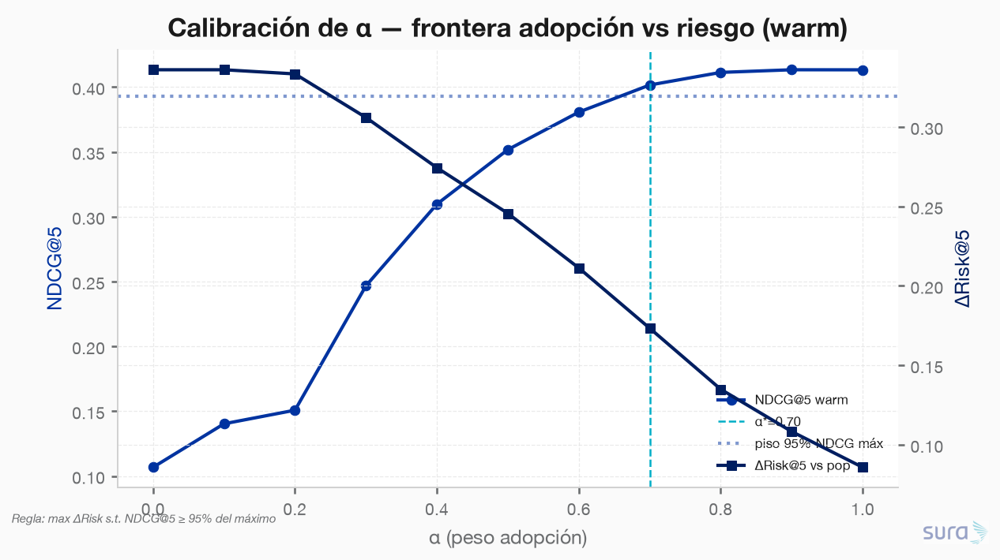
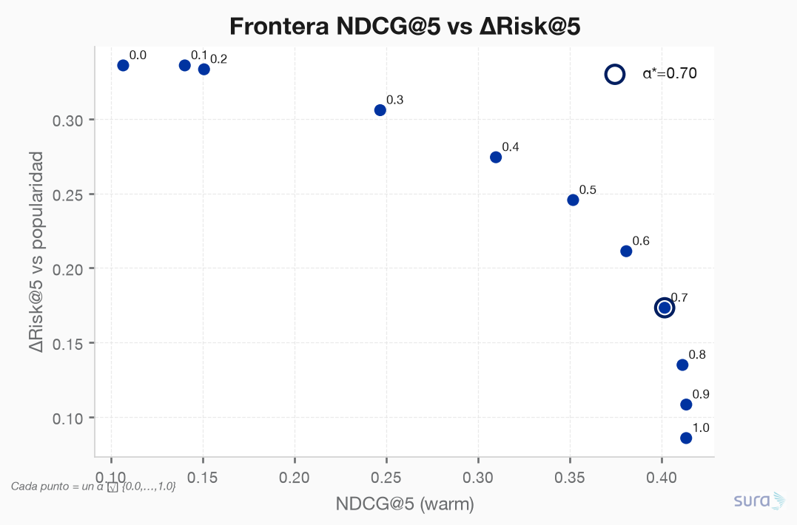
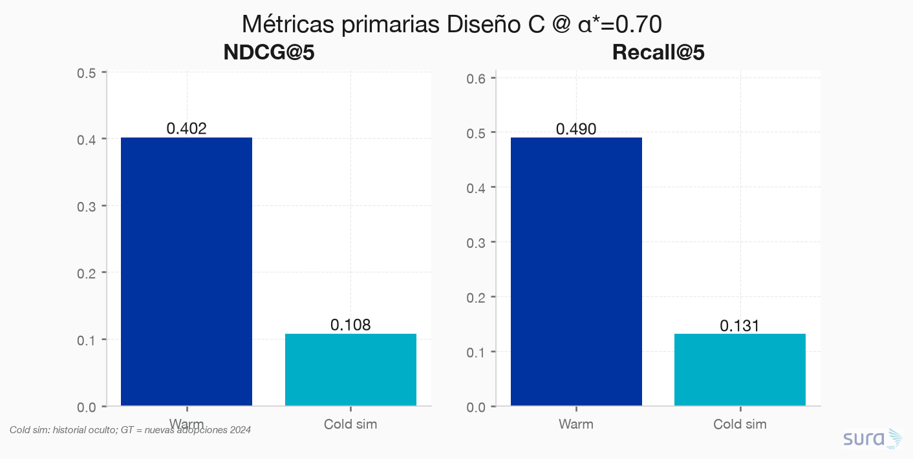
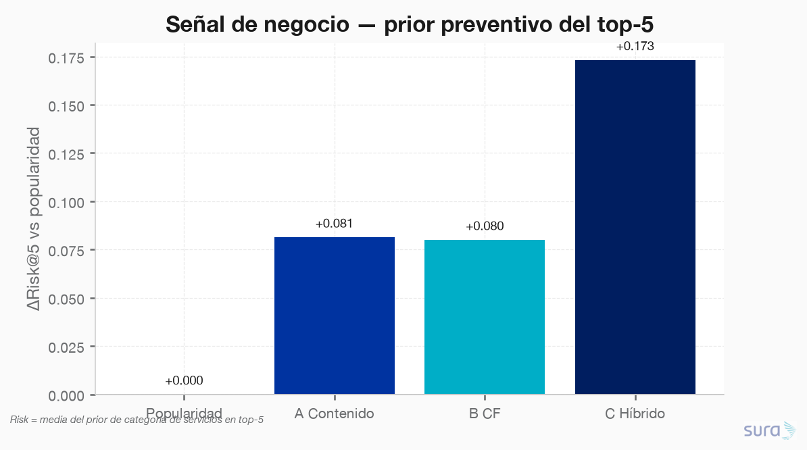
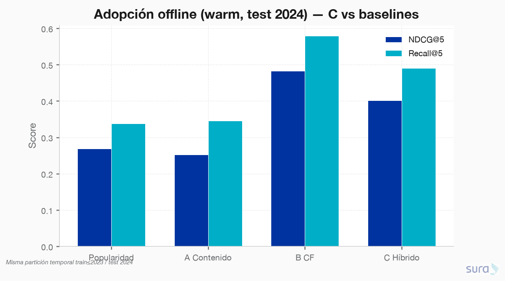
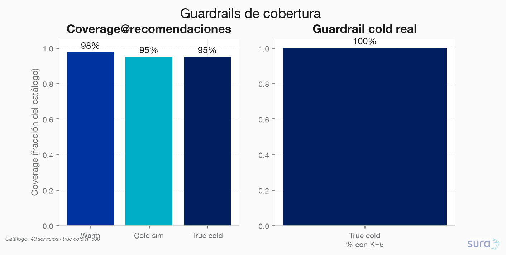
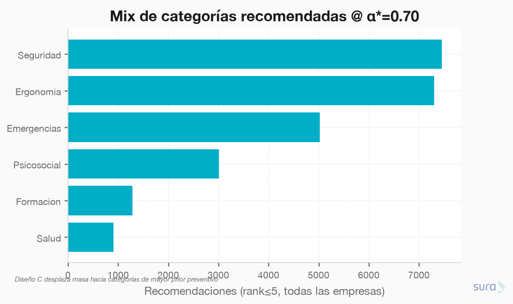

### **S05: Sistema de recomendación de servicios**
Objetivo: El área quiere recomendar a cada empresa los servicios de prevención con mayor probabilidad de ser adoptados y de reducir su riesgo. Dispone del histórico de uso en uso_servicios.csv, de los atributos de los servicios en catalogo_servicios.csv y de los atributos de las empresas en empresas.csv, que en conjunto permiten construir el recomendador y resolver el arranque en frío de empresas sin histórico.

---

### **Requerimiento 5.2**
Implementar un prototipo funcional y evaluarlo con una metodología de validación apropiada que incluya partición temporal. Reportar las métricas que considere pertinentes y discutir las limitaciones de la evaluación offline.

---

#### 5.2.1 Prototipo Recomendador: Diseño C — Híbrido adopción × riesgo (enrutamiento warm/cold)

**Script:** `code/01-prototipo/01-prototipo.py`  
**Diseño:** C (elegido en 5.1.1)  
**Staging:** `data/staging/S05/prototipo_*.parquet` (#140–146)  
**Figuras:** `results/imgs/01_prototipo_*.png`

---

##### Metodología de validación

| Pieza | Definición |
|---|---|
| **Train** | Usos con `fecha_uso ≤ 2023-12-31` (65 798 eventos; 4 500 empresas) |
| **Test** | Usos 2024 (32 938 eventos) |
| **Ground truth** | Servicios usados en 2024 **no vistos** en train (nuevas adopciones); 3 764 empresas con GT |
| **Warm** | CF item–item entrenado solo en train + mezcla contenido; excluye ítems ya vistos en train |
| **Cold sim** | 500 empresas warm con historial **oculto** en inferencia (rama contenido+riesgo); GT = mismas nuevas adopciones 2024 |
| **True cold** | 500 empresas sin ningún uso histórico → solo guardrails / riesgo (sin GT de adopción) |
| **K** | 5 |
| **ΔRisk@5** | Media del prior preventivo de categoría en el top-5 − misma métrica del baseline de popularidad train |

> No existen empresas “solo-2024” en los datos (0). Por eso el cold de adopción se mide con **cold simulado**; el cold real se reporta en guardrails.

---

##### Calibración de α

Regla: **maximizar ΔRisk@5** sujeto a **NDCG@5 ≥ 95% del máximo** observado en la curva α ∈ {0.0,…,1.0}.

| α | NDCG@5 warm | ΔRisk@5 warm |
|---:|---:|---:|
| 0.0 | 0.107 | +0.336 |
| 0.5 | 0.352 | +0.246 |
| **0.7 ★** | **0.402** | **+0.173** |
| 0.9 | 0.413 | +0.108 |
| 1.0 | 0.413 | +0.086 |

**α\* = 0.70** — piso NDCG = 0.393 (95%·máx 0.413). Es el punto donde el riesgo aún sube de forma material sin tumbar la adopción hacia el extremo α=1.

---

##### Métricas primarias (C @ α\*=0.70)

| Cohorte | NDCG@5 | Recall@5 | n |
|---|---:|---:|---:|
| **Warm** | **0.402** | **0.490** | 3 764 |
| **Cold sim** | 0.108 | 0.131 | 500 |
| True cold | — (sin GT) | — | 500 |

**Lectura:** en warm, C recupera ~49% de las nuevas adopciones 2024 dentro del top-5. En cold simulado la adopción cae (esperado: sin CF), pero el sistema sigue emitiendo listas válidas y con ΔRisk positivo.

---

##### Métrica de negocio: ΔRisk@5 vs popularidad

| Modelo | ΔRisk@5 (warm) | NDCG@5 | Recall@5 |
|---|---:|---:|---:|
| Popularidad | 0.000 | 0.269 | 0.338 |
| A Contenido | +0.081 | 0.252 | 0.345 |
| B CF | +0.080 | **0.482** | **0.579** |
| **C Híbrido α\*=0.70** | **+0.173** | 0.402 | 0.490 |

**Trade-off explícito:** B gana adopción pura; C cede ~8 pp de NDCG y ~9 pp de Recall a cambio de **≈2×** el lift de prior preventivo vs B/A. Alineado al objetivo dual del enunciado.

---

##### Guardrails

| Guardrail | Warm | Cold sim | True cold |
|---|---:|---:|---:|
| **Coverage** (% catálogo en tops) | 97.5% | 95.0% | **95.0%** |
| **% con K=5 válidas** | 100% | 100% | **100%** |
| ΔRisk@5 | +0.173 | +0.131 | +0.125 |

El cold real no queda sin recomendaciones: 500/500 reciben top-5; coverage del catálogo se mantiene alta (no colapsa a head items como popularidad, coverage warm pop = 45%).

---

##### Entregable operativo

`prototipo_recomendaciones.parquet`: **25 000** filas = 5 000 empresas × top-5 @ α\*=0.70, con `modo` ∈ {warm, cold}, score, categoría y nombre de servicio. Listo para 5.3 / demo.

---

##### Limitaciones de la evaluación offline

| ID | Limitación | Impacto |
|---|---|---|
| L1 | True-cold (500) **sin GT de adopción** | NDCG/Recall cold solo vía cold_sim; true_cold = guardrails/riesgo |
| L2 | ΔRisk es **proxy** (categoría × perfil), no efecto causal post-adopción | No demuestra menos siniestros; alinea intención preventiva |
| L3 | Offline ignora capacidad operativa, canal y fatiga de oferta | Puede sobreestimar valor de negocio en producción |
| L4 | Feedback implícito ≠ preferencia (reuso por hábito/contrato) | CF puede reforzar head items |
| L5 | Un solo corte 2023/2024 (sin rolling) | Sensibilidad a shocks 2024 no cuantificada |
| L6 | α calibrado en warm; cold hereda la misma α | El óptimo cold puede diferir — monitorear en 5.3 |

---

##### Veredicto para revisión

| Pregunta | Respuesta |
|---|---|
| ¿El prototipo C es funcional? | **Sí** — top-5 para 5 000 empresas, ramas warm/cold |
| ¿α razonable? | **0.70** (piso 95% NDCG máx + mejor ΔRisk admisible) |
| ¿Cumple guardrails cold? | **Sí** — 100% K válidas, coverage 95% |
| ¿Vale el trade-off vs B? | **Sí, si el KPI incluye riesgo**; si solo importa adopción, preferir B |

**Recomendación:** llevar **Diseño C @ α=0.70** a la propuesta de producción (5.3), con monitoreo separado warm/cold y revisión trimestral de α. Si Dirección prioriza únicamente adopción, documentar B como alternativa con fallback cold = rama contenido.
